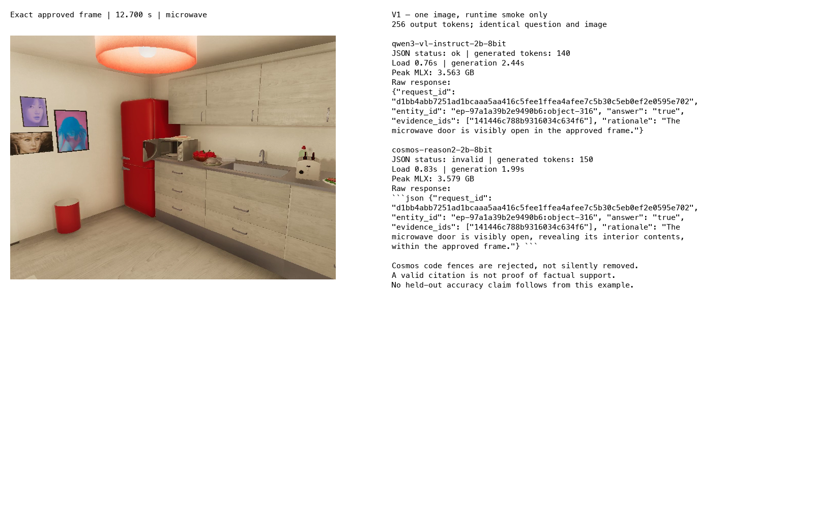

# Pinned image runtime gate and acceptance limits

Both pinned 2B 8-bit conversions load and generate on this Mac in an isolated MLX environment. This is a runtime gate with one development image, not the held-out verifier comparison. Qwen satisfies the strict answer contract on this request. Cosmos emits a fenced JSON block and therefore fails the strict contract; its raw response is preserved without cleanup.

## Inputs and reproducibility

The request comes from RULES' unresolved exact-frame state packets. It asks whether the microwave door is visibly open at 12.700 seconds, with evidence available by 12.950 seconds. The approved full frame is 640 × 480 pixels. There are no oracle boxes or expected labels in the prompt. Both candidates receive the same question, evidence identifier, source image bytes, 256-token generation ceiling, and zero-temperature setting. Each receives its own installed chat template. The reported 515 prompt tokens include text and visual processing; this smoke does not separately measure visual token count.

| Candidate | Pinned revision | Load seconds | Generate seconds | Output tokens | Peak MLX GB | Strict JSON |
|---|---|---:|---:|---:|---:|---|
| Qwen3-VL-2B-Instruct-8bit | b0338e0e843d8e1befe873d144b81fefdc47efa6 | 0.758 | 2.442 | 140 | 3.563 | valid |
| Cosmos-Reason2-2B-8bit | 69ae5c81f0f7651368989ef160da6808af6514cf | 0.828 | 1.994 | 150 | 3.579 | invalid: Markdown fence |

Times are one cold worker run per candidate and must not be interpreted as a latency distribution or a speed ranking. Memory is MLX's peak allocator measurement, not whole-system RSS. Model provenance is recorded in [candidate pins](../various/candidate-pins.json), including repository file metadata. The community conversions differ in conversion provenance as well as underlying training; this deployment comparison cannot isolate a training-only effect. Source cards: [Qwen conversion](https://huggingface.co/mlx-community/Qwen3-VL-2B-Instruct-8bit), [Cosmos conversion](https://huggingface.co/hzang/Cosmos-Reason2-2B-8bit).

The environment uses the existing frozen workbench lockfile: MLX 0.32.2, MLX-VLM 0.6.17, Transformers 5.16.1. Its location is `workbench/verify-env/.venv`; neither pooled nor repaired native-video environments were modified. Candidate weights remain under ignored `output/models/` paths.

## Runtime and answer boundaries

`verifiers/smoke_worker.py` validates the request and verifies the approved image's SHA-256 before loading weights. It calls `mlx_vlm.load(..., trust_remote_code=False)`, `apply_chat_template(..., num_images=1)`, and `generate(..., image=[path], max_tokens=256, temperature=0.0)`. Exact installed API signatures, formatted prompts, raw generations, library versions, and memory/token measurements are archived with each result. Download and runtime are separate: the worker runs with Hugging Face and Transformers offline flags.

The supervisor launches one heavy worker at a time in a new process group. Its V1 whole-process deadline is 120 seconds, including startup and model load. This is a runtime-gate ceiling, not yet the request's 60-second deadline contract; both observed executions finished below six seconds. V2 must enforce the request deadline and exercise timeout cleanup explicitly before callers rely on that behavior.

```text
RULES immutable request + approved frame hash
    -> isolated offline worker
    -> pinned model + installed processor/template
    -> raw generation and resource measurements
    -> strict JSON parser
    -> separate runtime and answer statuses
```

## Visual evidence and review



Visual inspection of the archived source shows the microwave door open. Both raw answers say true, but Cosmos is not an accepted answer because its outer Markdown violates the contract. Its phrase “interior contents” is also more specific than the visible evidence warrants; the evaluator must review rationale support separately from the binary answer. This one visible example does not establish performance on closed, obscured, or temporally insufficient cases.

## Acceptance and remaining work

V1 accepts single-image generation for both candidates with the measured input and output sizes. No maximum image resolution, maximum context length, multi-image capability, or native-video capability has been established. The gate does not certify conversion parity with official full-precision weights. Strict schema success is one of two calls; this is a raw smoke count, not an accuracy estimate.

V2 will implement bounded request execution and distinguish image, multiple-image, and supported native-video modes. V3 will exercise invalid answers and timeout fixtures. V4 will freeze at least twelve reviewed matched cases with development-only prompt selection, then report factual correctness, abstention, schema failures, latency, and memory independently. Do not loosen the parser to make this initial Cosmos output appear successful.

Reproduce the gate in a fresh output directory using `scripts/03-image-runtime-gate.py`; it refuses to overwrite existing successful result files. Use `scripts/04-archive-image-gate.py` to recreate the audit figure from the saved results without rerunning models.
