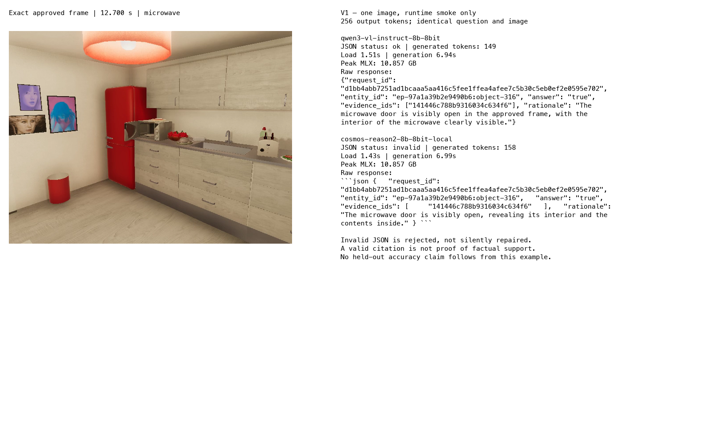

# 8B verifier runtime follow-up

Both 8B candidates were run on the exact request and approved image used for the 2B runtime gate. This is a single development smoke example, not the frozen V4 comparison or an accuracy estimate.

## Models, format, and engine

- Qwen: `mlx-community/Qwen3-VL-8B-Instruct-8bit`, revision `a0093b9b5fda6f76ddd4a462c6830ae7c4fe47ec`.
- Cosmos source: official `nvidia/Cosmos-Reason2-8B`, revision `a9fae2cf89dc64db96b12860417f0eb403013bb9`; converted locally with MLX-VLM 0.6.17, 8-bit affine quantization, group size 64, and remote code disabled.
- Both execute through the existing generative MLX-VLM 0.6.17 worker, MLX 0.32.2, in `workbench/verify-env/.venv`. These are answer-generating models; they do not consume the TEMPORAL embedding vectors.

Cosmos access required web agreement and a valid local Hugging Face credential. Merely agreeing in the browser did not replace the previously invalid CLI token. The successful source download is pinned; converted output file hashes and conversion settings are stored in `various/cosmos-8b-conversion.json`.

## Conversion cost

Local conversion took **8.63 seconds**. Output hashing took **6.58 seconds**; together they took 15.22 seconds. These timings exclude download time. They measure this checkpoint, machine, and conversion method; they are not a general quantization timing guarantee.

## Single-image measurements

| Candidate | Load s | Generate s | Output tokens | Peak MLX GB | Strict JSON |
|---|---:|---:|---:|---:|---|
| qwen3-vl-instruct-8b-8bit | 1.507 | 6.937 | 149 | 10.857 | ok |
| cosmos-reason2-8b-8bit-local | 1.434 | 6.992 | 158 | 10.857 | invalid |

The approved 640 × 480 full frame shows the microwave at 12.700 seconds. Both runs use the same question, request/evidence identifiers, 256 generated-token ceiling, and temperature zero. The archived formatted prompts capture candidate chat-template behavior. The 120-second whole-process ceiling is a runtime smoke guard, not the production request-deadline implementation. Peak memory measures MLX allocations rather than total system memory. Single-run timings are not latency distributions.

## Acceptance limits

Generation success, strict answer validity, and factual support are distinct outcomes. Preserve the exact response and parser status; never silently repair invalid JSON for the measured result. This example can establish usable local inference, but cannot establish that 8B is more accurate than 2B or that one model is better at household reasoning.

The Qwen community conversion and local Cosmos conversion have different provenance; identical declared bit width is not numerical parity. Floating-point modules may remain under the converter's multimodal quantization policy. We have not compared quantized outputs against official unquantized reference logits or validated native-video input for these verifier checkpoints.

## Reproduction and next work

Ticket scripts `05-download-8b.py`, `06-convert-cosmos-8b.py`, and `03-image-runtime-gate.py --pins FILE --output DIRECTORY` implement the pinned sequence. Use `07-report-8b.py` to assemble the saved runs and regenerate the visual report without model inference. Existing 2B and individual 8B results remain separate.

Next work is V2 bounded evidence execution and V3 output/timeout fixtures, followed by the frozen reviewed V4 comparison. The 8B embedding proposal is explicitly deferred in VIDEO-TEMPORAL-001; it is not part of this run.
