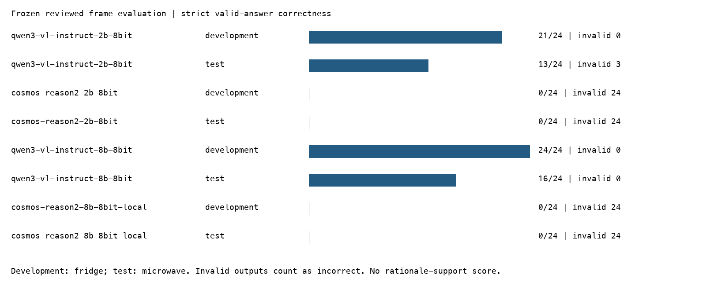
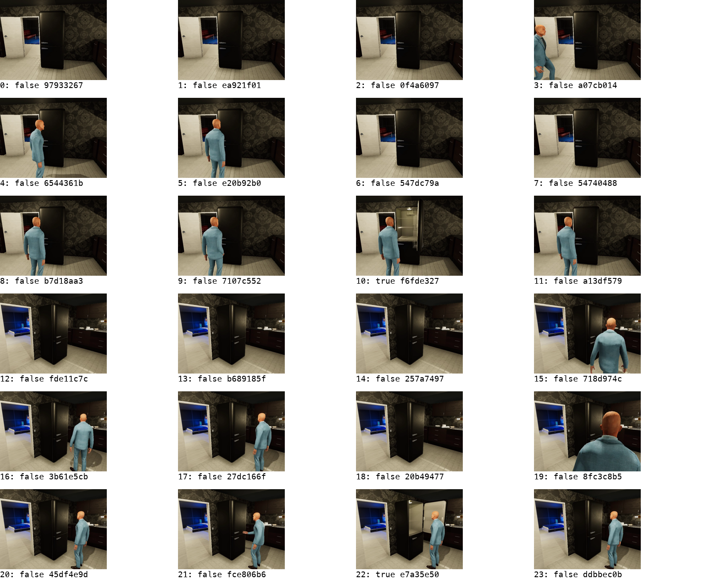
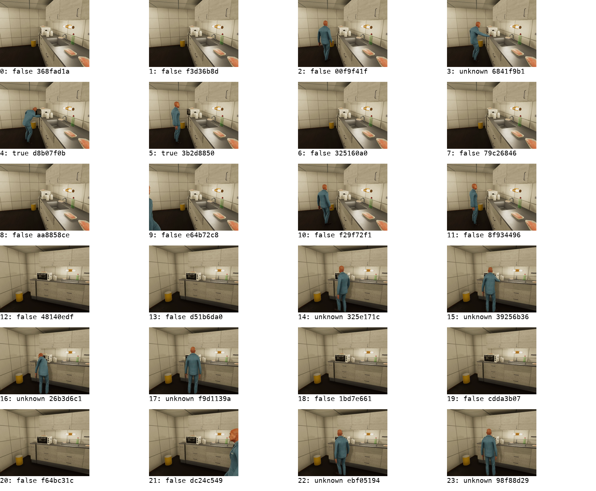
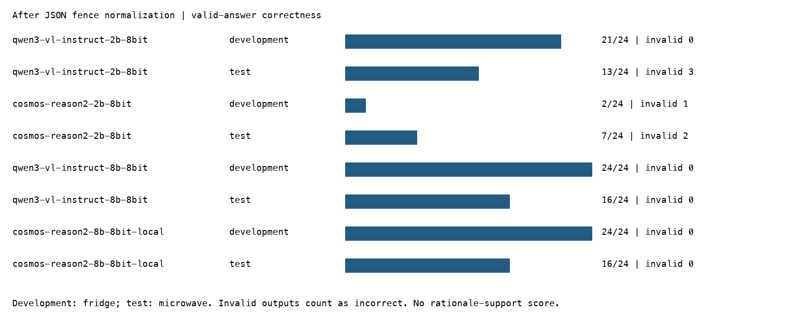

# Reviewed verifier and native temporal rerun results

The native temporal head rerun reproduces the accepted native FP32 measurements. The verifier experiment expands the one-frame smoke to 48 existing reviewed development/test frames, running all four pinned Qwen/Cosmos 2B/8B candidates. These results assess separate components. No integrated evidence retrieval, detector, tracker, temporal rule, and verifier accuracy is claimed.

## Measured interpretation

After fence normalization, both 8B candidates produce identical answer enums on all 48 frames: 24/24 correct on development and 16/24 on test. Both correctly answer 16/17 visible test cases, but label all seven unknown cases false instead of abstaining. Their 66.7% test correctness is only one answer above the always-closed baseline (62.5%). This is not reliable uncertainty handling.

Qwen 2B reaches 13/24 test correctness with three copied-ID failures. Cosmos 2B reaches 7/24 after normalization, primarily because it abstains: it gets all seven unknowns right but no visible test states right. Cosmos 2B also retains three binding failures across the two splits. Larger-model contract correctness improves, but the size effect cannot be summarized as a broad visual-reasoning success. No 8B Cosmos advantage over 8B Qwen is observed on this set.

## Native embedding evaluation

Fresh ridge and six TCN heads were trained using the unchanged native FP32 2B embedding cache: 792 windows across 48 episodes. Training splits, seeds, and development selection were unchanged. New results are under `output/temporal-native-fp32-rerun-v1`; the feature directory is a link to the accepted cache. Original heads and pooled artifacts were preserved.

| Test macro recall | Pooled reference | Native FP32 rerun |
|---|---:|---:|
| Ridge | 21.16% | 24.55% |
| TCN mean, three selected seeds | 18.63% | 24.31% |

The new ridge and TCN comparison structures match the previous native results exactly, including paired predictions and selected seed checks. Native representation still helps this benchmark, but native TCN mean remains below native ridge. CLOSE, GRAB, PUTBACK, and TURNTO remain unresolved. Precision and preprocessing also differ between pooled and native: these results do not isolate temporal ordering. The original 199-second extraction measurement is inherited provenance, not time spent extracting during this rerun.

The targeted regression selection passed **18 tests** covering temporal data, classical decoding, TCN causality, observation storage, and native video timestamp/cache contracts. These tests include fixtures; they are not another full GPU embedding extraction.

## Frozen verifier evaluation

All previously reviewed development and test frames were included before model execution. The protocol records original image hashes, sample identities, reviewer labels, timestamps, questions, and answer expectations. There is no prompt tuning or test-based candidate selection in this run. Each model receives the same source image and question with 256 output tokens and temperature zero, through its installed chat template.

Development contains 24 fridge frames: 22 closed and 2 open. Test contains 24 microwave frames: 15 closed, 2 open, and 7 unknown. These are repeated frames from a small within-scene corpus with assistant-reviewed RGB labels. Appliance and split are confounded; do not treat an aggregate score as appliance-independent generalization. The majority closed baseline on test is 15/24, or 62.5%.

## Strict answer outcomes

Correct means the output passes the strict response contract and its answer enum matches the reviewed label. Invalid JSON is a failed response and remains in the denominator. Known correctness includes only visibly open/closed labels; unknown correctness measures appropriate abstention on the seven unobservable test cases. A 0/0 entry means the split has no unknown examples.

| Model | Split | Correct / all | Invalid / all | Known correct | Unknown correct | Median generation s |
|---|---|---:|---:|---:|---:|---:|
| qwen3-vl-instruct-2b-8bit | development | 21/24 | 0/24 | 21/24 | 0/0 | 1.92 |
| qwen3-vl-instruct-2b-8bit | test | 13/24 | 3/24 | 12/17 | 1/7 | 2.00 |
| cosmos-reason2-2b-8bit | development | 0/24 | 24/24 | 0/24 | 0/0 | 1.77 |
| cosmos-reason2-2b-8bit | test | 0/24 | 24/24 | 0/17 | 0/7 | 1.91 |
| qwen3-vl-instruct-8b-8bit | development | 24/24 | 0/24 | 24/24 | 0/0 | 7.49 |
| qwen3-vl-instruct-8b-8bit | test | 16/24 | 0/24 | 16/17 | 0/7 | 7.41 |
| cosmos-reason2-8b-8bit-local | development | 0/24 | 24/24 | 0/24 | 0/0 | 7.76 |
| cosmos-reason2-8b-8bit-local | test | 0/24 | 24/24 | 0/17 | 0/7 | 7.84 |

The full confusion counts, abstention counts, accuracy conditional on schema validity, and memory measurements are in `various/rerun/summary.json`. Raw answers and original parser errors are in `raw-results.json`. Do not infer factual competence from schema failure alone; equally, do not count a plausible answer inside invalid output as an accepted verifier response. No permissive fence-stripping score has been substituted for the strict result.

## Runtime behavior and limits

One model is resident at a time. The worker reuses model weights and processor but passes no generation cache or previous answer between requests. First-request loading and warm-request generation times are stored separately. The supervisor enforces a 60-second active-request budget by killing the model process group on timeout, with a separate 120-second startup allowance. This is an evaluation harness; the complete production V2 adapter and deliberate timeout/restart fixtures remain open.

All four candidates are 8-bit MLX deployments in MLX-VLM 0.6.17. Cosmos 8B is locally converted from the pinned official source, while the other candidates use pinned community conversions. Quantization/conversion parity with full-precision references is not established. Memory values describe peak MLX allocation, not whole-system memory. Latency includes the actual workload on this Mac and is not an isolated hardware benchmark.

This direct-answer protocol is intentionally unchanged from the prior smoke. It does not measure each model's best prompt or a long-form Cosmos reasoning configuration. No multi-image or native-video verifier capability is established. Native embeddings belong to the separate temporal experiment; the reasoning models inspect original frames directly.

## Visual evidence and review

The figures preserve the visual trail and permit inspection of label plausibility and visibility failures. Automated scores compare the answer enum to the prior reviewed label. They do not comprehensively grade rationale support, entity localization, or citation entailment; those remain required for a stronger verifier acceptance claim.

## Reproduction and next decision

Scripts `08-freeze-rerun.py`, `09-rerun-verifiers.py`, `10-report-rerun.py`, and `11-write-rerun-report.py` freeze, execute, audit, and report this evaluation. Runtime files remain in `output/verifier-rerun-v1`; reviewed protocol and compact evidence are committed with this ticket. Use fresh result directories for another execution. Reporting can be repeated from existing outputs without rerunning the models.

The next useful experiment is a separately planned output-contract/prompt study on development evidence, followed by untouched reviewed evaluation cases and the bounded verifier-to-rule integration. Do not claim completion of the whole V4 program from this point-state frame set: temporal insufficiency questions, multi-image evidence, and full rationale support are absent. The 8B embedding experiment remains explicitly deferred.

## Requested fence normalization: separate replay of the same answers

After the strict sweep was underway, the user requested inspection of `~/code/wesen/go-go-golems/sanitize` and backtick handling. The implementation follows its `markdown_fence_wrapper` approach (commit `c142cca399ff596da307d287fceda8de4155a3dd`, `pkg/json/fix.go:78`). The Python adapter unwraps one enclosing bare or json code fence, records `normalizations`, and preserves raw text. It does not invoke Go or enable the broader sanitizer repairs. Duplicate keys, nonfinite values, multiple blocks, surrounding prose, wrong IDs, and invented citations still fail validation. Eleven focused tests passed.

All saved raw answers were reparsed without model calls. The original strict results remain unchanged; this table measures only the parser change. It is a post-observation contract revision, not a new untouched model evaluation.

| Model | Split | Correct / all | Invalid | Fence-normalized | Known correct | Unknown correct |
|---|---|---:|---:|---:|---:|---:|
| qwen3-vl-instruct-2b-8bit | development | 21/24 | 0 | 0 | 21/24 | 0/0 |
| qwen3-vl-instruct-2b-8bit | test | 13/24 | 3 | 0 | 12/17 | 1/7 |
| cosmos-reason2-2b-8bit | development | 2/24 | 1 | 24 | 2/24 | 0/0 |
| cosmos-reason2-2b-8bit | test | 7/24 | 2 | 24 | 0/17 | 7/7 |
| qwen3-vl-instruct-8b-8bit | development | 24/24 | 0 | 0 | 24/24 | 0/0 |
| qwen3-vl-instruct-8b-8bit | test | 16/24 | 0 | 0 | 16/17 | 0/7 |
| cosmos-reason2-8b-8bit-local | development | 24/24 | 0 | 24 | 24/24 | 0/0 |
| cosmos-reason2-8b-8bit-local | test | 16/24 | 0 | 24 | 16/17 | 0/7 |

This removes formatting friction without claiming that the recovered answers are necessarily correct. Request-ID copy failures remain failures; moving request identity into a host-owned envelope is a separate proposed improvement. See `normalized/summary.json` and `normalized/raw-results.json` for complete reparse evidence.
