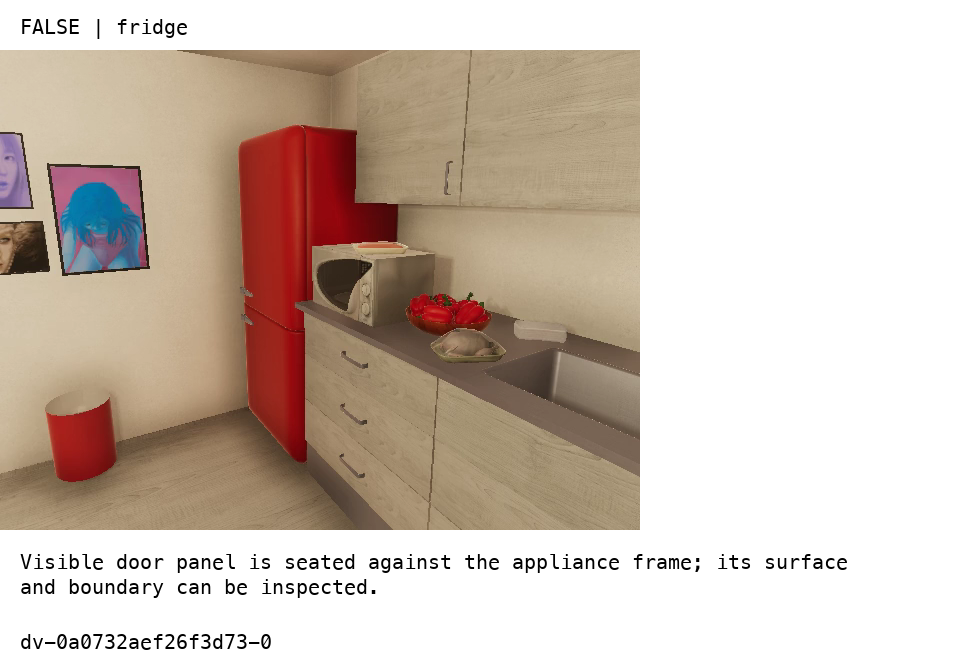
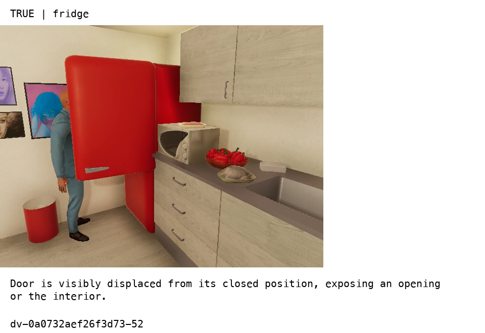
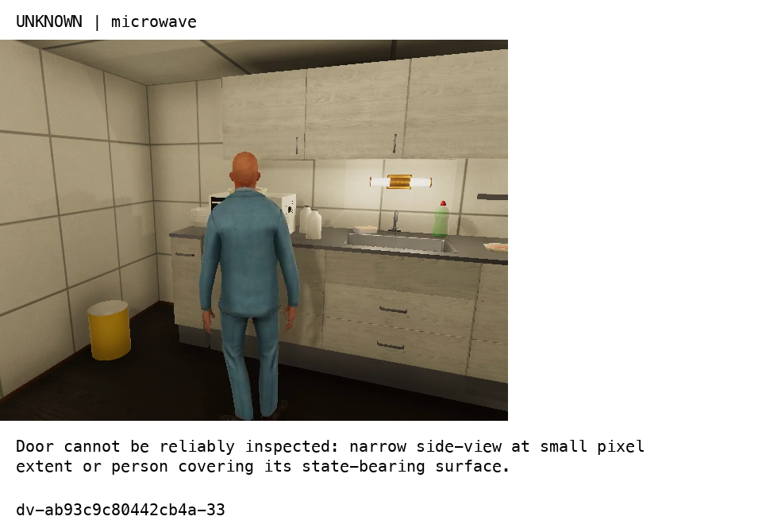
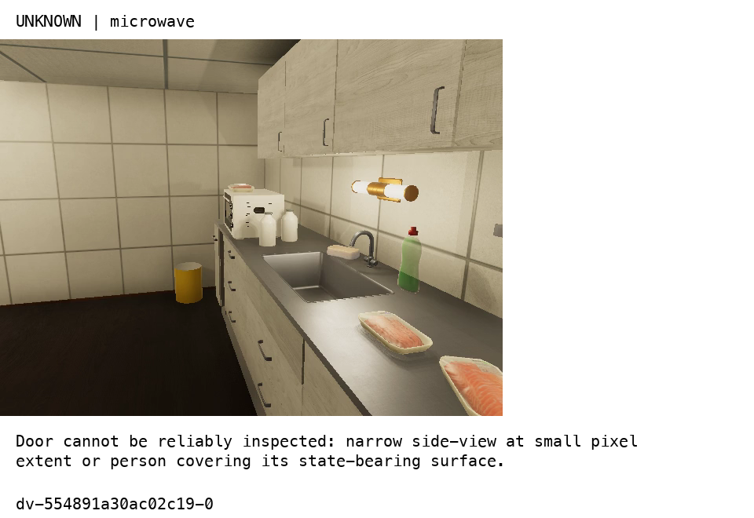
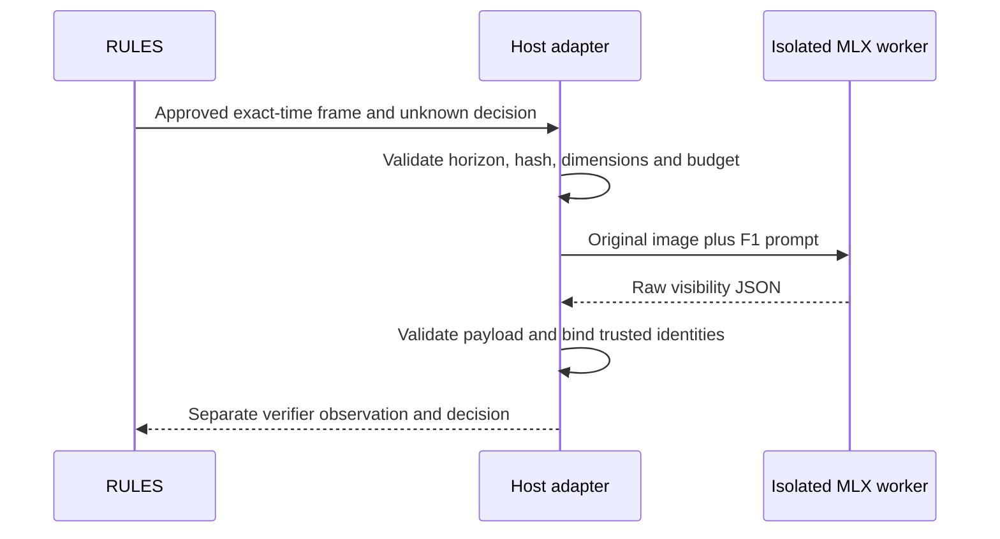

# Bounded visibility verification: implementation and measured limits

The adapter now executes one bounded image request in an isolated MLX process, validates the model's small response, and supplies trusted request identities itself. A real Cosmos 8B call successfully produced a separate RULES evaluation without changing the original unknown decision. The visual classifier is not accepted for reliable abstention: both models answered all four unobservable test cases with definite states.

## What a closed case means

Our property is `door_open`. The answer `false` means that the visible door is closed, `true` means visibly open, and `unknown` means the image does not establish the state. Closed requires positive visual evidence: a sufficiently visible door seated against its frame. An appliance behind a person is not closed merely because the image lacks a visible opening.









These panels are human-facing report artifacts. Models received the original unannotated images. Labels reflect assistant RGB review, not simulator graph state. The conservative side-view rubric deserves independent human review before this becomes a benchmark.

## Request and response path



`verifiers/visibility.py` owns prompt construction and response validation. The model supplies `target_identified`, `door_observable`, `answer`, `evidence`, and `rationale`. It cites the short alias `F1`. The host maps that alias to the approved frame ID and attaches the original request and entity IDs. This removes the former long-ID copying obligation without repairing model statements after the fact.

Known answers require an identified, observable target and an approved citation. The parser rejects extra fields, duplicate keys, nonfinite JSON, invalid boolean types, and fabricated citations. One outer Markdown JSON fence may be removed with a recorded normalization trace. That transformation does not alter answer contents. A syntactically valid visibility assertion can still be visually wrong; the test results demonstrate this distinction.

`verifiers/adapter.py` validates one image, its SHA-256, a maximum ten MiB file size, and a maximum 1920-by-1080 pixel count. The existing request contract checks evidence times against the allowed interval and availability horizon. The adapter starts a process group, applies the remaining deadline after setup, kills and reaps the group on timeout, and distinguishes timeout and execution failure from an answer. A subsequent request starts a fresh worker. The current implementation supports one image only; multi-image and native-video packets are intentionally unimplemented.

`verifiers/worker.py` loads the pinned local MLX model, constructs its actual chat template, and retains raw output, formatted prompt, token counts, generation timing, finish reason, package versions, and peak MLX allocation. The current benchmark uses temperature zero and 384 output tokens. These are short direct-answer settings, not NVIDIA's explicit reasoning profile; reference 06 explains that separate experiment.

```text
investigate(rule, baseline, event, approved_frames):
    plan = plan_request(rule, baseline, event, approved_frames)
    if plan is not ready: return its reason
    result = bounded_verify(plan.request)
    if execution or validation failed: return failure
    observation = bind_validated_answer_to_original_request(result)
    conditioned = evaluate_with_separate_verifier_stream(observation)
    return baseline_identity, observation, conditioned
```

The integration entry point is `rules/handoff.py:investigate`. It calls the existing focused planner and returns a distinct verifier-conditioned result. It does not replace the baseline observation, rewrite history, or initiate a retrieval/retry loop. The stored `live-rules.json` demonstrates an UNKNOWN baseline and a PASS conditioned decision for a controlled closed-fridge frame. Its event is a frame-sample fixture, not a measured departure detector or an end-to-end rule benchmark.

## Frozen experiment

Scripts 13 and 14 extracted and reviewed 24 fresh frames across four episodes. Their hashes do not match the 48 previously evaluated frames. Development contains four closed, four open, and four unknown labels. Test contains six closed, two open, and four unknown labels. Episodes are separated across splits, but the data remain correlated VirtualHome scenes; the microwave cases share an apartment and action family under different camera views.

Before inference, `protocol.json` froze the reviewed labels, original image identities, both prompt variants, and selection policy. Each 8B model evaluated direct and visibility variants on all 12 development frames. The selected shared variant maximized correct answers minus unsupported known answers on unknown labels, with ties preferring direct. Visibility won by one aggregate point, 2 versus 1. Only then did both models evaluate the 12 test frames with that frozen variant. There were 48 development and 24 test calls.

| Partition | Model | Prompt | Correct | Unsupported known answers on 4 unknown cases | Invalid responses |
|---|---|---|---:|---:|---:|
| Development | Qwen 8B | Direct | 5/12 | 4 | 0 |
| Development | Qwen 8B | Visibility | 5/12 | 4 | 0 |
| Development | Cosmos 8B | Direct | 4/12 | 4 | 0 |
| Development | Cosmos 8B | Visibility | 5/12 | 4 | 0 |
| Test | Qwen 8B | Visibility | 8/12 | 4 | 0 |
| Test | Cosmos 8B | Visibility | 7/12 | 4 | 0 |

Both models achieved zero correct abstentions. Qwen got all eight known test states correct; Cosmos got seven. Always answering closed scores six of twelve on test. These counts show some visible-state discrimination but no reliable treatment of missing visual evidence. The new sample and rubric differ from the previous 48-frame evaluation, so a change in overall accuracy cannot be attributed solely to the prompt or host envelope.

Median generation time on test was 3.880 seconds for Qwen and 4.289 seconds for Cosmos. Peak MLX allocation was approximately 10.857 GB for both. Generation timings exclude model loading and host setup; memory is MLX allocation, not total system memory. All 72 calls completed with valid payloads and no reported length truncation. `various/visibility-v2/results/` retains requests, raw worker outputs, host results, summary counts, and selection provenance.

## Validation and acceptance

At feature completion, 26 focused tests passed in 0.29 seconds. They exercise host identity binding, citation/visibility constraints, duplicate keys, changed image bytes, future evidence, a real subprocess timeout followed by successful recovery, runtime-error separation, and baseline preservation. A separate real Cosmos call validated the live handoff. These checks establish implementation behavior; they do not establish semantic correctness on hidden or ambiguous doors.

Accept the single-image adapter and independently recorded RULES comparison as an experimental capability. Do not promote model self-reported observability into a trusted visibility gate. Leave multi-image/video support, full rationale-support scoring, reliable abstention, and end-to-end rule recall open. The next controlled comparison should test NVIDIA's explicit reasoning configuration, with its own prompt, output parser, budget, and untouched evaluation set.

## File and API guide

- `workbench/src/video_workbench/verifiers/visibility.py`: `prompt`, `parse_visibility`, schema version.
- `workbench/src/video_workbench/verifiers/adapter.py`: `check_packet`, `supervise`, `verify`.
- `workbench/src/video_workbench/verifiers/worker.py`: isolated `run` function and CLI.
- `workbench/src/video_workbench/rules/handoff.py`: `plan_request`, `evaluate_answer`, `investigate`.
- `workbench/tests/test_visibility_adapter.py`: bounded adapter and RULES fixtures.
- Ticket scripts 13–18: extraction, frozen review, evaluation, upstream archive, live handoff, report reproduction.
- Reference 06 and ticket `sources/`: primary-source guidance and explicit follow-up recommendations.
