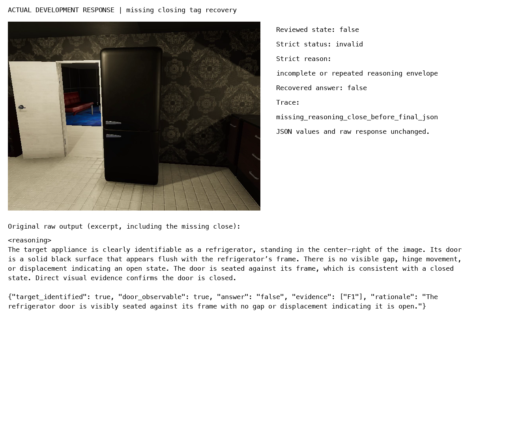
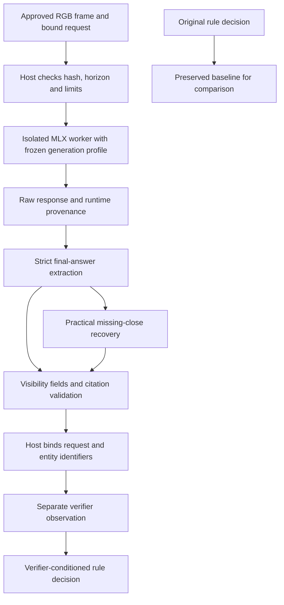
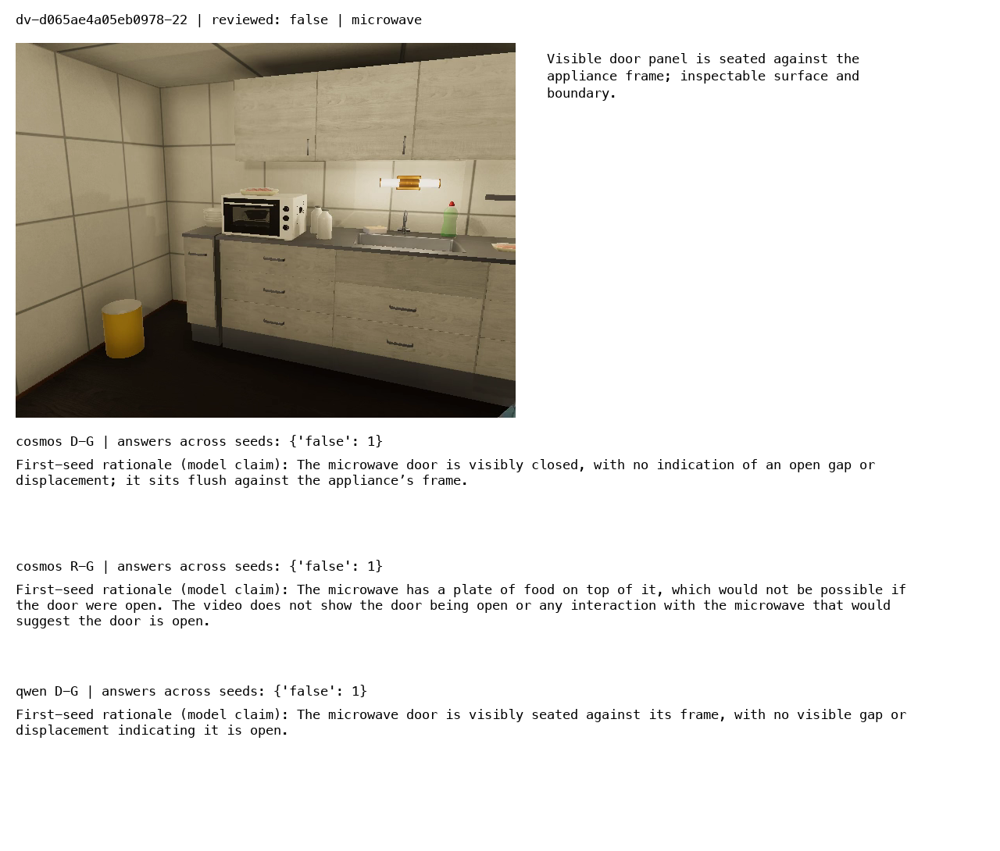

# Qwen and Cosmos prompted reasoning comparison

Status: completed. All 384 development and 72 held-out calls are archived, all 72 final test rationales were visually audited, both selected-profile live RULES handoffs passed, and practical recovery integration passed 71 completion smoke tests.


## Measured conclusion

Keep direct greedy as the practical reference for this single-frame door-state task. Both 8B direct controls scored 22/24 on the untouched test set. Cosmos's development-selected greedy reasoning profile scored 20/24: it added two unnecessary abstentions on visibly closed fridge doors without resolving either genuinely unknown microwave case. Qwen reasoning did not improve its development selection score and was not advanced to test. These results do not establish that reasoning models are generally worse; they describe the pinned checkpoints, prompts, sampling policies, and small synthetic population tested here.

The requested missing-close heuristic is implemented and enabled for practical profiled calls. A separate replay recovered all 13 Qwen sampled-reasoning wrapper failures, including ten correct answers and three unsupported answers. It leaves the three Cosmos enum failures and one execution timeout unchanged. Strict experiment artifacts and selections remain preserved.

## System under test

The experiment compares four arms within each existing 8B checkpoint: direct versus prompted step-by-step reasoning, crossed with greedy versus sampled decoding. Qwen uses the accepted community MLX 8-bit Instruct conversion; Cosmos uses the local 8-bit group-64 conversion of the pinned official Reason2 8B checkpoint. This is not a Qwen Thinking checkpoint experiment and does not change the native FP32 embedding pipeline.

The recorded inference environment is MLX 0.32.2, MLX-VLM 0.6.17, and Transformers 5.16.1 in `workbench/verify-env/.venv`. Qwen is pinned to community revision `a0093b9b5fda6f76ddd4a462c6830ae7c4fe47ec`; Cosmos's official source is pinned to `a9fae2cf89dc64db96b12860417f0eb403013bb9`, with the local conversion recorded in `various/cosmos-8b-conversion.json`. The protocol embeds the model provenance records; per-call worker records preserve actual runtime versions and processed inputs.

Each request receives exactly one original approved RGB frame. The host validates its identity, timestamp horizon, size, and hash; starts an isolated worker; and enforces a 120-second deadline. The worker applies a frozen generation profile, records actual processed image tensors, and returns complete raw output. The host extracts the declared final-answer object and applies existing visibility and F1 citation validation before binding long request/entity identifiers.

The reasoning explanation is a generated claim. Its existence or fluency is not used as evidence of correctness. The final answer and its brief visible-evidence rationale are evaluated separately.

## Profiles and pilot findings

All new arms have a 4096-token maximum. Qwen sampled arms use temperature 0.7, top-p 0.8, top-k 20, repetition penalty 1.0, and presence penalty 1.5; seeds are 3407–3409. Cosmos sampled arms use temperature 0.6, top-p 0.95, top-k 20, repetition penalty 1.0, and presence penalty 0.0; seeds are 1234–1236. Greedy arms run once per case with explicit neutral penalties. MLX's recent-4096-input/generated-token penalty scope is recorded as a local approximation, not vLLM parity.

The initial eight-call pilot found that Qwen omitted the requested think delimiters. Those outputs remain rejected and archived. A separate pilot established literal reasoning tags for Qwen, while Cosmos retains think tags. All eight revised calls passed output validation in approximately 7–12 seconds, but one sampled Cosmos answer incorrectly called the reviewed closed door open. Passing the output contract does not establish factual accuracy.

Qwen keeps the original no-system-turn policy. All new Cosmos arms use the documented minimal helpful-assistant system message and media-first ordering. Therefore, the new direct greedy control is the comparison reference; the historical no-system Cosmos score is not a matched prompt-effect control.

## Frozen visual population

There are 48 reviewed frames from eight episodes excluded from earlier verifier populations. Development has 15 closed, 3 open, and 6 unknown cases. Test has 18 closed, 4 open, and 2 unknown cases. RGB review refined sampling around visible opening intervals before the freeze. The remaining episodes did not provide the planned balanced label mix.

These are assistant-reviewed synthetic cases, not an independent human benchmark. Episodes are separate across splits, but apartments, objects, action families, and nearby opening frames are correlated. Only two unknown test cases limit abstention conclusions. Original frames and contact sheets are preserved under `various/reasoning-v3/`; annotations are never sent to a model.

Both model protocols, prompts, pins, profiles, frame hashes, and runtime code hashes were frozen in the same protocol before development inference. The runner refuses test mode until both development selections exist. It validates frozen code hashes at startup, saves each bounded call immediately, and can resume completed calls with identity checks without rerunning their generation.

## Selection and metrics

The development sweep has 384 calls: 24 cases × eight runs per model × two models. For each sampled arm, score each case over three seeds first; then average cases. Select by correctness minus unsupported known answers on unknown cases, with both indicators averaged over the full case population. Break ties by unsupported rate and latency. Retain direct greedy if no arm improves its development score.

Test evaluates each selected arm and its direct greedy control; if the selected arm is already the control, run it once. Report exact call counts and per-case averages, seed range, episode summaries, known-state accuracy, unknown recall, unsupported certainty, execution/output failures, tokens, latency, and peak MLX allocation. Median and p95 latency include cold process/model setup; MLX allocation is not total system memory.

The rationale audit covers every accepted final test rationale for each tested arm and seed. Supported/mixed/unsupported classifications require reading the short rationale against the original image. Invalid outputs are counted separately because they have no accepted rationale. The full preceding explanation is retained for diagnosis, but is not scored as independent evidence. Agreement between rationale and answer is not sufficient for factual support.

## Evidence and reproduction

- Scripts 21–23: original/revised development pilots, frame extraction, and frozen labels/profiles.
- Script 24: sequential bounded development and test execution with shared test gate.
- Script 25: complete raw JSONL archive, per-case metrics, and annotated test panels.
- Script 26: one selected-profile live RULES handoff per model after test completion.
- Shared runtime: `verifiers/profiles.py`, `visibility.py`, `worker.py`, `adapter.py`, and `rules/handoff.py`.
- Implementation commits: `4608902` (shared boundary) and `5aa10eb` (pilots and protocol freeze).
- Validation: 48 focused tests at initial feature completion; 23 reasoning-profile tests after the pilot-driven delimiter adjustment.

## Completed development comparison

All 384 planned development calls completed in 3,780 seconds (63 minutes), including the recorded timeout. D/R denote direct/prompted reasoning; G/S denote greedy/sampled decoding. Each sampled row contains three predefined seeds on the same 24 cases. The score is mean correctness minus unsupported certainty, each averaged over the full case population.

| Model | Arm | Correct calls | Unsupported calls | Non-OK calls | Selection score | Median seconds |
|---|---|---:|---:|---:|---:|---:|
| qwen | D-G | 18/24 | 6/24 | 0 | 0.5000 | 6.66 |
| qwen | R-G | 18/24 | 6/24 | 0 | 0.5000 | 10.13 |
| qwen | D-S | 54/72 | 18/72 | 0 | 0.5000 | 6.70 |
| qwen | R-S | 44/72 | 15/72 | 13 | 0.4028 | 10.22 |
| cosmos | D-G | 17/24 | 6/24 | 0 | 0.4583 | 7.33 |
| cosmos | R-G | 18/24 | 4/24 | 1 | 0.5833 | 12.26 |
| cosmos | D-S | 37/72 | 18/72 | 0 | 0.2639 | 7.39 |
| cosmos | R-S | 52/72 | 12/72 | 3 | 0.5556 | 13.92 |

The frozen policy selected Qwen D-G and Cosmos R-G before held-out inference. Qwen reasoning did not improve the selection score, and sampled reasoning introduced wrapper failures. Cosmos greedy reasoning improved development uncertainty handling enough to win its selection score; sampled reasoning did not improve on it. The Cosmos non-OK population consists of three invalid answer enums and one 120-second timeout across its two reasoning arms.

The separate recovery replay restores all 13 Qwen sampled-reasoning wrapper failures. Its recovered correctness becomes 54/72 and unsupported count becomes 18/72, matching the aggregate Qwen direct sampled result. Cosmos has no recoverable missing-close cases in development. This replay does not alter the recorded selections.

## Development diagnostic: explanation can repeat the visibility error

The first completed Qwen greedy pair scored 18/24 in both direct and reasoning modes. Each got all 18 known-state labels correct and answered all six unknown labels with definite states. In the side-facing microwave example below, the reasoning response described a visible seated door even though the review rubric judged its state-bearing surface insufficiently inspectable. The additional explanation did not establish new visual evidence. These are development diagnostics; the completed held-out results are reported below.


## Input forwarding and the meaning of the recorded grid

The experimental worker calls `mlx_vlm.utils.prepare_inputs` once and records the returned tensor shapes. It then supplies `input_ids`, `pixel_values`, the attention mask under the generation API's `mask` name, and the remaining processor metadata directly to generation. The installed dispatch path recognizes supplied input IDs and skips its own preparation step. This avoids a second resize pass and makes the saved grid describe the actual submitted tensors.

The pilot frame produced an image grid `[1, 30, 40]` and pixel-value shape `[1200, 1536]`, with reconstructed spatial dimensions 480×640 from the processor's patch size. The grid is a preprocessing record, not a bounding box or evidence of target visibility. A correctly forwarded image can still contain too few inspectable target pixels, as the unknown microwave case demonstrates.

The runtime comparison is sequential, using a fresh isolated process for every request. Reported wall time includes process and model setup. Model families are not interleaved, so temperature/load conditions and execution order may influence timing; latency figures describe these runs rather than isolated engine performance.

## User-requested missing-close recovery

During development, sampled Qwen reasoning sometimes omitted its closing delimiter while still emitting final JSON. The user requested a heuristic. `recovery.parse_with_recovery` now accepts that single wrapper omission only when the expected opener is present, the preceding explanation has no competing JSON/fences, and the final line-start object or outer JSON fence passes the unchanged visibility validator. Raw text and a recovery trace are retained. Truncation, repeated/mixed tags, trailing prose, duplicate keys, and invalid citations remain failures.

The completed comparison retained its frozen strict path. Script 28 performs a separately labeled post-observation replay; it does not change generation records, prompts, labels, or selection. The completed Qwen development population contains 13 missing-close failures among 72 sampled-reasoning calls (18.1%). Replay recovered all 13: ten correct answers and three unsupported known answers on unknown cases. This changes sampled-reasoning correct calls from 44/72 to 54/72 and unsupported calls from 15/72 to 18/72. Cosmos had no recoverable missing-close cases, and none of the 72 test responses required recovery. Practical adapter integration landed after all frozen inference and strict live handoffs in commit `89c4313`. Profiled calls record `validation_policy`; `recover_missing_close=False` preserves strict extraction.



## Development diagnostic: uncertainty and contract failures in Cosmos

The completed Cosmos greedy runs scored 17/24 direct and 18/24 reasoning under strict parsing. Direct answered all six unknown cases with definite states. Reasoning correctly abstained on two of those cases, but also abstained on one visibly open frame and emitted an invalid `closed` enum on a closed frame. These development observations precede sampled-arm selection and are not test results.

The missing-close heuristic deliberately leaves that enum failure unchanged. Mapping arbitrary synonyms would change the answer-content policy; the implemented recovery only locates the final JSON after one observed wrapper omission. The accepted enums remain `true`, `false`, and `unknown`.


The uncertainty example also illustrates why rationale support requires a separate audit: the answer `unknown` can match the review label while its explanation still refers to an agent's actions or describes the poorly inspectable door as visible. Label correctness alone does not establish support for every statement in the rationale.

## How the runtime and rule handoff fit together



The worker performs inference; the host owns the accepted contract. A model cannot choose a different frame, expand the timestamp horizon, substitute request identity, or invent an evidence reference through its answer. This boundary constrains what an accepted result means, but it does not determine whether the depicted door is actually inspectable. The latter remains a measured model capability.

The RULES integration produces a separate verifier observation and evaluates a corresponding rule condition. It does not replace the original state observation or rewrite the original decision. The live fixture uses an exact frame-sample event to exercise request binding, evidence validation, and the separate decision path. It does not measure departure detection or end-to-end warehouse rule recall.

## Final-rationale audit rubric

Every accepted final test rationale is read against the supplied RGB frame. `supported` means its material visual claims are inspectable and support the answer. `mixed` means it combines supported observations with unsupported details, activity/history claims, or an unjustified conclusion. `unsupported` means the decisive evidence claim is not visible or is contradicted by the image. Invalid responses are recorded separately and have no accepted rationale to score.

These annotations assess the short final rationale, not the entire preceding generated explanation. The reviewer is the same assistant that reviewed the synthetic frames, so this is an internal visual audit with correlated judgments. It is useful for diagnosing specific errors, but is not independent human validation. Raw responses, image identities, case labels, and per-response audit notes are retained so another reviewer can reassess them.

## Untouched test results

The held-out run took 639 seconds (10.65 minutes). Every tested profile used the same 24 frames: 18 closed, four open, and two unknown. All 72 responses passed strict output validation.

| Model and condition | Correct | Known-state correct | Unknown recall | Unsupported on unknown | Non-OK |
|---|---:|---:|---:|---:|---:|
| qwen D-G | 22/24 (91.7%) | 22/22 | 0/2 | 2/2 | 0 |
| cosmos D-G | 22/24 (91.7%) | 22/22 | 0/2 | 2/2 | 0 |
| cosmos R-G | 20/24 (83.3%) | 20/22 | 0/2 | 2/2 | 0 |

The two additional Cosmos reasoning errors are `dv-dad43880b6994056-28` and `dv-dad43880b6994056-38`. Both show a person partly overlapping a red refrigerator, with sufficient upper door surface and boundary still visible to establish closure. The reasoning response judged the door uninspectable. Both direct controls returned the reviewed closed label.

All three conditions incorrectly returned closed for `dv-d065ae4a05eb0978-30` and `dv-d065ae4a05eb0978-38`, where the actor blocks the microwave door. Thus aggregate accuracy above 80% coexists with zero unknown recall. These models do not yet provide reliable evidence-sensitive abstention.


## Runtime cost and seed variability

| Test condition | Median wall seconds | p95 wall seconds | Median generated tokens | Maximum generated tokens | Peak MLX GiB |
|---|---:|---:|---:|---:|---:|
| qwen D-G | 6.62 | 6.86 | 56.5 | 64 | 10.11 |
| cosmos D-G | 7.36 | 7.55 | 73.5 | 77 | 10.11 |
| cosmos R-G | 12.56 | 14.96 | 237.5 | 355 | 10.11 |

Cosmos reasoning required about 1.71 times its direct-control median wall time and 3.23 times its median generated tokens. Peak reported MLX allocation remained near 10.11 GiB because the loaded model dominates this measurement. These are fresh-process timings; peak MLX allocation is not total process or system memory. The timed-out development worker returned no completed token or allocation record, so resource summaries cannot characterize that failed call.

Development sampling was unstable for Cosmos direct answers: seed 1235 answered `true` on all 24 frames and scored 3/24, while seeds 1234 and 1236 each scored 17/24. Cosmos sampled reasoning ranged from 16/24 to 19/24; Qwen direct sampling stayed at 18/24 for every seed. Strict Qwen sampled reasoning ranged from 14/24 to 15/24 because of wrapper failures; the recovery replay restores 18/24 for each seed. Seeds are reset for each isolated call according to the frozen profile; outcomes within a seed can therefore be correlated. The all-true run is an observed result, not proof of a particular underlying sampler defect.

Full development and test p95 latency, token maxima, seed scores, and episode scores are available in `various/reasoning-v3/results/summary.json`. No completed response exhausted the 4096-token cap; the maximum completed development response contained 680 generated tokens.

## Completed final-rationale audit

| Test condition | Supported | Mixed | Unsupported | Invalid |
|---|---:|---:|---:|---:|
| Qwen D-G | 22 | 0 | 2 | 0 |
| Cosmos D-G | 18 | 4 | 2 | 0 |
| Cosmos R-G | 10 | 9 | 5 | 0 |

The audit covers every final test rationale, with per-response notes and result hashes in `various/reasoning-v3/test-rationale-audit.json`. All 24 source frames have separate visual notes. Ratings concern material visual and causal claims: generic naming of a frame as a video is not penalized by itself. Explicit invented state assertions, action history, incorrect object details, and invalid physical inferences are assessed. These manual classifications are an internal review, not an independent or blinded human evaluation.

Cosmos direct sometimes attached incorrect details to a correct label, including a single-door description of a two-door refrigerator and unestablished stored contents in an open cavity. Cosmos reasoning added causal claims unrelated to door geometry. In `dv-d065ae4a05eb0978-22`, it asserted that a plate on top of the microwave would be impossible with an open door. The front door can open while the top remains occupied; the correct closed label therefore has an unsupported stated justification. In the unknown cases, it claimed the door was explicitly stated to be closed, although no such state description was supplied.



## Practical API, smoke checks, and acceptance boundary

Commit `89c4313` enables `recovery.parse_with_recovery` in profiled `adapter.verify` calls by default. Existing calls without a profile continue to use the visibility parser. For profiled calls, `recover_missing_close=False` selects strict extraction; the result always records the selected validation policy. Successful recovery preserves the original raw text and records the missing token, extraction offset, and original strict failure. The host still rechecks frame bytes and binds request/entity identifiers after final validation. See `workbench/README.md` for the callable API example.

After the frozen test run, one selected-profile live RULES handoff per model returned a separate conditioned `PASS` from an original `UNKNOWN` baseline. Both baseline objects remained unchanged. The evidence is `various/reasoning-v3/live-rules.json`. These fixtures exercise an exact frame-sample event and a closed-state rule; they do not establish departure detection, end-to-end rule recall, or observation replacement semantics.

At feature completion, 71 focused tests passed in 0.40 seconds across profile validation, strict and recovered parsing, host profile binding, visibility output, and process failure boundaries. The four new host checks cover both delimiter families with default recovery and explicit strict mode, including persisted raw text and recovery traces. No additional model sweep was needed to activate the parser change.

R1–R5, C1–C4, and the missing-close recovery follow-up are complete for this bounded single-image experiment. The implementation is usable, while semantic acceptance remains limited. Separate Qwen Thinking weights, full-frame plus crop experiments, multi-image/native-video verification, and broader rule-level validation remain later work. This experiment did not change or evaluate the native FP32 embedding pipeline.

## Reproduction and artifact review

The original strict inference runtime is available at commit `5aa10eb`. Reproduce strict generation in an isolated checkout of that commit with the pinned environment, model files, and relative evidence paths. Script 24 deliberately refuses changed frozen runtime hashes, including the practical adapter added later; do not rewrite protocol hashes to bypass that check. Run its development phase before its test phase so both selections are frozen first.

Current-checkout reporting and replay use saved outputs and do not generate model responses:

```sh
PYTHONPATH=workbench/src workbench/.venv/bin/python ttmp/2026/09/06/COSMOS-VERIFY-001--cosmos-and-qwen-verifier-runtime-baseline/scripts/25-report-reasoning.py
PYTHONPATH=workbench/src workbench/.venv/bin/python ttmp/2026/09/06/COSMOS-VERIFY-001--cosmos-and-qwen-verifier-runtime-baseline/scripts/28-replay-reasoning-recovery.py
PYTHONPATH=workbench/src workbench/.venv/bin/python ttmp/2026/09/06/COSMOS-VERIFY-001--cosmos-and-qwen-verifier-runtime-baseline/scripts/30-finalize-rationale-audit.py
```

The ticket retains complete development/test raw result JSONL, selection records, summary metrics, 24 test comparison panels, six development panels, a missing-close recovery panel, source-review notes, and all 72 rationale annotations. Per-call runtime directories remain under `output/verifier-reasoning-v3/`. For review, begin with the three failure panels embedded above and trace their case/profile identities into the raw archives and audit notes.
