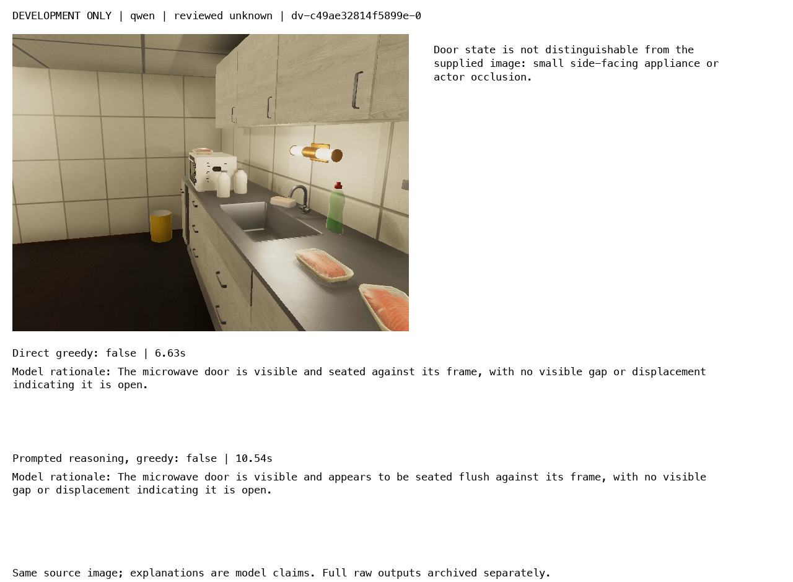

# Qwen and Cosmos prompted reasoning comparison

Status: development comparison running. This document records the frozen method; measured tables and acceptance decisions will be filled after both model selections and the untouched test run complete.

## System under test

The experiment compares four arms within each existing 8B checkpoint: direct versus prompted step-by-step reasoning, crossed with greedy versus sampled decoding. Qwen uses the accepted community MLX 8-bit Instruct conversion; Cosmos uses the local 8-bit group-64 conversion of the pinned official Reason2 8B checkpoint. This is not a Qwen Thinking checkpoint experiment and does not change the native FP32 embedding pipeline.

Each request receives exactly one original approved RGB frame. The host validates its identity, timestamp horizon, size, and hash; starts an isolated worker; and enforces a 120-second deadline. The worker applies a frozen generation profile, records actual processed image tensors, and returns complete raw output. The host extracts the declared final-answer object and applies existing visibility and F1 citation validation before binding long request/entity identifiers.

The reasoning explanation is a generated claim. Its existence or fluency is not used as evidence of correctness. The final answer and its brief visible-evidence rationale are evaluated separately.

## Profiles and pilot findings

All new arms have a 4096-token maximum. Qwen sampled arms use temperature 0.7, top-p 0.8, top-k 20, repetition penalty 1.0, and presence penalty 1.5; seeds are 3407–3409. Cosmos sampled arms use temperature 0.6, top-p 0.95, top-k 20, repetition penalty 1.0, and presence penalty 0.0; seeds are 1234–1236. Greedy arms run once per case with explicit neutral penalties. MLX's recent-4096-input/generated-token penalty scope is recorded as a local approximation, not vLLM parity.

The initial eight-call pilot found that Qwen omitted the requested think delimiters. Those outputs remain rejected and archived. A separate pilot established literal reasoning tags for Qwen, while Cosmos retains think tags. All eight revised calls passed output validation in approximately 7–12 seconds, but one sampled Cosmos answer incorrectly called the reviewed closed door open. Passing the output contract does not establish factual accuracy.

Qwen keeps the original no-system-turn policy. All new Cosmos arms use the documented minimal helpful-assistant system message and media-first ordering. Therefore, the new direct greedy control is the comparison reference; the historical no-system Cosmos score is not a matched prompt-effect control.

## Frozen visual population

There are 48 reviewed frames from eight episodes excluded from earlier verifier populations. Development has 15 closed, 3 open, and 6 unknown cases. Test has 18 closed, 4 open, and 2 unknown cases. RGB review refined sampling around visible opening intervals before the freeze. The remaining episodes did not provide the planned balanced label mix.

These are assistant-reviewed synthetic cases, not an independent human benchmark. Episodes are separate across splits, but apartments, objects, action families, and nearby opening frames are correlated. Only two unknown test cases limit abstention conclusions. Original frames and contact sheets are preserved under `various/reasoning-v3/`; annotations are never sent to a model.

Both model protocols, prompts, pins, profiles, frame hashes, and runtime code hashes were frozen in the same protocol before development inference. The runner refuses test mode until both development selections exist. It validates frozen code hashes at startup, saves each bounded call immediately, and can resume completed calls with identity checks without rerunning their generation.

## Selection and metrics

The development sweep has 384 calls: 24 cases × eight runs per model × two models. For each sampled arm, score each case over three seeds first; then average cases. Select by correctness minus unsupported known answers on unknown cases, with both indicators averaged over the full case population. Break ties by unsupported rate and latency. Retain direct greedy if no arm improves its development score.

Test evaluates each selected arm and its direct greedy control; if the selected arm is already the control, run it once. Report exact call counts and per-case averages, seed range, episode summaries, known-state accuracy, unknown recall, unsupported certainty, execution/output failures, tokens, latency, and peak MLX allocation. Median and p95 latency include cold process/model setup; MLX allocation is not total system memory.

The rationale audit is a deliberately limited diagnostic sample: the first reviewed closed test frame, first open test frame, and every unknown test frame, for every tested arm and seed. Its supported/mixed/unsupported classifications require reading the final rationale against the original image. Do not extrapolate this sample's support rate to all responses or treat agreement between rationale and answer as factual support.

## Evidence and reproduction

- Scripts 21–23: original/revised development pilots, frame extraction, and frozen labels/profiles.
- Script 24: sequential bounded development and test execution with shared test gate.
- Script 25: complete raw JSONL archive, per-case metrics, and annotated test panels.
- Script 26: one selected-profile live RULES handoff per model after test completion.
- Shared runtime: `verifiers/profiles.py`, `visibility.py`, `worker.py`, `adapter.py`, and `rules/handoff.py`.
- Implementation commits: `4608902` (shared boundary) and `5aa10eb` (pilots and protocol freeze).
- Validation: 48 focused tests at initial feature completion; 23 reasoning-profile tests after the pilot-driven delimiter adjustment.

## Development diagnostic: explanation can repeat the visibility error

The first completed Qwen greedy pair scored 18/24 in both direct and reasoning modes. Each got all 18 known-state labels correct and answered all six unknown labels with definite states. In the side-facing microwave example below, the reasoning response described a visible seated door even though the review rubric judged its state-bearing surface insufficiently inspectable. The additional explanation did not establish new visual evidence. These are development observations; sampled-arm selection and test results remain pending.

## Input forwarding and the meaning of the recorded grid

The experimental worker calls `mlx_vlm.utils.prepare_inputs` once and records the returned tensor shapes. It then supplies `input_ids`, `pixel_values`, the attention mask under the generation API's `mask` name, and the remaining processor metadata directly to generation. The installed dispatch path recognizes supplied input IDs and skips its own preparation step. This avoids a second resize pass and makes the saved grid describe the actual submitted tensors.

The pilot frame produced an image grid `[1, 30, 40]` and pixel-value shape `[1200, 1536]`, with reconstructed spatial dimensions 480×640 from the processor's patch size. The grid is a preprocessing record, not a bounding box or evidence of target visibility. A correctly forwarded image can still contain too few inspectable target pixels, as the unknown microwave case demonstrates.

The runtime comparison is sequential, using a fresh isolated process for every request. Reported wall time includes process and model setup. Model families are not interleaved, so temperature/load conditions and execution order may influence timing; latency figures describe these runs rather than isolated engine performance.
