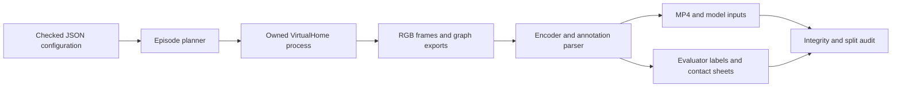

# VirtualHome household corpus design and generation report

The corpus generator turns household action programs into RGB videos, raw simulator exports, and explicitly qualified training labels. The initial configuration produces 24 episodes in one apartment: fridge and microwave routines, each with normal closure, omitted closure, and reopening before departure. Four initialization/camera groups provide 12 training, six development, and six test episodes. Generation and validation are complete: 4,261 frames, 426.1 seconds of video, and zero failed episodes.

## Architecture and data flow



`configs/virtualhome-household-v1.json` is the experiment definition. `src/virtualhome_corpus/core.py` contains pure planning, graph binding, program construction, action parsing, and endpoint-rule functions. `runner.py` owns the filesystem lifecycle, Unity communication, image inspection, FFmpeg encoding, manifest creation, and corpus validation. `tests/test_virtualhome_corpus.py` exercises boundaries that could silently corrupt labels or splits. The operational commands are in `docs/playbook/virtualhome-corpus.md`; installed-runtime details are in `docs/playbook/virtualhome-video-generation.md`.

## Scenario semantics

Every episode starts from scene 0, inserts one male character, and selects the target appliance and neighboring appliance from the kitchen graph. It opens the target and walks to the neighbor to let the open state persist. Normal episodes return and close the target. Omission episodes leave it open. Reopening episodes close it, open it again, then walk to the neighbor. All variants end by walking to the living room. The appliances are never switched on.

```text
for initialization_group in configuration.groups:
    for family in [fridge, microwave]:
        for variant in [closed, omitted, reopened]:
            reset_scene()
            insert_actor_at_recorded_group_position()
            bind_objects_from_current_graph()
            add_fixed_camera(group.camera_offset)
            execute_and_record(build_program(family, variant))
            assert final_target_state_matches_variant
            assert actor_inside_destination_room
            validate_frames_and_graphs()
            encode_mp4_and_export_weak_labels()
```

Grouping prevents related counterfactual variants from crossing splits. A recorded actor position is reused within a group, but initial orientation and complete render determinism are not guaranteed. All groups share the same apartment and character. Consequently the split measures within-scene performance only, with very limited diversity.

## Runtime API references

The installed AIST checkout is `output/virtualhome-install/virtualhome-aist` at revision `122d3b0aee04768d988e02929f6eeeb38f2f28a8`. The implementation uses `simulation.unity_simulator.UnityCommunication(port=..., timeout_wait=180)`. `reset(scene_index)` and `add_character(resource, position=...)` return booleans; `environment_graph()`, `camera_count()`, and `add_camera(position, rotation)` return success/result pairs. `render_script()` accepts programs such as `<char0> [Open] <fridge> (308)` with current graph object IDs, recording options, an absolute output directory, and a fixed camera index. `<char0>` is the actor ordinal, not the graph node ID.

The graph contains nodes with `id`, `class_name`, `states`, `properties`, and transforms, plus relational edges such as INSIDE. IDs are rebound after every reset. FFmpeg reads sequential PNG frames at 10 FPS and emits H.264/yuv420p MP4; ffprobe checks dimensions, frame count, duration, and rate. Pillow loads every source image and creates inspection sheets. No new simulator installation is required.

## Labels and limits

The exported Unity action file may contain inserted WALK actions and repeated program indices. The parser preserves those rows and their original numeric endpoints. Since the endpoint convention is unresolved, derived intervals discard two frames at both ends and are marked weak program supervision. Empty interiors are excluded. The guard is a conservative heuristic, not a calibrated temporal error bound.

Per-frame graphs are retained as simulator exports, not certified visual labels. Pilot open-close graphs failed to expose a visibly plausible intermediate OPEN state, and other pilot states changed ahead of action intervals. Dense visual-state supervision and precise boundary supervision are therefore explicitly disabled. The final rule verdict checks actual final graph state and destination membership. It establishes endpoint world truth, not the exact moment of departure or pixel visibility.

`inputs.jsonl` exposes only opaque episode IDs, group/split, video paths, and hashes. `labels.jsonl` contains family, variant, annotation path, and endpoint truth for evaluators. Four retrieval queries point to weak OPEN/CLOSE interiors. Avoid feeding contact sheets, action programs, or label-bearing manifests to an embedding model.

## Reliability and inspection

Each run freezes configuration, installation metadata, and exporter source hashes in `corpus.json`. Changed provenance requires a new output directory. A filesystem lock excludes another writer to the same corpus; the explicit port is an operator ownership assertion, not a cross-process simulator lock. Each attempt has its own directory and persisted started/complete/failed manifest. Successful resume verifies completed episodes before skipping them. Failures retain raw evidence.

Validation checks continuity and RGB/graph pairing, image decoding and dimensions, graph JSON, video checksum, encoded metadata, raw-action/annotation agreement, endpoint truth, full planned completion, and exact duplicate videos across splits. This does not measure perceptual near-duplicates or model generalization. Inspect contact sheets and videos before using the labels for a new objective.

## Validation at the implementation milestone

Ten unit tests passed. The full simulator smoke produced 183 frames and an 18.3-second video in 25.809 seconds. The inspected sheet shows the fridge open during the detour and closed at the end; final graph validation confirms the actor reached the living room. Full-corpus results will be appended after rendering.

## Consuming the corpus

Start with coarse retrieval: read only the desired split from `inputs.jsonl`, decode the MP4 frames, and compute embeddings without loading labels. Persist features by episode ID, frame index, and presentation timestamp. Only the evaluation stage joins against `labels.jsonl` and `retrieval-queries.json`. This separation prevents programs, variant names, or final simulator states from entering model inference.

```python
# Pseudocode: decoder and encoder are deliberately downstream choices.
inputs = read_jsonl(root / "inputs.jsonl")
for episode in inputs:
    if episode["split"] != desired_split:
        continue
    for frame_index, rgb in decode_video(root / episode["video"]):
        features.write(episode["episode_id"], frame_index,
                       frame_index * 100_000, encoder(rgb))

# Evaluation is a separate pass, after inference has completed.
for query in read_json(root / "retrieval-queries.json"):
    candidates = rank_features(query["query"], desired_split)
    evaluate_weak_interval_retrieval(candidates, query["relevant_interiors"])
```

A half-open interior `[start_frame, end_frame_exclusive)` includes its first frame and excludes its last numeric endpoint. At 10 FPS, frame 52 has presentation time 5.2 seconds. These are MP4 presentation times, not wall-clock render times. Train/development/test selection must be applied to both candidates and relevant intervals; training on all query relevance entries would leak held-out labels.

Episode-level normal-versus-violation classification is an easy pipeline sanity check but is vulnerable to shortcuts: variants differ in duration and action count, and final door state often determines the result. Do not interpret high accuracy as proof of temporal reasoning. Reopened variants provide an initial challenge for systems that remember only that a close action happened; a meaningful temporal benchmark still needs matched-duration distractors and independent homes.

## Source-level API navigation

The installed communication implementation is `output/virtualhome-install/virtualhome-aist/simulation/unity_simulator/comm_unity.py`: character insertion at line 121, fixed camera insertion at 175, reset at 214, camera count at 231, graph retrieval at 291, and recording at 332. These are references to the recorded checkout, not promises about another VirtualHome version. The project package imports this class through `simulation.unity_simulator`.

The generator depends on Python 3.11, Pillow for image validation, the installed VirtualHome communication dependencies, and FFmpeg/ffprobe on PATH. Actual versions are recorded in `../various/corpus-runtime-versions.json`. The existing environment was installed without pip; `importlib.metadata` was used to inventory it without changing the environment.

## Final generation results

The completed run is at `output/virtualhome-corpus/home-v1`. Open `gallery.html` there for local playback and contact sheets. All 24 episodes succeeded on the first attempt: 12 fridge and 12 microwave episodes; eight normal, eight omission, and eight reopening cases. The partition is 12 training / 6 development / 6 test. The videos contain 4,261 frames at 10 FPS (426.1 seconds, or 7 minutes 6.1 seconds) and 640x480 resolution.

The run spent 600.735 seconds in per-episode generation/export. MP4s total 7,661,124 bytes; all raw frames, graph exports, and inspection artifacts occupy approximately 2.5 GB. Generated assets stay in the ignored output directory. The [tracked inventory](../various/corpus-result-inventory.json) records all episode paths, video hashes, counts, endpoint verdicts, and producer hashes. [Runtime versions](../various/corpus-runtime-versions.json), [validation results](../various/corpus-validation.json), and [visual review](../various/corpus-visual-review.json) preserve the supporting evidence.

Deep validation loaded every source image and graph, checked media metadata and hashes, and verified action exports. All MP4s decoded completely without errors. The independent audit matched plans, provenance, input/label indices, final graph verdicts, and world-state rows. Resume produced no render events, left manifest hashes and modification times unchanged, and created no additional attempt directories. There are eight PASS and sixteen VIOLATION endpoint verdicts.

Sampled contact sheets for all 24 episodes were inspected. The camera keeps both appliances in view; sampled normal endpoints appear closed, and omission/reopening endpoints appear open. The actor can briefly occlude the microwave during manipulation. This review does not certify all frames or exact boundaries; dense visual-state and precise-boundary supervision remain disabled. Each original manifest retains `visual_review: pending` from generation; the later scoped review is recorded separately in the linked review file rather than rewriting provenance.

The owned simulator was stopped after validation. Follow the playbook to launch a new owned instance before another generation/resume command. Pure validation and the gallery do not require a running simulator.
