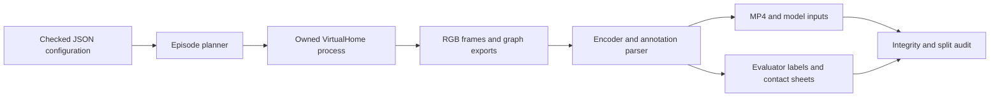

# VirtualHome household corpus design and generation report

The corpus generator turns household action programs into RGB videos, raw simulator exports, and explicitly qualified training labels. The initial configuration produces 24 episodes in one apartment: fridge and microwave routines, each with normal closure, omitted closure, and reopening before departure. Four initialization/camera groups provide 12 training, six development, and six test episodes. Full generation and final validation are pending at this implementation milestone.

## Architecture and data flow



`configs/virtualhome-household-v1.json` is the experiment definition. `src/virtualhome_corpus/core.py` contains pure planning, graph binding, program construction, action parsing, and endpoint-rule functions. `runner.py` owns the filesystem lifecycle, Unity communication, image inspection, FFmpeg encoding, manifest creation, and corpus validation. `tests/test_virtualhome_corpus.py` exercises boundaries that could silently corrupt labels or splits. The operational commands are in `docs/playbook/virtualhome-corpus.md`; installed-runtime details are in `docs/playbook/virtualhome-video-generation.md`.

## Scenario semantics

Every episode starts from scene 0, inserts one male character, and selects the target appliance and neighboring appliance from the kitchen graph. It opens the target and walks to the neighbor to let the open state persist. Normal episodes return and close the target. Omission episodes leave it open. Reopening episodes close it, open it again, then walk to the neighbor. All variants end by walking to the living room. The appliances are never switched on.

```text
for initialization_group in configuration.groups:
    for family in [fridge, microwave]:
        for variant in [closed, omitted, reopened]:
            reset_scene()
            insert_actor_at_recorded_group_position()
            bind_objects_from_current_graph()
            add_fixed_camera(group.camera_offset)
            execute_and_record(build_program(family, variant))
            assert final_target_state_matches_variant
            assert actor_inside_destination_room
            validate_frames_and_graphs()
            encode_mp4_and_export_weak_labels()
```

Grouping prevents related counterfactual variants from crossing splits. A recorded actor position is reused within a group, but initial orientation and complete render determinism are not guaranteed. All groups share the same apartment and character. Consequently the split measures within-scene performance only, with very limited diversity.

## Runtime API references

The installed AIST checkout is `output/virtualhome-install/virtualhome-aist` at revision `122d3b0aee04768d988e02929f6eeeb38f2f28a8`. The implementation uses `simulation.unity_simulator.UnityCommunication(port=..., timeout_wait=180)`. `reset(scene_index)` and `add_character(resource, position=...)` return booleans; `environment_graph()`, `camera_count()`, and `add_camera(position, rotation)` return success/result pairs. `render_script()` accepts programs such as `<char0> [Open] <fridge> (308)` with current graph object IDs, recording options, an absolute output directory, and a fixed camera index. `<char0>` is the actor ordinal, not the graph node ID.

The graph contains nodes with `id`, `class_name`, `states`, `properties`, and transforms, plus relational edges such as INSIDE. IDs are rebound after every reset. FFmpeg reads sequential PNG frames at 10 FPS and emits H.264/yuv420p MP4; ffprobe checks dimensions, frame count, duration, and rate. Pillow loads every source image and creates inspection sheets. No new simulator installation is required.

## Labels and limits

The exported Unity action file may contain inserted WALK actions and repeated program indices. The parser preserves those rows and their original numeric endpoints. Since the endpoint convention is unresolved, derived intervals discard two frames at both ends and are marked weak program supervision. Empty interiors are excluded. The guard is a conservative heuristic, not a calibrated temporal error bound.

Per-frame graphs are retained as simulator exports, not certified visual labels. Pilot open-close graphs failed to expose a visibly plausible intermediate OPEN state, and other pilot states changed ahead of action intervals. Dense visual-state supervision and precise boundary supervision are therefore explicitly disabled. The final rule verdict checks actual final graph state and destination membership. It establishes endpoint world truth, not the exact moment of departure or pixel visibility.

`inputs.jsonl` exposes only opaque episode IDs, group/split, video paths, and hashes. `labels.jsonl` contains family, variant, annotation path, and endpoint truth for evaluators. Four retrieval queries point to weak OPEN/CLOSE interiors. Avoid feeding contact sheets, action programs, or label-bearing manifests to an embedding model.

## Reliability and inspection

Each run freezes configuration, installation metadata, and exporter source hashes in `corpus.json`. Changed provenance requires a new output directory. A filesystem lock excludes another writer to the same corpus; the explicit port is an operator ownership assertion, not a cross-process simulator lock. Each attempt has its own directory and persisted started/complete/failed manifest. Successful resume verifies completed episodes before skipping them. Failures retain raw evidence.

Validation checks continuity and RGB/graph pairing, image decoding and dimensions, graph JSON, video checksum, encoded metadata, raw-action/annotation agreement, endpoint truth, full planned completion, and exact duplicate videos across splits. This does not measure perceptual near-duplicates or model generalization. Inspect contact sheets and videos before using the labels for a new objective.

## Validation at the implementation milestone

Ten unit tests passed. The full simulator smoke produced 183 frames and an 18.3-second video in 25.809 seconds. The inspected sheet shows the fridge open during the detour and closed at the end; final graph validation confirms the actor reached the living room. Full-corpus results will be appended after rendering.
