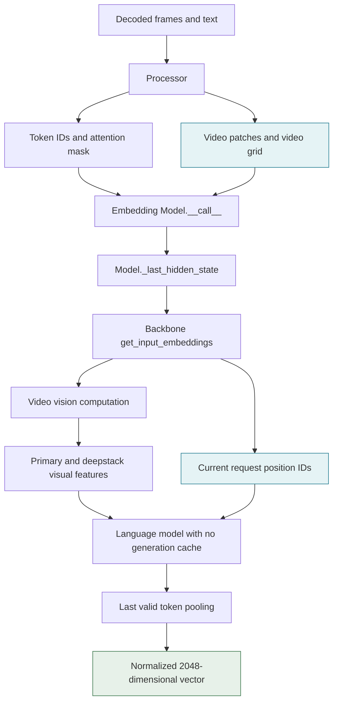
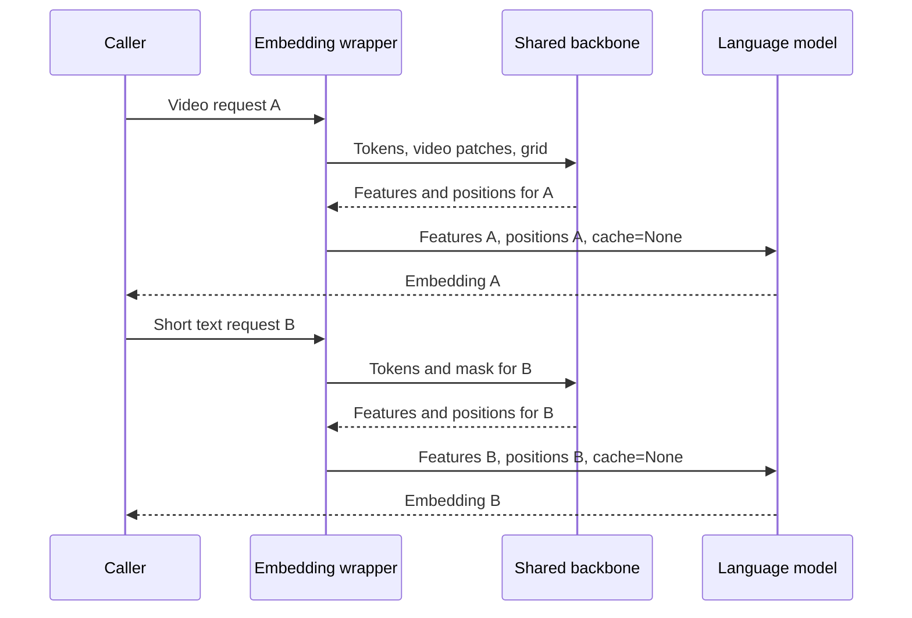
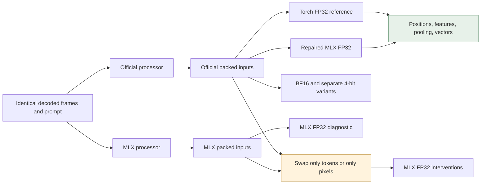
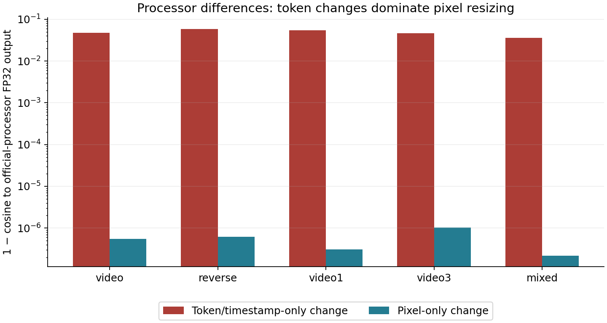
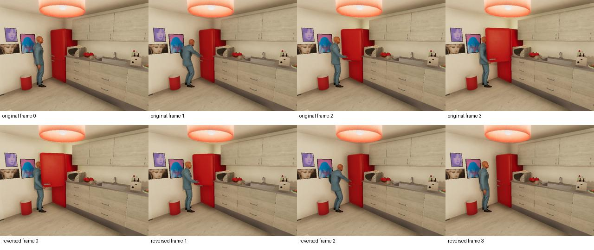
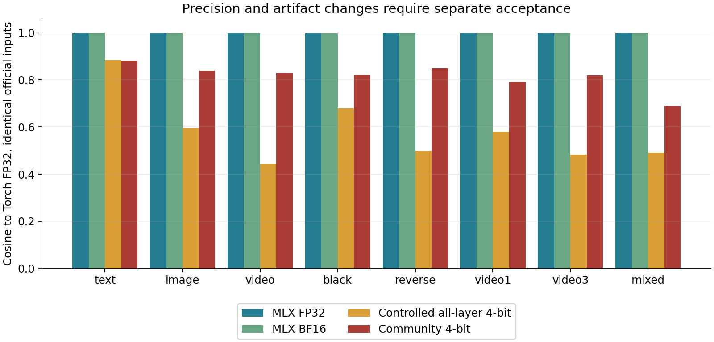
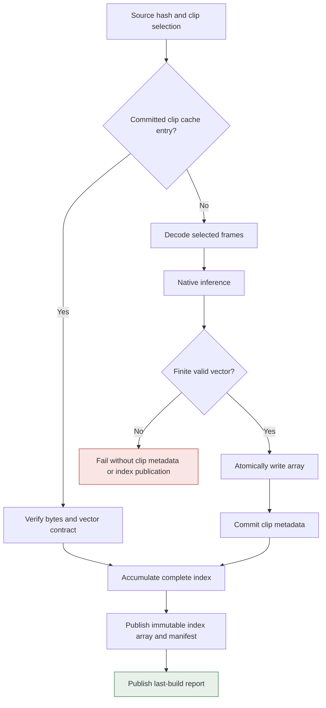

# Native Video Embeddings in MLX: Repairing Pixel Forwarding and Establishing Reference Parity

A video embedding can have the expected dimension, contain only finite values, and still contain no information computed from the video pixels. That was the failure in the Qwen3-VL embedding wrapper examined in this project. The public interface accepted a video tensor, but an internal call omitted it. The remaining token sequence and video metadata were sufficient for the language model to produce a normalized vector, so a shape-based smoke test could report success while the vision encoder was never called.

Repairing that omission exposed a second defect: independent embedding requests reused positional state from earlier requests. A text query could therefore change depending on whether the same model instance had previously encoded a video. Establishing correctness required more than forwarding one argument. The investigation separated input routing, request isolation, processor behavior, positional indices, intermediate visual features, pooling, numerical precision, and application cache identity.

The result is a three-commit repair on `wesen/mlx-vlm`, an eight-case official-reference comparison, and an explicit native-video mode in the local video workbench. The accepted application configuration uses official Qwen weights, FP32 computation, and pinned official preprocessing. The existing pooled-image baseline remains available in its original environment. The four-bit variants were measured separately and were not accepted for native rollout. No pull request or issue was created; the repair branch was pushed to the user's fork for personal review.

> [!summary]
> The repaired wrapper forwards video pixels through the video-specific path and uses positions computed for the current request. All eight FP32 reference cases pass exact positional checks and strict intermediate/vector tolerances. Processor token formatting and quantization introduce separate, measured differences. Native application features therefore have their own runtime, timestamp policy, source identity, and clip cache.

This article continues [[ARTICLE - Timestamped Video Search - From Verified Pixels to Frozen Evaluation]]. That earlier implementation deliberately used frame pooling because native-video behavior was not trustworthy. The earlier note remains a record of that configuration; the repair described here creates a separate option rather than changing the interpretation of previously cached vectors. Corpus provenance is covered in [[ARTICLE - VirtualHome on Apple Silicon - Simulator Setup and Audited Video Corpus]] and [[ARTICLE - VirtualHome Corpus Expansion - Scenario Diversity Provenance and Visual Labels]].

## 1. Specify what an embedding request must preserve

An embedding is the result of a complete computation, not a property of a checkpoint name alone. For this system, the computation begins with decoded RGB frames and text, constructs model-specific tokens and visual patches, assigns positions, runs the vision and language networks, selects one hidden state, and normalizes it. Every stage can change the output while leaving its shape unchanged.

Let $V$ denote decoded video frames, $T$ the textual content and instruction, and $P$ the preprocessing function. The processor produces token IDs $I$, an attention mask $A$, video patches $X_v$, and a video grid $G_v$, with corresponding image fields when images are present. A useful description of the resulting embedding is:

$$
z = \operatorname{normalize}\left(\operatorname{pool}\left(L_\theta(I,A,R,\Phi_\theta(X_v,G_v))\right)\right).
$$

Here $\Phi_\theta$ represents the visual computation, $R$ the positional indices derived for this request, and $L_\theta$ the language computation after visual feature insertion. This expression omits implementation details such as deepstack features, but it identifies the dependencies that the tests must preserve. If $X_v$ disappears before $\Phi_\theta$ is called, the program can still evaluate another expression involving $I$ and $A$ and return a plausible-looking vector.

The local contract therefore includes several independent requirements. Video pixels must reach the vision computation. Their grids must describe the same patches. Positions must belong to the current request. Pooling must select the final valid token under the supplied padding mask. Stored vectors must identify the exact computation that produced them. Returning 2,048 numbers satisfies only the output-dimension requirement.

| Input or result | Role in this implementation | Failure that can remain shape-valid |
|---|---|---|
| `input_ids` | Text, modality markers, timestamp text, visual placeholder tokens | Different timestamp or boundary tokens alter the output. |
| `attention_mask` | Valid token locations in the padded sequence | Pooling selects a padding location or an invalid request. |
| `pixel_values_videos` | Packed video patches | Pixels are omitted while tokens continue through the language model. |
| `video_grid_thw` | Temporal and spatial patch dimensions | Metadata reaches the model without its matching pixels. |
| `position_ids` | Current token positions, including multimodal axes | A previous request supplies a stale prefix. |
| Deepstack visual features | Additional vision outputs inserted during language computation | A partial adapter forwards only the primary visual representation. |
| Pooled normalized vector | One vector representing the request | A finite unit vector conceals failures in earlier stages. |

The upstream patch is deliberately limited to the embedding wrapper and synthetic tests. Processor discrepancies and application migration are handled as separate questions because changing all of them together would make the cause of an output difference difficult to establish.

## 2. Follow the actual data path

The shared Qwen3-VL backbone already had separate image and video paths. The missing implementation was in the embedding-specific wrapper above it. The public embedding call invokes `_last_hidden_state`, which obtains input embeddings and auxiliary features from `get_input_embeddings`, runs the language model, and returns hidden states for pooling.



Before the repair, the public method accepted arbitrary keyword arguments. That matters because a call containing `pixel_values_videos` did not necessarily fail at the Python boundary. The parameter could be accepted into `**kwargs` and then ignored when constructing the next call. The helper's own signature did not expose the video-pixel parameter, so the omission occurred at two related boundaries.

The downstream backbone received information sufficient to construct a token-based computation but did not receive the tensor required to execute the video vision branch. This explains why the failure was silent for the controlled fixture. It does not imply that every possible malformed video request would succeed: other shapes, token arrangements, or runtime paths could fail earlier or later.

The repaired signatures explicitly include the video tensor after the pre-existing grid parameters. Preserving that order avoids changing the meaning of earlier positional arguments. The forwarding is explicit at both boundaries:

```python
# Simplified from the repaired wrapper; unrelated arguments omitted.
def __call__(self, input_ids, attention_mask=None,
             pixel_values=None, image_grid_thw=None,
             video_grid_thw=None, pixel_values_videos=None, **kwargs):
    hidden = self._last_hidden_state(
        input_ids,
        attention_mask=attention_mask,
        pixel_values=pixel_values,
        image_grid_thw=image_grid_thw,
        video_grid_thw=video_grid_thw,
        pixel_values_videos=pixel_values_videos,
    )
    return normalize(last_non_padding_token(hidden, attention_mask))
```

The helper then forwards `pixel_values_videos` to the corresponding backbone argument. It does not pass the video tensor through `pixel_values`. The backbone's distinction between image and video arguments is part of the model interface, so relabeling the tensor would require a separate compatibility argument that this repair does not make.

Before forwarding, the helper checks each modality's pixel/grid pair. Supplying pixels without a grid, or a grid without pixels, raises an error. This converts an ambiguous partial visual request into an explicit boundary failure. It also makes a test failure easier to interpret: a missing modality tensor is detected before the program returns a token-only embedding.

## 3. Prove the omission with a controlled pixel intervention

A useful reproduction must distinguish visual computation from changes in text or metadata. Comparing two unrelated videos would not isolate the missing tensor because their frame counts, timestamps, grids, and token sequences might also differ. The first real-model test instead froze those non-pixel inputs and replaced the original video patches with an all-black intervention.

The fixture came from development episode `ep-368d6331fc690a2c`, using four selected frames at 2.0, 2.4, 2.8, and 3.2 seconds. The historical processor output had a video patch tensor of shape `[640, 1536]`, a grid `[2, 16, 20]`, and 196 input tokens. The grid's temporal dimension is two because the model groups frames into temporal patches. The patch vector width includes the flattened temporal, spatial, and channel content expected by the vision encoder.

Two kinds of evidence were collected. Structural tests placed sentinel tensors at the public and helper boundaries and checked which arguments reached the next call. The real-model test instrumented vision-tower calls and compared output vectors after explicit materialization. The sentinel tests explain where the argument disappears; the real-model test demonstrates the consequence for actual inference.

| Measurement on the historical fixed fixture | Before forwarding | After forwarding |
|---|---:|---:|
| Vision-tower calls per video request | 0 | 1 |
| Original/black maximum coordinate difference | 0 | 0.08496094 |
| Original/black cosine | Approximately 1 | 0.518210 |
| Output dimensions | `[1, 2048]` | `[1, 2048]` |

The unchanged dimensions are central to the diagnosis. The output-shape check succeeded in both versions, while the vision-call count and pixel intervention distinguished them. A normalized output is not additional evidence that the vision path ran: normalization can be applied to a token-only result just as easily as to a visual result.

The cosine calculation divided by the actual measured norms. This avoids treating a raw dot product as exact cosine when the model's output normalization is performed in reduced precision. The historical BF16 output norm was close to one rather than exactly one. That numerical detail did not alter the exact-zero before-repair difference, but it matters when reporting nonzero similarity values accurately.

The first two commits preserve this causal sequence. `05432ac` contains the failing regressions. `d26804d` forwards video pixels and adds paired-input checks. Keeping those commits separate makes it possible to inspect the reproduction without inferring it from the final implementation.

## 4. Make each embedding request independent

A persistent encoder instance should produce the same embedding for a request regardless of which independent request preceded it. This is distinct from deterministic repetition of the same request shape. Repeating one four-frame video can pass while a later short text request uses state created by the video.

The forwarding-only wrapper still managed positional state associated with generation. It could reuse a cached positional prefix instead of the positions that the backbone had just computed for the current embedding input. In a structural regression, the current request should have used positions 0 and 1, but the wrapper used stale values 40 and 41. The real mixed-order probe also showed substantial output drift: one text query differed from its fresh-instance reference by as much as 0.35791016 per coordinate.

The repair uses the current backbone result directly:

```python
features = self.get_input_embeddings(...)
position_ids = features.position_ids

hidden_states = language_model.model(
    input_ids,
    inputs_embeds=features.inputs_embeds,
    mask=model_mask,
    cache=None,
    position_ids=position_ids,
    visual_pos_masks=features.visual_pos_masks,
    deepstack_visual_embeds=features.deepstack_visual_embeds,
)
```

This change removes redundant positional computation from the embedding wrapper. It leaves generation behavior in the shared language model intact. The embedding call explicitly uses no generation cache and supplies the positions belonging to its own features. The primary and deepstack visual inputs remain connected to the same request.



The real request-order test compared eleven mixed-order requests with separately constructed fresh model instances. It included text, image, multiple video lengths, and mixed image/video input. After the positional repair, every measured same-runtime maximum absolute difference was zero. The fresh resume audit also reran the targeted synthetic tests, and the application smoke later checked text, single-frame, and odd-frame requests after video against the accepted reference vectors.

The important invariant is ownership of positional data by the current request. A workaround that resets one private field only for video would leave other request orders unproven. Using the position output that already accompanies the current input features expresses the invariant at the point where the language computation is invoked.

## 5. Pool a valid token under either padding direction

The embedding head selects a single hidden state and normalizes it. For a padded sequence, the final array position is not necessarily the final valid token. Right padding makes that distinction immediate; left padding changes where valid tokens begin and must also remain consistent with individual-request inference.

For a binary mask $A$ of sequence length $S$, the selected token index is the last index with a nonzero mask. The implementation reverses the mask, finds the first valid location from the right, and converts that location back into the original sequence coordinates. It validates that the mask shape matches the hidden-state batch and sequence dimensions and that every row contains at least one valid token.

```python
# The mask contract is a binary padding mask.
if attention_mask.shape != hidden_states.shape[:2]:
    raise ValueError("attention_mask must match batch and sequence dimensions")
if any(row_has_no_valid_tokens(attention_mask)):
    raise ValueError("each embedding input must contain at least one valid token")

from_right = argmax(attention_mask[:, ::-1], axis=1)
positions = attention_mask.shape[1] - from_right - 1
pooled = hidden_states[arange(batch_size), positions]
```

The all-padding check prevents `argmax` from silently choosing an arbitrary location when no valid token exists. Normalizing that arbitrary hidden state would otherwise produce a numerically acceptable result for an invalid request. Tests cover both padding directions, mask validation, actual tiny-model batch-versus-individual text agreement, and video-related request isolation.

The workbench adapter itself processes one request at a time. Wrapper-level text batching tests should not be read as an acceptance claim for every possible mixed multimodal batch arrangement. That distinction keeps the tested model contract separate from the narrower application interface.

## 6. Separate backend parity from processor parity

The first parity scripts compared the repaired MLX model with a PyTorch reference using identical packed inputs. That is necessary for testing the model implementation, but it leaves preprocessing outside the comparison. If both backends receive the same unusual token sequence, they can agree perfectly without establishing that two independent application pipelines construct equivalent inputs.

The resumed investigation audited those scripts before accepting their reports. Two methodological problems were found. The model script enumerated `*-inputs.npz`, while the processor script later wrote additional Hugging Face files ending in the same suffix. A later four-bit run consequently included twelve cases while the earlier FP32 report contained six. The per-case timer also included extra diagnostic vision passes after the embedding call. Those durations were not isolated embedding latency.

The new audit uses explicit case names and input families. It prepares official and MLX processor inputs in separate processes because MLX model registration can replace processor lookup behavior. It runs Torch FP32, MLX FP32, MLX BF16, controlled four-bit quantization, and the community four-bit artifact serially. It records timestamps, source commit, runtime versions, tensor hashes, and measurement boundaries. The earlier reports are preserved as partial historical evidence rather than rewritten to appear complete.

The official model is `Qwen/Qwen3-VL-Embedding-2B` at revision `9f2f7e710d6d81056aa5c0a4f04764fec6bb7bda`. The unquantized MLX comparison loads those same official weights through the strict MLX loader, sanitizes the layout, and casts the materialized model to FP32. This is a controlled in-memory conversion; no unrelated unquantized MLX checkpoint is substituted. Weight and configuration hashes are archived alongside the fixture hash.

There are eight named cases: text, image, video, black video, reversed video, single-frame video, three-frame video, and mixed image/video. These cases exercise different model paths without pretending to form a retrieval benchmark. The reference computation gathers the last valid token from the official model output and normalizes it in FP32.



The central comparison is Torch FP32 versus repaired MLX FP32 on official packed inputs. Independent processor comparisons and precision comparisons branch from that controlled case. This organization assigns each difference to a specific experimental question instead of combining every change into one final cosine value.

## 7. Explain the processor differences with interventions

Independent preprocessing differed in both token construction and pixel values. The installed official Transformers processor retained outer video vision delimiters from the checkpoint template while adding timestamped internal visual groups. The MLX processor replaced the wrapped video marker and removed those outer delimiters. For the direct-processor four-frame case, official processing produced 197 tokens and MLX processing produced 195.

The difference can be seen without displaying hundreds of repeated video placeholders:

```text
Official, simplified:
<vision_start>
<0.2 seconds><vision_start>[video group 0]<vision_end>
<1.0 seconds><vision_start>[video group 1]<vision_end>
<vision_end>

MLX, simplified:
<0.2 seconds><vision_start>[video group 0]<vision_end>
<1.0 seconds><vision_start>[video group 1]<vision_end>
```

These strings describe the measured Transformers 5.16.1 and MLX processor behavior with the pinned checkpoint template. They are not a claim about every release of either library, nor a general recommendation to add or remove delimiters. The integration chooses one audited contract and records it explicitly. A future processor correction or upgrade creates a new validation and feature-identity question.

Pixel values also differed by up to approximately `0.0078433` after normalization, consistent with one 8-bit resampling step under the configured normalization. The code paths use PIL and Torchvision bicubic operations. Because the resize kernels are different implementations, exact pixel equality is not assumed merely because both are called bicubic.

To determine which difference mattered more, the audit constructed two hybrid inputs. The pixel-only intervention retained official tokens, masks, and grids while replacing only the pixel arrays with MLX-processed pixels. The token-only intervention retained MLX tokens and masks while using official pixel arrays. Both were evaluated with the same repaired FP32 model and compared with its official-input output.

| Case | Token-only cosine to official output | Pixel-only cosine to official output |
|---|---:|---:|
| Four-frame video | 0.952632 | 0.99999945 |
| Black video | 0.875407 | 1.00000000 |
| Reversed video | 0.941468 | 0.99999938 |
| Single-frame policy | 0.945169 | 0.99999969 |
| Three-frame policy | 0.953707 | 0.99999898 |
| Mixed image/video | 0.963681 | 0.99999978 |



*The plotted quantity is one minus cosine on a logarithmic axis. The token intervention includes the measured boundary-token and timestamp differences; the pixel intervention changes only packed pixel values. Values are computed directly from the archived audit, not estimated from the image.*

The token intervention causes much larger output changes on these fixtures. This supports a precise explanation for the end-to-end discrepancy: different prompt expansion and timestamp text dominate the small resize-kernel differences. It does not justify discarding resize provenance, because another input distribution or model could respond differently. Both remain part of the feature-space contract.

### Single and odd frame counts need an explicit temporal policy

The official processor rejected a one-frame input with `ValueError: t:1 must be larger than temporal_factor:2`. The audit made temporal padding explicit before either processor: repeat the final frame when the count is odd, and preserve the repeated frame's timestamp. A one-frame observation at time zero becomes two identical frames both at time zero; the three-frame input at 0.0, 0.4, and 0.8 seconds gains a duplicate at 0.8 seconds.

That policy changes the timestamp of the final temporal group. Averaging the three-frame input's last real frame and its duplicate gives 0.8 seconds. Treating the duplicate as a new regular-grid observation would instead advance its time, producing a different timestamp string. MLX's regular-grid formula and the explicit official metadata differed on this point.

The application preserves actual selected presentation timestamps rather than reconstructing time from the requested sampling FPS. It expresses relative microsecond PTS as integer ticks with metadata FPS equal to one million and disables processor sampling. Under the pinned processor's calculation, dividing a tick value by this rate yields the exact relative time in seconds. `frames_indices` in that adapter metadata is therefore a timestamp-tick representation, not the original decoded frame number. The field usage is intentional and documented because a reader could otherwise mistake it for a decode-index mapping.

For example, selected source PTS of 2.000, 2.350, and 2.800 seconds in a clip beginning at 2.000 seconds become ticks `[0, 350000, 800000]`. Odd-frame padding produces `[0, 350000, 800000, 800000]`. This preserves variable frame rate and avoids inventing a later observation. The original decoded indices and raw PTS still remain in the index's source-evidence metadata.

## 8. Inspect intermediate results before accepting the final vector

A final embedding comparison reports the aggregate effect of every earlier computation. Intermediate comparisons make a failed result actionable. The audit exports positional IDs, primary visual features, each of the three deepstack feature arrays, the pooled hidden state, and the normalized embedding. Shape equality is checked before elementwise numerical comparison.

Positions are discrete indices and are required to match exactly. Text-only output may omit a redundant modality axis, so the comparison permits broadcasting that axis before checking equality. It does not permit a numerical positional tolerance. Visual and pooled activations are unnormalized values whose scale differs from the final unit vector, so they use a separate absolute-error bound.

All eight FP32 cases pass the following policy:

| Component | Acceptance condition | Largest observed discrepancy |
|---|---|---:|
| Positions | Exact equality after redundant text-axis broadcasting | 0 |
| Every exported visual/deepstack/pooled tensor | Equal shape and maximum absolute error at most 0.01 | 0.000860214 |
| Normalized embedding | Maximum coordinate error at most 0.0001 | 0.00000283123 |
| Normalized embedding | Cosine at least 0.99999 | Minimum 0.999999999741 |

These tolerances express implementation parity under the controlled inputs. They allow floating-point reduction-order differences while remaining far tighter than the measured preprocessing or four-bit changes. The intermediate threshold has deliberately more absolute allowance than the unit-vector threshold because those activations are not normalized to a common scale. Every exported intermediate is checked; a successful final cosine cannot conceal an intermediate shape mismatch.

The policy is a regression policy for the enumerated development fixtures. It is not a universal mathematical error bound for arbitrary sequence lengths, hardware, model versions, or inputs. Its rationale and measured margins are stored together so a future maintainer can decide whether a new discrepancy reflects ordinary accumulation, a changed input contract, or a real implementation regression.

The official-input original/black cosine is 0.429234 in repaired MLX FP32, and original/reversed cosine is 0.969836. These differ from the earlier 0.518210 forwarding smoke because the earlier measurement used the community checkpoint and MLX preparation. Comparing those values as if only the patch had changed would mix different experimental conditions.



*Top row: the four selected original frames. Bottom row: the same frames in reverse order. The sequence visibly changes the actor and door configuration, so reversal is not identical at the pixel level.*

The contact sheet shows an opening sequence, while the diagnostic text query says closing. That mismatch is retained explicitly. The experiment establishes sensitivity to visual content and order and agreement with the reference implementation. It does not establish that the model correctly labels the action or distinguishes opening from closing in general. A semantic evaluation needs appropriate labels and a separate protocol.

## 9. Measure precision and checkpoint changes independently

Reducing precision is a separate change to the function producing the embedding. Even if the architecture and input arrays stay fixed, weight rounding and activation arithmetic can alter both vector direction and ranking. The audit therefore runs BF16, a controlled affine four-bit conversion, and the existing community four-bit checkpoint separately from the FP32 acceptance test.

The controlled four-bit experiment begins with the same official model used for FP32 and quantizes all eligible layers with group size 64 and four bits. This is an explicit conversion policy. It is not claimed to reproduce the community conversion procedure, which may treat layers differently. The community artifact also has distinct tokenizer/configuration files; its full identity is hashed separately. Differences from that artifact cannot all be assigned to quantization alone.

| Runtime or artifact | Minimum embedding cosine to Torch FP32 across eight cases | Maximum coordinate error |
|---|---:|---:|
| Repaired MLX FP32 | 0.999999999741 | 0.00000283123 |
| Same-source MLX BF16 | 0.998436 | 0.017016 |
| Controlled all-eligible-layer four-bit | 0.443686 | 0.228689 |
| Community four-bit artifact | 0.689270 | 0.277270 |



*Each bar compares an embedding with Torch FP32 on the same official packed input. The controlled four-bit policy and community checkpoint are different treatments, so their relative bar heights do not establish which conversion method is generally better.*

A small ranking diagnostic makes the practical consequence visible. The query was “A person closing the fridge door.” The seven candidates were the image, original video, black video, reversed video, single-frame policy, three-frame policy, and mixed image/video input. Torch FP32, MLX FP32, and BF16 gave the same candidate order. The two four-bit variants changed that order.

```text
Torch FP32 / MLX FP32 / BF16:
video, video3, reverse, mixed, video1, image, black

Controlled all-layer four-bit:
reverse, image, video, video3, mixed, black, video1

Community four-bit:
video3, reverse, video, image, mixed, video1, black
```

For the FP32 query, original video scored about 0.595902 and reversed video about 0.580056. Those scores are close enough that changes in vector direction can affect their order. A global norm or dimension check cannot reveal that consequence. Conversely, one unchanged ranking would not prove numerical interchangeability when scores and candidate margins differ on other requests.

The decision is conservative and narrow: the initial native application mode uses FP32; neither four-bit variant is accepted for rollout. BF16 was measured and preserved as an exploratory result rather than silently selected because its small ranking happened to match. A future quantized native configuration needs its own conversion policy, reference comparisons, retrieval protocol, and feature identity.

## 10. Integrate native video as a different feature space

The original workbench represents a window by normalizing individual frame embeddings, averaging them, and normalizing the average. Native video instead processes a sequence of frames jointly through video patching, temporal metadata, visual computation, and language pooling. The two computations are different even when they use related checkpoints and both return 2,048 values.

For frame embeddings $e_i$, the baseline window representation is approximately:

$$
z_{\mathrm{pooled}} = \operatorname{normalize}\left(\frac{1}{N}\sum_i\operatorname{normalize}(e_i)\right).
$$

The native representation is computed from the whole sampled sequence and its temporal metadata. It cannot be reconstructed from the stored unit frame vectors because the model's joint video computation occurs before the final pooling operation. Reusing a baseline frame cache for native video would therefore substitute a different computation, not merely reuse equivalent work.

The application adds `NativeVideoEmbedder` and `build_native` in separate modules. CLI `index`, `search`, and `serve` commands accept `--mode native_video`; their default remains `pooled_images`. Native indexing defaults to `output/video-workbench-native`, while pooled indexing retains `output/video-workbench`. This makes both runtime choice and output selection explicit.

Startup verifies the repaired wrapper's source SHA-256, the complete audited official artifact identity, and pinned runtime versions. It constructs the official processor before loading the MLX model because model registration can alter automatic processor mappings. It also rejects substituted MLX processor classes. The model is materialized in FP32 before serving requests, and quantized configurations are outside the accepted native contract.

The feature identity is a digest of a structured specification. It includes the source identity of the adapter itself, the Python source tree of the loaded MLX package, model and processor artifact hashes, runtime versions, instruction, image resizing, final-token pooling, normalization, dimension, and temporal policy. Source hashes matter because the earlier audit used a repaired checkout through `PYTHONPATH` while installed distribution metadata still reported `mlx-vlm==0.6.17`. After installing that checkout editable, its actual distribution version was `0.7.0rc0`. Version metadata alone did not identify the code being imported.

| Identity input | Why it belongs in the native feature specification |
|---|---|
| Official model/tokenizer/configuration hashes | A checkpoint label does not prove which bytes were loaded. |
| Repaired wrapper hash | Startup must not silently load the known broken wrapper. |
| MLX package source digest | Editable or locally changed runtime code can alter results. |
| Native adapter source digest | Prompt construction, tensor conversion and normalization are executable behavior. |
| Processor/runtime versions | Token expansion and numerical kernels are version-dependent. |
| Temporal policy | Actual PTS and duplicate-frame timestamps affect the token sequence. |
| Pooling and normalization policy | The stored vector depends on which hidden state is selected and how it is scaled. |

This identity is intentionally stricter than a human-readable model name. A harmless source edit may create a new native namespace because the adapter source is hashed. That can reduce cache reuse, but it makes changed code distinguishable during this initial validation phase. Future compatibility rules should be explicit and tested rather than inferred from equal vector dimensions.

The package configuration separates `pooled-images` and `native-video` into mutually exclusive extras. The former pins the original `mlx-vlm==0.6.17`; the latter pins the fork commit and its audited runtime. The lockfile represents both alternatives, while the environments remain separate. The baseline environment at `workbench/.venv` was not synced or replaced. Native work uses `output/mlx-video-fix/.venv`.

## 11. Publish only validated clip results

Native indexing retains the existing workbench's source and timestamp discipline. Each episode's video bytes are checked against the registered SHA-256. Windows are half-open intervals. Sampling selects the first decoded PTS at or after each requested sampling-grid point within the interval, deduplicating selected observations. The complete sampled frames and their actual timestamps are passed to the native encoder.

The native cache stores one vector per clip under `clips/SPACE_ID`, separate from the baseline's `frames/SPACE_ID`. A clip key includes the feature space, source hash, interval, selected PTS, raw PTS and time-base metadata. Even two windows from the same video are distinct if they represent different sampled evidence or temporal origins.

The cache writer first requires inference to return a finite, correctly shaped vector that can be normalized. It writes the array atomically, then commits the corresponding metadata row. A file left by an interrupted write without an authoritative row is not treated as a committed cache hit. Existing entries are checked for byte integrity, shape, dtype, finiteness and unit normalization before reuse.

```python
# Simplified ordering from native indexing.
for clip in selected_clips:
    key = digest({"space": encoder.space.id, **clip.metadata})
    vector = clip_cache.get(key)
    if vector is None:
        frames = decode_selected(clip.source, clip.indices)
        vector = encoder.video(frames, clip.pts_us, clip.start_us)
        vector = clip_cache.put(key, vector)  # validates before metadata commit
    output_vectors.append(vector)

publish_array_and_manifest(output_vectors, complete_specification)
publish_latest_build_report()
```

A failed later clip may leave earlier successfully committed clip vectors available for reuse. It must not publish a complete index manifest or latest-build pointer for the failed build. The tests distinguish these levels of publication: valid partial cache work is reusable; a successful full-index announcement requires the complete build.



A query encoder supplies its feature-space ID when loading and searching an index. Loading a pooled manifest with the native encoder, or a native manifest with the pooled encoder, raises an incompatible-space error. No native failure falls back to pooled images. This preserves the meaning of previously indexed data and makes rollback a selection of the old configuration rather than an implicit change within the new one.

The development integration test encoded nine two-second clips at two FPS from one episode into a separate smoke directory. The next build reused all nine vectors and produced the same index identity. The parent registry was opened with SQLite `mode=ro`, and no corpus ingestion or concurrent perception/state files were modified by this work. The final native space ID begins `2610572d944a`; the complete identity and manifest are archived with the report evidence.

The real adapter also checked its output against the P3 arrays. The four-frame video, single-frame policy, and three-frame policy matched exactly. A text query after video differed by only `2.98e-8` after the workbench's additional FP32 normalization. These checks connect the isolated parity experiment to the actual application entry point.

## 12. Measure materialized work and state the timing boundary

MLX uses lazy evaluation, so recording time around an expression without forcing its result can measure graph construction rather than completed inference. The audit calls `mx.eval` on the returned embedding and relevant output tensors before stopping the timer. Conversion to NumPy also occurs within the measured call. Additional standalone vision-feature diagnostics run afterward and are excluded from embedding latency.

Each backend report records model load/materialization, a first call for each shape, and three repeated warm calls. The first video call in the model audit follows text and image, so it is not the first inference in a fresh model process. The later adapter smoke specifically starts with video in a fresh process and includes preprocessing, providing a separate cold-first-inference measurement. Neither experiment clears filesystem caches.

| Backend | Load/materialization, s | First video shape, s | Warm video median, s | MLX peak, decimal GB | RSS high-water, decimal GB |
|---|---:|---:|---:|---:|---:|
| Torch CPU FP32 | 5.435 | 1.175 | 1.185 | — | 13.153 |
| MLX FP32 | 4.197 | 0.356 | 0.201 | 9.545 | 5.019 |
| MLX BF16 | 2.996 | 0.196 | 0.196 | 5.655 | 4.799 |
| Controlled four-bit | 2.894 | 0.217 | 0.215 | 2.397 | 4.810 |
| Community four-bit | 2.478 | 0.219 | 0.215 | 3.182 | 2.350 |

The memory columns measure different things. MLX reports allocator peak memory; process RSS is an operating-system high-water measurement. Both are process-wide and include diagnostic work outside the timed embedding call. They must not be interpreted as per-request incremental allocations or added together to estimate a single memory total.

The two fresh-process adapter runs varied substantially. The first measured 5.435 seconds to construct and materialize the adapter, 0.324 seconds for first video inference including preprocessing, and 0.207–0.209 seconds warm. The final source-gated run measured 6.562 seconds load, 2.578 seconds first inference, and 0.318–0.371 seconds warm. Its MLX peak was 9.539 GB and RSS high-water 4.842 GB, including the development subset build.

Both observations are retained. The machine was shared with concurrent work, and no isolated performance guarantee or causal attribution of the variance is made. Repeating until a favorable value appeared would weaken the report. A deployment decision can use these measurements to identify the relevant costs, then run a separate controlled benchmark for the intended hardware, clip sizes, process concurrency and memory budget.

The native adapter currently rejects clips with more than 32 selected frames. That is an explicit resource limit, not an experimentally chosen semantic optimum. Users can reduce sampling FPS or window duration to remain within it. The accepted parity fixtures contain at most four original frames, and the development smoke also uses short windows; larger operational workloads require additional measurement.

## 13. Reproduce and review the delivered implementation

The source workspace is `/Users/manuel/code/wesen/2026-09-06--vision`. The isolated MLX checkout is `output/mlx-video-fix/mlx-vlm`; its branch is `fix/qwen3-vl-video-embeddings`. The official model directory is `output/mlx-video-fix/models/official`. Ticket scripts and evidence are under `ttmp/2026/09/06/MLX-VIDEO-FIX-001--repair-native-video-pixel-forwarding-in-the-mlx-embedding-wrapper`.

The repair commits are intentionally small and ordered:

| Fork commit | Purpose |
|---|---|
| `05432ac` | Add failing video-forwarding regressions. |
| `d26804d` | Forward video pixels and validate paired modality inputs. |
| `6452614` | Use current-request positions and validate pooling masks. |

The fork was freshly checked against upstream: main remained at `d5064772dcd1e31704604f93a873323505ae70d5`, and the user's fork branch resolved to `6452614f6de04694d1e34fd13abaca11f6ffb994`. A final push reported everything up to date. The portable three-patch package was replayed onto an isolated worktree at the base; its resulting tree matched the repaired head. A final test selection on that replayed tree passed 34 tests, with 426 deselected and four subtests passing.

The targeted native/index/embedding/registry/API workbench selection passed 16 tests in both the existing baseline interpreter and the isolated native interpreter. Dependency consistency checking reported all 73 installed native-environment packages compatible. These are focused checks of the changed functionality and nearby contracts, not a claim that every unrelated subsystem in the workspace was retested.

The complete P3 reproduction runs ticket script `09-parity-audit.py` in this order: `prepare-hf`, `prepare-mlx`, `torch`, `mlx`, `bf16`, `quant`, `community`, and `compare`. Script `10-parity-gates.py` evaluates the explicit policy and writes ranking, intervention, and performance evidence. Script `11-native-integration-smoke.py` performs the fresh-process adapter/reference and development-cache checks. Earlier scripts 05 and 06 preserve the pixel-loss and request-order experiments; 07 and 08 remain archived partial parity evidence.

For an already prepared native environment, the application commands are:

```sh
output/mlx-video-fix/.venv/bin/video-workbench index \
  --mode native_video --splits development --seconds 2 --fps 2

output/mlx-video-fix/.venv/bin/video-workbench search \
  --mode native_video 'A person closing the fridge door.' \
  --manifest output/video-workbench-native/indices/INDEX_ID/manifest.json \
  --split development
```

The default native model path must contain the exact audited official artifacts. A fresh native environment installs `workbench/native-video-requirements.txt` and the `native-video` workbench extra. The baseline installation uses the `pooled-images` extra. Do not combine them into one environment: the two runtime pins intentionally conflict.

Rollback selects the existing baseline interpreter, explicit `--mode pooled_images`, and an existing pooled manifest. The old model artifacts, frame vectors and application adapter remain available. No conversion of existing cached vectors is attempted because their computation is different.

## 14. What this project establishes, and what remains to study

The strongest conclusion is that the repaired embedding wrapper implements the tested official FP32 computation on the controlled fixtures and that the application can use that computation with explicit source, temporal and storage contracts. The missing video argument and stale positional state are demonstrated defects with focused regressions. The native adapter is connected to the same accepted input policy, and its outputs and publication behavior were exercised with real development media.

The evidence does not establish a native-video retrieval advantage over the pooled-image baseline. It does not establish reliable action-direction recognition, generalized multimodal batching, interchangeable preprocessing across library versions, or an accepted four-bit production configuration. Each of those questions requires its own experiments. Preserving those boundaries is part of the delivery because downstream users may otherwise interpret “native video works” as a much broader quality claim.

The next semantic experiment should compare native and pooled representations on the same frozen candidate intervals, queries and relevance definitions. It should preserve actual sampled evidence and evaluate temporal direction with labels that match the visible clips. A precision experiment should define which layers are quantized and compare numerical drift and retrieval behavior under that fixed conversion policy. A processor upgrade should independently check token construction, timestamp policy, packed pixels and final vectors before assigning compatibility with any existing feature space.

The engineering method transfers directly to other model wrappers. First verify that required tensors survive every adapter boundary. Then test independent requests against fresh instances across modality and shape changes. Compare backends on identical packed inputs before changing processors or precision. Inspect intermediate values when a final vector differs. Finally, name and store the complete computation in the feature identity so an application cannot silently combine incompatible results.

## Evidence and related reading

The report's figures and selected machine-readable evidence are copied into the vault's colocated `_assets` directory. They remain available without the source workspace:

- [Acceptance policy](_assets/mlx-video-fix-audit-policy.json) explains the numerical bounds and measurement-only quantization status.
- [Layer and preprocessing comparisons](_assets/mlx-video-fix-audit-comparison.json) contains each case, precision and token/pixel intervention.
- [Gate, ranking and performance results](_assets/mlx-video-fix-audit-gates.json) records the eight FP32 decisions and the small candidate-ranking probe.
- [Model and fixture provenance](_assets/mlx-video-fix-audit-provenance.json) records artifact SHA-256 values.
- [Final native integration measurement](_assets/mlx-video-fix-native-integration.json) records the source-space identity, nine-clip build/reuse, query hits and final timing run.
- [First native integration measurement](_assets/mlx-video-fix-native-integration-first.json) preserves the earlier timing observation.

The [official model page](https://huggingface.co/Qwen/Qwen3-VL-Embedding-2B) describes the model and supported modalities; the [official implementation repository](https://github.com/QwenLM/Qwen3-VL-Embedding) supplies reference usage context. The claims about this repair are supported by local source inspection and the archived experiments, rather than by those general capability descriptions. The [fork branch](https://github.com/wesen/mlx-vlm/tree/fix/qwen3-vl-video-embeddings) contains the three source/test commits for personal review. No issue, PR, comment or review request was submitted.
