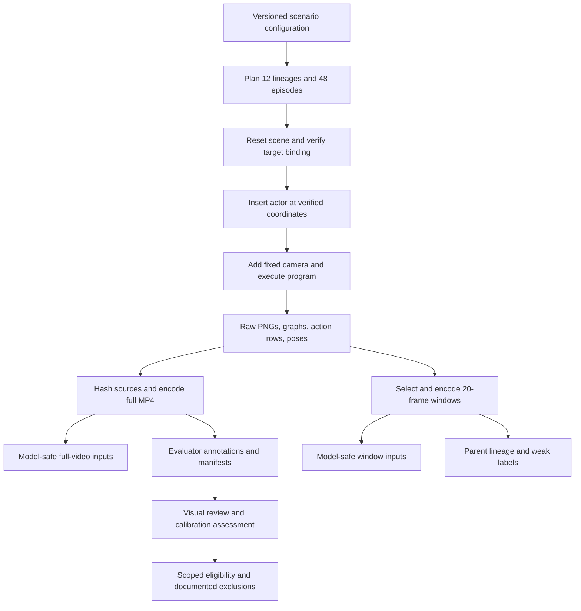

# Diverse household video release: implementation and evidence

The completed release contains 48 full VirtualHome trajectories and 48 derived two-second windows. The trajectories cross three apartments, four interaction families, two conditions, and two fixed views. The release broadens the original appliance-only corpus into kitchens, living rooms, and bedrooms, with different props and supported interactions. It is a development corpus with weak labels and explicit visual limitations, not a fully adjudicated benchmark.

The original 24 videos and their model-input manifest were rehashed after generation and remain unchanged. The work does not depend on the MLX repair. The dedicated Unity process used for generation was stopped after the recordings completed.

## Release contents and experimental unit

| Measure | Result |
|---|---:|
| Full trajectories | 48 |
| Source RGB/graph pairs | 3,682 |
| Full-video duration | 368.2 seconds |
| Fixed-duration windows | 48 × 2.0 seconds |
| Recording dimensions | 640 × 480, 10 FPS |
| Train / development / test | 16 / 16 / 16 |
| Interaction / approach-only | 24 / 24 |
| Final release attempts | 48 complete; one earlier failed attempt retained |
| Corpus unit tests | 18 passed |
| Archived evidence images | 50, with SHA-256 inventory |

The experimental unit is a scenario lineage: one apartment, target binding, and configured actor start. Four recordings belong to each lineage: interaction-left, interaction-right, control-left, and control-right. All four remain in the same partition. The two-second derivatives inherit that ownership; they are not independent samples for splitting or significance calculations.

| Family | Train: apartment 0 | Development: apartment 1 | Test: apartment 2 |
|---|---|---|---|
| Open/close | Fridge 308 | Fridge 155 | Microwave 174 |
| Pick up/return | Mug 454 | Book 332 | Plate 67 |
| Sit | Sofa 375 | Sofa 301 | Bed 296 |
| Switch | TV 433 | TV 313 | Table lamp 268 |

This design puts each action family in every partition. It avoids assigning one action exclusively to one apartment, but it does not fully disentangle action, object identity, layout, and room. One apartment per partition provides only a small scene-held-out evaluation, and the single Male1 actor does not test actor generalization. Repeated views are related observations, not independent households.

## System structure

The implementation uses the existing pinned AIST simulator and exporter helpers. New modules handle the diverse configuration, release ownership, review artifacts, and derivative clips. The original `core.py` and `runner.py` were not modified, preserving the v1 producer files.



`src/virtualhome_corpus/diversity.py` defines target binding, camera construction, action programs, and planning. Binding checks an exact object ID, expected class, required affordance, and a unique containing room. Pickup additionally requires an explicit support surface. Scene IDs and object IDs are meaningful only within the pinned scene inventory; they are not portable object identifiers across simulator releases.

`src/virtualhome_corpus/diversity_runner.py` owns attempts. A root filesystem lock excludes another generator for the same release. An existing output configuration must exactly match the requested configuration. Each episode points to a numbered attempt, and an exception persists a failed manifest before stopping. A completed attempt retains the program, initial and final graphs, actual transforms, camera parameters, seed, installation metadata, source hashes, action annotations, and encoded media.

The installation is the AIST checkout at `122d3b0aee04768d988e02929f6eeeb38f2f28a8`, with the recorded `Door_Modified_Build_2023_0404` release. The local client is `output/virtualhome-install/virtualhome-aist/simulation/unity_simulator/comm_unity.py`. Its observed API calls are:

| API | Role in this release |
|---|---|
| `UnityCommunication(port, timeout_wait)` | Address the explicitly owned local simulator with bounded requests |
| `reset(scene_index)` | Load the selected apartment |
| `environment_graph()` | Obtain object IDs, properties, transforms, states, and relations |
| `add_character(asset, position=...)` | Reuse a verified world-space starting position |
| `camera_count()` / `add_camera(...)` | Allocate a fixed camera for one recording |
| `camera_image(...)` | Capture actual probe evidence from both views |
| `render_script(..., recording=True, out_graph=True, per_frame=1)` | Execute and record the complete action program |

A request timeout does not cancel a running simulator action. Two probe sequences stalled while Unity continued exporting frames. The investigation stopped the owned client and simulator instead of issuing more resets into an uncertain execution state. The release runner similarly stops at the first exception.

## Supported programs and observed exclusions

The accepted door program walks to the appliance, looks toward it, opens, looks, closes, and looks again. The pickup program uses GRAB followed by PUTOBJBACK; the tested explicit PUTBACK-to-desk sequence failed. The posture program terminates with SIT. The switching program toggles the device and then returns it to its graph-reported initial state. Approach-only controls walk and look without the target manipulation.

The tests establish planner invariants and failure handling, but simulator execution determines which compositions are usable. LOOKAT after grabbing or while seated produced failures in tested sequences. An extended seated sequence stalled. Some advertised chairs and cabinets could not be approached. A scene-1 lamp replacement rejected the observation command. All failures remain in the diary and probe JSON; the final configuration uses successfully recorded replacements.

Visual acceptance is distinct from execution acceptance. A fridge obscured an otherwise executable light switch and chair, so those bindings were replaced. The final cameras still contain realistic and simulator-specific limitations: small props, actor occlusion, an edge-on television view, and a brief near-camera actor clipping artifact in one development control. The signed window assessment records these limits individually.

## Placement validation and producer history

The first 40 recordings completed before the exporter encountered a false assumption: it required the starting room to equal the target room. Apartment 2 contains two bedrooms. Its successful bed probe starts at `[1.98290539, 1.25, 1.5227592]` in room 358 and walks to bed 296 in room 253. The failed release attempt reproduced the requested position to floating-point precision, so it was a legitimate cross-room scenario.

The corrected `placement_room` check requires one actual room and less than 0.25 m horizontal displacement from the requested coordinates. It records initial and target room IDs separately. It does not relocate the actor or change the frozen configuration. The failed attempt is retained, and the remaining eight videos were generated successfully.

Consequently, the release contains two exporter hashes: 40 recordings from the initial implementation and eight from the placement-check correction. Every manifest records its exact producer. The final audit reports this distribution rather than claiming all videos used identical code. Configuration and installation metadata each have one variant across the release.

## Why fixed-duration windows were added

Full interaction programs take longer than controls. Their mean durations are 10.175 and 5.167 seconds respectively. A classifier using only duration, with its threshold fitted on training data, achieves:

| Split | Duration-only accuracy |
|---|---:|
| Train | 16/16, 100% |
| Development | 16/16, 100% |
| Test | 12/16, 75% |

The selected threshold is 5.7 seconds. These results demonstrate a nuisance feature, not visual understanding. `src/virtualhome_corpus/diversity_windows.py` therefore provides an additional representation in which every clip contains exactly 20 original frames at 10 FPS. There is no padding, looped video, synthetic hold, or variable frame rate.

```python
# Implementation outline; raw rows remain weak supervision.
if condition == "approach_only":
    start = source_frame_count - 20
elif family == "posture":
    start = sit_action.raw_end - 20
else:
    start = midpoint(first_target_action.raw_start,
                     first_target_action.raw_end) - 10
start = clamp(start, 0, source_frame_count - 20)
verify_original_frame_hashes(start, start + 20)
encode_original_pngs(start, count=20, fps=10)
copy_parent_split_and_lineage()
```

The terminal SIT interval was selected because its exported action can contain substantial preparation before the visible seating motion. Controls use their final two seconds. These choices are program-conditioned sampling, so the clips still have selection, pose, actor-presence, and context biases. Equal duration removes one shortcut; it does not establish an unbiased benchmark. A duration-only constant/majority prediction obtains 50% in each balanced window partition.

## Calibration results: pixels are not graph state

All six appliance trajectories were inspected across their complete OPEN/CLOSE action intervals and neighboring frames. Native-resolution composites preserve the selected old/new state evidence. The assessment is single-assistant review with no independent human adjudication.

| Apartment / view | Opening bracket, frames | Closing bracket, frames |
|---|---:|---:|
| 0 / left | 38–44 | 60–67 |
| 0 / right | 38–44 | 62–68 |
| 1 / left | 52–56 | 75–82 |
| 1 / right | 55–62 | 76–84 |
| 2 / left | Unknown: occluded | No confirmed closure |
| 2 / right | 40–48 | No confirmed closure |

These nine brackets are conservative reviewed state-change ranges, not exact action boundaries. Divide frame indices by 10 for seconds. They apply only to the specific video hashes in [the signed assessment](../various/calibration-assessment-v1.json).

Every reviewed graph stream retains CLOSED for the appliance throughout, including frames where the fridge is visibly open. There is no intermediate graph transition from which to estimate an RGB/graph timing offset. The microwave additionally remains visibly open after its exported CLOSE action in the reviewed frames. Simulator execution success therefore does not establish visible closure.

The release leaves precise boundary supervision and dense visual-state supervision disabled. Microwave CLOSE must be excluded from visually confirmed closing evaluation. The left microwave opening cannot receive a reliable visual boundary from its occluded view. Other families retain weak program labels and separate sampled visibility assessments; no dense lamp, holding, or seated-state annotation is claimed.

## Validation and evidence boundaries

All 48 full videos and 48 window videos passed decoding and media checks. Source validation covers video hashes, frame continuity, paired graph files, dimensions, FPS, counts, durations, raw RGB/graph hashes, annotation hashes, and correspondence to raw action rows. Model-input records contain only opaque ID, split/group, video path, and video hash. Evaluator labels, reviewed state evidence, programs, and gallery captions remain separate.

No lineage/group ownership violation or exact video duplication crossed partitions. The full-video perceptual diagnostic compares 64-bit difference hashes at five trajectory fractions. Its nearest cross-split pair has mean Hamming distance 18/64. This diagnostic does not prove the absence of every perceptual duplicate, and it is not a learned similarity metric.

The final audit also verifies parent/window split consistency and rehashes all 24 original v1 videos. Do not combine v1 evaluation with v2 training and call that unseen-apartment testing: v1 is entirely apartment 0. A combined release requires a new global partition policy without modifying either original release.

## Files, commands, and report material

The operational instructions are in `docs/playbook/virtualhome-diversity.md`. The key commands are:

```sh
PYTHONPATH=src output/virtualhome-install/.venv/bin/python \
  -m virtualhome_corpus.diversity_runner validate
PYTHONPATH=src output/virtualhome-install/.venv/bin/python \
  -m virtualhome_corpus.diversity_review
PYTHONPATH=src output/virtualhome-install/.venv/bin/python \
  -m virtualhome_corpus.diversity_windows
```

The full inputs are `output/virtualhome-corpus/diversity-v2/inputs.jsonl`; fixed-window inputs are `output/virtualhome-corpus/diversity-v2/windows-v1/inputs.jsonl`. Paths in each manifest are relative to that manifest's directory. Parent programs, graphs, labels, and review galleries are evaluator material and should not be supplied to the model.

The ticket retains [the release audit](../various/release-audit.json), [window visual assessment](../various/window-visual-assessment-v1.json), [calibration source inventory](../various/calibration-source-inventory.json), [screenshot inventory](../various/screenshots/index.json), and [review dashboard](../various/release-gallery.html). The screenshot archive includes failed probes, accepted replacements, full transition strips, native state evidence, every window's sampled frames, and actual browser captures. The detailed diary records commands, failures, decisions, and commit milestones.

Useful report figures are the [test-apartment browser capture](../various/screenshots/release-test-apartment-browser.png), [microwave calibration browser capture](../various/screenshots/release-calibration-browser.png), and [initial failed-probe gallery](../various/screenshots/probe-gallery-browser.png). These document both the increased variety and the limitations discovered while producing it.

For the next model experiment, keep the fixed-window and full-trajectory results separate, report per-family and per-view outcomes, and consult the signed visual exclusions. The corpus now supports broader pipeline and action-discrimination experiments, while its evidence prevents those experiments from silently treating execution metadata as visual truth.
