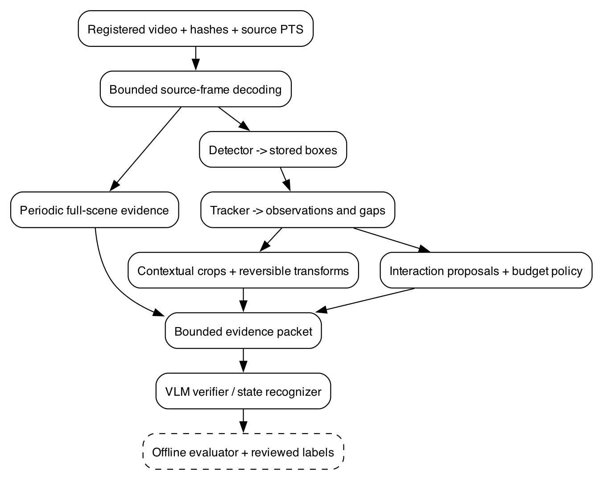

# Object detection, tracking, and evidence selection for video-language inference

## 1. Purpose and reading order

This project adds a conventional computer-vision pipeline to the procedural-video workbench. It detects objects, associates detections through time, constructs traceable image crops, and proposes intervals worth inspecting with a vision-language model (VLM). Its primary research question is whether these operations improve recognition of household interactions while reducing expensive inference. Improved speed alone is insufficient if the selector removes the moment that establishes an action.

This is an implementation design, not a claim that detection or tracking has been built or benchmarked. Repository observations below were checked on 2026-09-06 at base commit `de014ed`; other agents may subsequently change the embedding runtime and corpus. This ticket adds documentation only. All new Python modules, commands, schemas, thresholds, and endpoint paths described below are proposed unless explicitly identified as existing.

Read Sections 2–5 before writing code. Implement the pure geometry and provenance contracts before loading a detector. Use Sections 6–10 to build the pipeline, Sections 11–13 to run controlled experiments, and Sections 14–16 to review decisions and locate sources. The first useful deliverable is an inspectable object-detection baseline over registered videos, including misses and unsupported classes.

The initial scope includes boxes, short-lived object identities, contextual crops, event proposals, a review interface, and a bounded VLM evidence adapter. Pixel masks, pose estimation, detector fine-tuning, and open-vocabulary detection are follow-on experiments. Temporal action segmentation remains the responsibility of VIDEO-TEMPORAL-001; visible state classification belongs to VIDEO-STATE-001; answer generation belongs to COSMOS-VERIFY-001. This project supplies evidence to those components.

## 2. Concepts and failure semantics

An object detector maps a frame to class scores and rectangular regions. A classifier assigns a category to an input region. Instance segmentation assigns a pixel mask to each object instance. Tracking associates observations across frames; it does not prove that an identity remains correct through an occlusion. Temporal segmentation divides a sequence into labeled action intervals. These are distinct prediction problems, with different supervision and metrics.

A bounding box is an estimated image extent. A track is a sequence of associations. An event proposal is a request for closer inspection. None establishes that a person grasped a cup or that an appliance changed state. A refrigerator box may remain essentially constant through opening and closing. A person near a cup may look at it without touching it. A switch may be too small to resolve even if its room is correctly recognized.

Use separate statuses for the following conditions:

- **Observed detection:** the detector emitted a box on this frame.
- **Predicted track location:** the tracker extrapolated from previous observations.
- **No accepted detection:** the detector ran, but no output survived the declared policy.
- **Not processed:** the frame was not scheduled or could not be decoded.
- **Unsupported category:** the model vocabulary cannot express the requested category.
- **Unknown state:** available visual evidence does not establish the property.

Do not collapse these into a Boolean absence label. Predicted locations can help request a wider crop, but cannot count as observed object evidence. Retain the exact producer configuration so later evaluation can distinguish model limitations from filtering policy.

## 3. Existing architecture and integration boundaries

The workbench already has the correct foundation for source identity and time. `media.py:11` implements `probe`, which decodes presentation timestamps (PTS), retains raw PTS and time base, and normalizes the first displayed frame to time zero. `selected_indices` at line 52 selects the first frame at or after each sampling-grid point. `decode_selected` at line 69 returns Pillow images indexed by source frame ordinal. Its current implementation accumulates selected images in memory; use bounded chunks for long videos and preserve global frame indices across chunks.

`registry.py:19` implements a SQLite registry. `Registry._ingest` at line 62 accepts exactly five model-safe manifest fields: episode ID, split, split group, video path, and video SHA-256. It checks source hashes, rejects path escapes, and prevents identical videos or shared groups from crossing partitions. Do not add simulator labels, action names, or object IDs to this manifest. Read evaluator labels in a separate evaluation process.

`embedding.py:33` defines a content-derived `FeatureSpace`; `QwenEmbedder.image` at line 125 converts to RGB and resizes to 320×240. The inspected implementation exposes pooled image features and explicitly rejects its native-video method. The separate MLX repair may change that capability: query a validated runtime manifest at implementation time. Detection work should not depend on an unverified video path. An embedding produces a vector; it is not the generative verifier described in COSMOS-VERIFY-001.

`index.py:120` hashes source identity, timestamps, and feature-space identity to form a full-frame cache key. That key contains no crop coordinates. Therefore a crop must receive a new evidence key and a declared representation identity; otherwise two different crops at the same timestamp could collide in a cache. `api.py:44` builds the current FastAPI search application, and its video route at line 107 serves registered sources after rechecking the source hash. Reuse this source-serving behavior for overlays rather than accepting arbitrary filesystem paths from a browser.

The corpus producer is in `src/virtualhome_corpus/`. Its existing labels include simulator-derived weak action intervals and graph evidence. The corpus expansion is actively probing additional actions, scenes, and views. Treat proposed scenarios as unvalidated until their release manifest is published. A 3D object bounding box in a simulator graph is not a reviewed 2D visible box; projection requires the correct camera model and still does not resolve occlusion.

The concrete dependencies are:

| Component | Reuse or integration |
|---|---|
| VIDEO-SEARCH-001 | Source registry, PTS decoding, immutable features, playback |
| VIDEO-CORPUS-001 | Released varied RGB data and reviewed labels |
| VIDEO-STATE-001 | Entity/property observations from selected visual evidence |
| VIDEO-TEMPORAL-001 | Action segments and causal availability contracts |
| COSMOS-VERIFY-001 | Bounded question/evidence verifier protocol |
| VIDEO-REPLAY-001 | Synchronized source video, overlays, and evidence inspection |

## 4. End-to-end data flow



There are two visual paths. The full-frame path supplies periodic scene context independently of detections. The region path supplies focused detail and candidate interactions. Both meet at an evidence packet whose contents are bounded by time, image count, and pixel budget. Evaluation reads reviewed labels after predictions are written; it does not participate in evidence selection.

Persist intermediate outputs before adding VLM calls. The detector can then be benchmarked independently, tracking can be replayed without re-running detection, and crop policies can be compared using identical source observations. Derived video is optional; a sequence of source-frame references and crop transforms is the authoritative representation.

An initial output layout is:

```text
output/video-perception/<run_id>/
  run.json
  episodes/<episode_id>/
    frames.jsonl
    detections.jsonl
    tracks.jsonl
    crops.jsonl
    proposals.jsonl
    evidence-packets.jsonl
    attempts/<attempt_id>/status.json
  evaluation/metrics.json
  review/index.html
```

The run manifest records schema version, source manifest hash, code revision and dirty diff hash if applicable, detector weights hash, package lock hash, backend/device, detector thresholds, tracker YAML hash, class-map version, sampling policy, and crop/proposal configurations. Compute run identity from semantic inputs, not output timestamps. Store execution timestamps and timings as separate metadata.

Publish each episode manifest atomically only after all expected rows validate. Failed attempts remain inspectable and are excluded from successful release counts. Restarting a tracker requires replaying its deterministic prefix or loading a tested state checkpoint; resuming detection at frame 500 does not recreate tracking history automatically.

## 5. Data contracts, coordinates, and clocks

A frame reference must identify a particular decoded image and its time without relying on a mutable filename. Use the following proposed application types; they are not third-party API signatures.

```python
@dataclass(frozen=True)
class FrameRef:
    episode_id: str
    video_sha256: str
    frame_index: int
    raw_pts: int
    time_base: str
    pts_us: int
    width: int
    height: int

@dataclass(frozen=True)
class Detection:
    detection_id: str
    frame: FrameRef
    producer_id: str
    class_id: int
    class_name: str
    score: float
    xyxy: tuple[float, float, float, float]

@dataclass(frozen=True)
class TrackObservation:
    track_id: str
    frame: FrameRef
    detection_id: str | None
    xyxy: tuple[float, float, float, float]
    status: str  # observed or predicted
    available_at_us: int
```

Coordinates use the decoded image's top-left origin, x increasing rightward and y downward. Canonical boxes are floating-point half-open rectangles `[x1,y1,x2,y2)` in original decoded pixels. Reject NaN, infinity, inverted boxes, and zero-area boxes. Clip small out-of-image excursions only under a recorded normalization policy; retain raw vendor coordinates for diagnostics. Derive normalized coordinates by dividing x by width and y by height, not by the detector input dimensions.

Letterboxing resizes an image while adding padding. If an adapter exposes network-space coordinates, invert its actual resize and padding: `x_source = (x_network - pad_x) / scale_x`, and similarly for y. Do not invert twice when the vendor already returns source-image coordinates. Record orientation handling and reject unsupported rotation metadata until the decoder-to-overlay mapping is tested.

For a 640×480 frame and box `(100,120,180,200)`, a 25% margin on each side produces `(80,100,200,220)`. If this region is resized to 240×240, source x maps to `(x-80)*2` and source y to `(y-100)*2`. The crop record stores the integer extraction rectangle, resized dimensions, padding, interpolation, source frame ID, and content hash. This makes an answer citation reversible to source pixels.

Track IDs are namespaced by run, episode, and shot. An integer returned by a tracker is only a local identifier, not a simulator entity ID or a cross-video identity. If two cups are present, use two reviewed entity bindings or return ambiguous; class names alone cannot identify the requested cup.

Maintain three times: source event time, latest source evidence time used by a prediction, and availability time. A centered smoothing window uses future evidence even if its output is stamped at the center frame. An offline proposal may include post-event context; a causal caller can use it only after that context is available. Absolute wall-clock timestamps for execution belong in telemetry, not in source-time arithmetic.

## 6. Detector baseline and class coverage

Use an isolated perception environment so installing Torch and detector dependencies cannot alter the Unity NumPy environment or the MLX runtime being repaired. Initial package roles are: `ultralytics` for the first detector adapter, `torch`/`torchvision` for its backend, `av` for decoding, Pillow and NumPy for images, OpenCV for optional motion diagnostics, and pytest for tests. Pin exact versions only after a smoke test succeeds; preserve the resolved lock and model artifact SHA. No packages or weights were installed while writing this guide.

Start with one small pretrained YOLO detection checkpoint selected and pinned during Phase D1. The choice is a baseline to measure, not a claim about the best model. Use explicit inference parameters and an explicit tracker configuration rather than library defaults. The official prediction API exposes `YOLO(...).predict(...)` and `Results.boxes` with `xyxy`, `conf`, and `cls`; normalize these immediately into application records. The adapter should accept RGB Pillow images and own any conversion needed for other vendor input types. [Ultralytics prediction API](https://docs.ultralytics.com/modes/predict/).

```python
# Vendor API sketch; checkpoint is a pinned local path.
model = YOLO(checkpoint_path)
result = model.predict(
    source=rgb_pillow_image,
    device=device,
    imgsz=640,
    conf=config.detector_floor,
    verbose=False,
)[0]
if result.boxes is not None:
    boxes = result.boxes.xyxy.cpu().numpy()
    scores = result.boxes.conf.cpu().numpy()
    classes = result.boxes.cls.cpu().numpy()
    emit_validated_rows(frame_ref, boxes, scores, classes)
```

Do not filter classes before measuring vocabulary coverage. A COCO-pretrained model has an 80-class vocabulary containing person, cup, chair, couch, TV, microwave, refrigerator, and book. It has no separate lightswitch or tablelamp category. A mug-to-cup mapping is a declared evaluation mapping, not an exact simulator-name match; plate must not be silently mapped to bowl. Read `model.names` from the actual checkpoint and save it with the run. [COCO class definitions](https://docs.ultralytics.com/datasets/detect/coco/).

Create a coverage table with requested category, supported model classes, mapping rationale, reviewed visible examples, and unsupported status. Include all target categories in the final denominator, while reporting supported-category detection metrics separately. Otherwise dropping difficult or unsupported props can make the pipeline appear effective without serving the intended task.

For this Mac, compare CPU and MPS inference on the same frames; Import `mps` from `torch.backends` and call `mps.is_available()` to check runtime availability. Synchronize asynchronous device work around timing and include decoding and conversion costs separately. A successful MPS availability check does not prove that every selected model operation works. [PyTorch MPS backend](https://docs.pytorch.org/docs/main/notes/mps.html).

Core ML is an optional optimization after the baseline. Ultralytics documents `model.export` with `format="coreml"`; export settings and postprocessing differ by model family. Save the exported artifact hash and compare original-coordinate outputs against the Torch reference before reporting speed. Do not assume export success establishes Neural Engine execution or equivalent detections. [Core ML export reference](https://docs.ultralytics.com/integrations/coreml/).

## 7. Tracking, sampling, and scene changes

Tracking answers which current detection corresponds to an earlier one. Begin with a simple deterministic class-compatible IoU association fixture to test application contracts, then benchmark ByteTrack as the first real tracker. ByteTrack's two-stage association uses lower-score detections to recover unmatched tracks; an aggressively high detector floor would remove those candidates before tracking begins. [ByteTrack implementation and paper reference](https://github.com/FoundationVision/ByteTrack).

The vendor convenience path supports `model.track` with `persist=True` and an explicit `bytetrack.yaml` configuration. Persist only within a single consecutive stream. Make a fresh tracker session for each episode or shot. Keep the convenience path as a smoke-test reference; the production adapter should accept stored detections so detection and tracking experiments remain separable. Inspect and pin the installed low-level tracker signature when implementing it; this guide does not assume that internal signature is stable. [Ultralytics tracking API](https://docs.ultralytics.com/modes/track/).

Initial tracking should process all source frames of a short clip at its native cadence. VLM evidence sampling is a separate, lower-rate decision. Frame-count tracker buffers change their duration when sampling changes: ten lost updates mean one second at 10 Hz but five seconds at 2 Hz. Record effective cadence, convert policy durations explicitly, and reset or use a delta-time-aware adapter when gaps invalidate the selected motion model. Never feed widely separated frames while pretending they are adjacent.

\newpage

```python
for episode in registry.episodes():
    session = new_tracker_session(run_id, episode.id)
    previous = None
    for frame, detections in ordered_observations(episode):
        if shot_cut(previous, frame) or excessive_gap(previous, frame):
            session = new_tracker_session(run_id, episode.id)
        observations = session.update(frame, detections)
        validate_observation_links(observations, detections)
        append_tracks(observations)
        previous = frame
```

A shot cut invalidates coordinate continuity even when the same room or person remains visible. Begin with explicit episode boundaries and a reviewed cut fixture. Add a conservative image-change detector only as a proposal; lighting switches can resemble cuts. Save reset reasons for review. Lost tracks should expire under a time policy, not live indefinitely because a nearby object later appears.

Track quality must be examined on short annotated sequences, including occlusion and two similar objects. An ID swap can attach the correct state observation to the wrong entity. Report fragmentations, ID switches, and visible-frame coverage; implement a standard identity metric only with its declared matching policy and suitable annotated sequences.

## 8. Contextual crops and optional spatial segmentation

Crop selection has two opposing effects: increasing the target's effective resolution can help small-object recognition, while removing the actor, support surface, or adjacent door can destroy the evidence for an interaction. Emit both a target crop and, when relevant, a person–target union crop, while retaining a full frame in the evidence packet. Compare these representations experimentally.

Use a configurable context margin and minimum source-pixel extent. Expanding a ten-pixel switch to a large image does not recover missing visual detail. Flag source resolution explicitly and allow unknown results. Smooth crop motion only with a declared causal or offline policy; smoothing must not cut off a rapidly moving object. A missing detection may use a predicted crop for inspection, but label its origin.

```python
box = choose_observed_or_marked_predicted_box(track, frame)
region = expand(box, margin=config.margin)
if actor_box is not None and policy.include_interaction:
    region = union(region, actor_box)
region = clip_and_round_outward(region, frame.width, frame.height)
if region.area == 0:
    return RejectedCrop("empty_after_clip")
pixels = extract_original_pixels(frame, region)
crop_id = hash_canonical({
    "source": frame.identity,
    "region": region,
    "resize": config.resize,
    "padding": config.padding,
    "interpolation": config.interpolation,
    "policy_id": policy.id,
})
```

Future instance masks can reduce background contamination or quantify visible extent. Ultralytics segmentation results expose masks, including polygon and tensor representations. That is spatial segmentation, separate from action intervals. Retain full contextual views alongside masked experiments: removing the hand or appliance hinge can remove relevant evidence. [Instance segmentation API](https://docs.ultralytics.com/tasks/segment/).

Do not treat a box-filled rectangle as a ground-truth mask. If using simulator mask exports later, validate camera alignment and visible-instance identity independently. Report mask IoU only for reviewed compatible masks; mask area or centroid motion is a cue, not a grasp label.

## 9. Motion and interaction proposals

A proposal is a bounded interval with reasons, supporting observations, and a scheduling priority. Start with inexpensive cues: person–object image-space distance, target displacement, appearance change within a region, and a baseline periodic inspection schedule. Normalize displacement by object extent and divide by actual elapsed time. Low resolution, camera motion, occlusion, and track reassignment can create false motion.

OpenCV provides sparse pyramidal Lucas–Kanade flow through `calcOpticalFlowPyrLK` and dense Farnebäck flow through `calcOpticalFlowFarneback`. Use these as optional measured baselines; retain validity and tracking-status outputs. Optical flow estimates image motion and cannot alone distinguish object movement from camera movement. [OpenCV tracking and flow reference](https://docs.opencv.org/4.x/dc/d6b/group__video__track.html).

The first proposal policy should be intentionally small. For each candidate pair, combine normalized proximity, observed target movement, and regional change into separately logged cues. Thresholds and merge gaps are development-selected parameters. An approach-only clip is a crucial negative: proximity should trigger inspection, but it must not force an interaction answer.

```python
candidates = propose_from_observed_cues(tracks, frame_changes)
candidates += periodic_full_scene_windows(video_duration)
for candidate in candidates:
    candidate.interval = add_declared_context(candidate.interval)
    candidate.available_at = latest_required_evidence_time(candidate)
merged = merge_overlaps_preserving_reasons(candidates)
selected, rejected = allocate_budget(merged, budget)
write_selection_log(selected, rejected)
```

Budget allocation must reserve full-frame coverage even when there are no detections. Log rejected proposals, not just selected ones, so evaluator recall can include missed actions. Specify the tie-breaking order for reproducibility. Cap proposal duration, images per packet, total pixel area, and calls per video minute. Do not let the model request an unrestricted source video after receiving a bounded packet.

Offline preprocessing can examine the entire clip to choose a good interval. Online steering cannot use a future movement peak to choose an earlier frame without incurring that delay. Report these modes separately and retain the full selection history for as-of replay.

## 10. Steering the VLM without making detector hints into truth

Build a `VisualEvidencePacket` adapter for the verifier protocol already proposed in COSMOS-VERIFY-001. It contains packet ID, episode/source identity, allowed half-open time interval, as-of time, frame/crop IDs, transforms, source PTS, optional track bindings, and selection policy. A hint block may include predicted class and score, explicitly marked as machine estimates. Simulator graphs and action programs are never included.

The verifier receives a focused question such as whether the identified cup visibly leaves its support during the supplied interval. It returns true, false, or unknown plus evidence IDs and a bounded explanation under the verifier's existing design. Validate that cited IDs were supplied, timestamps lie in bounds, and all required evidence was available by the requested horizon. A transport timeout remains a failure status, not a false answer.

Compare the following conditions with identical questions, source intervals, and declared budgets:

| Condition | Evidence | Purpose |
|---|---|---|
| F | Full frames only | Existing visual baseline |
| C | Target crops only | Effect of removing context |
| FC | Full frames plus contextual crops | Combined scene and detail |
| FCH | FC plus predicted detector hints | Incremental value of textual hints |
| FCW | FC plus deliberately wrong hints | Diagnostic susceptibility to steering |
| H | Hints only, no images | Detect label/context shortcuts |

FCW is a diagnostic condition and is never mixed into production output. Use a predeclared permutation of hints, preserve true evidence labels, and report whether unsupported claims increase. Keep image count and pixel budgets matched where possible. If FC receives more pixels than F, report that comparison as a deployed-system tradeoff and include a matched-budget run to isolate representation effects.

Separate representation effects from selection effects. First run all conditions on identical oracle or fixed intervals. Then compare uniform selection against proposal selection using the same verifier. Otherwise a gain may come from selecting easier moments rather than better recognition.

For embedding-based recognition, use separate cache identities for crops and full frames and record pooling/fusion policy. Do not silently average different evidence sets under the old full-frame feature-space ID. For generative inference, store model revision, prompt template hash, packet hash, decoding settings, raw response, and parser version. A cache hit requires all these semantic inputs to match.

## 11. Annotation and dataset design

Begin with a small reviewed pilot across released scenes, views, and action families. Preserve existing apartment/group splits. The proposed three-apartment expansion would provide very few independent test groups, so report per-apartment results and raw counts without making broad generalization claims. Adjacent frames, alternate views, crops, and augmented versions share lineage and cannot be split independently.

Create two annotation products. A detection set contains reviewed frames with visible boxes, class mapping, occlusion/truncation status, and ignore regions. A sequence set contains short contiguous spans with local object identities and reviewed action/state evidence. Annotating isolated frames is sufficient for a detection pilot but insufficient for identity-switch evaluation.

An initial labeling budget proposal is 120–240 frames plus 8–12 short contiguous spans, distributed by family, view, target size, and occlusion. These are planning quantities, not completed labels or a statistical guarantee. Include random fixed-grid samples and targeted failure examples as separate strata. Do not evaluate population recall solely on examples selected because a detector already found something.

The reviewed frame record should include source SHA, frame index/PTS, annotator identity or declared automated reviewer, review date, category, box, local entity ID, visibility, ambiguity, and revision. When the action boundary is uncertain, record last definitely-old and first definitely-new frames rather than fabricating an exact transition. Keep graph truth as a separate diagnostic channel.

Situations should include interaction versus approach-only controls, two similar props, target occlusion, entering/leaving the view, small objects, camera changes, and static-object state changes. Generate only simulator-supported situations, preserving failed attempts. Real household footage is a later external-domain evaluation with its own provenance and splits; synthetic success alone does not establish real-video performance.

## 12. Evaluation and acceptance criteria

Measure each stage and the complete system. Detection precision and recall use class-compatible one-to-one matching under a declared box IoU threshold. For AP, retain scored detections and use a reviewed evaluator rather than computing a single-threshold F1 and naming it AP. Report per-category counts, small-target results, unsupported categories, and false-positive examples.

For proposals, report action-span coverage and complete-action misses versus selected video seconds, image pixels, and VLM calls. A frame-weighted coverage number can hide a completely missed short action. Count an action recovered under an explicit overlap or reviewed-interior rule, and report brief actions separately. For VLM answers, report supported-answer accuracy/F1, abstention coverage, false certainty, and wrong-hint sensitivity. Distinguish an unknown answer from a missing request.

```text
proposal coverage = reviewed action time covered / reviewed action time
call reduction = 1 - selected calls / uniform-baseline calls
false certainty = incorrect non-unknown answers / all questions
```

These formulas need declared denominators and handling of uncertain boundaries. Aggregate independent episodes or groups, not individual overlapping crops, when comparing runs. Publish raw per-episode counts. A speed improvement is acceptable only under a predeclared quality tolerance selected before test evaluation; do not choose that tolerance after seeing the test result.

The project is complete when it produces reproducible detection/track/crop artifacts, reversible source citations, a reviewed gallery, and a frozen comparison against the full-frame baseline. An honest negative result meets the research objective. No measured improvement is promised by this design.

## 13. Implementation phases and file-level work

### D1. Contracts, environment, and detector

Create a `perception/` package under the existing workbench source package. Add `contracts.py`, `geometry.py`, `detector.py`, and `store.py`. Keep optional heavy imports inside the adapter. Add a separate perception dependency lock and an environment manifest. Implement source/producer identity, box validation, an RGB adapter, empty-result handling, and atomic episode publication. Add a proposed `perception detect` CLI under the existing `cli.py` dispatcher only after the module API stabilizes.

Exit with one short training episode decoded through the existing timestamp path, source-aligned boxes, an explicit vocabulary coverage table, CPU/MPS observations, and a detector overlay contact sheet. Record a failure if the selected backend cannot execute; do not silently change the measured device.

### D2. Tracking and crop artifacts

Create `perception/tracking.py` and `crops.py`. Add a tracker session factory, typed reset reasons, observed/predicted distinction, context-margin geometry, and crop-specific identity. Add a proposed `perception track` command that consumes stored detections. Keep deterministic association fixtures independent of vendor weights.

Exit with reviewed short sequences showing identity preservation or documented switches, correct reset behavior, and reversible crop overlays. Demonstrate that two crops from the same frame cannot collide in the feature cache. Resume by replaying a prefix until checkpoint equivalence is explicitly tested.

### D3. Proposals and evidence packets

Create `perception/proposals.py` and `evidence.py`. Implement a uniform baseline first, then bounded cue-based selection with retained rejection reasons. Export packets compatible with the verifier's proposed request contract. Include source horizon validation and reserve periodic full-frame coverage.

Exit with a coverage-versus-budget report on reviewed development spans, an approach-only false-proposal analysis, and a future-perturbation test. Changing frames after time t must not change causal output available by t.

### D4. Recognition experiments and replay

Create `perception/evaluation.py`, a fixed experiment manifest, and a review page. Under the proposed `/v1/perception` API prefix, add read-only `runs/{run_id}` and `episodes/{episode_id}` routes with run/source identity checks. Overlay coordinates must account for the browser video element's displayed content rectangle, including letterboxing, rather than scaling against the outer element indiscriminately.

Run F/C/FC/FCH/FCW/H experiments after the verifier capability gate is satisfied. Before that, use oracle verifier responses to test orchestration without claiming model quality. Capture screenshots of a success, missed object, ID switch, bad crop, false proposal, and wrong-hint response when those cases exist; never fabricate an observed failure for an illustration.

Exit with frozen configuration, held-out raw predictions, stage and end-to-end metrics, timings, memory observations, screenshots, and a report. Leave optional masks, pose, Core ML, or fine-tuning as explicit follow-ups unless a measured failure justifies including one in scope.

## 14. Tests an intern should write

Geometry tests use hand-computed examples, non-square frames, edge clipping, zero-area regions, and resize/padding round trips. Add a color-channel fixture containing known red and blue patches. A detector smoke test should confirm that recorded coordinates match source dimensions; do not write a brittle unit test requiring a particular score from a mutable downloaded checkpoint.

Tracking tests cover two objects crossing, missed detections, an empty frame, a scene reset, and repeated local IDs in different episodes. Verify that predicted observations remain marked predicted. Replay a prefix and compare continuation output against a complete deterministic run. Sparse sampling must either use declared timing or fail clearly.

Provenance tests change the crop margin, model hash, tracker configuration, and prompt independently and expect corresponding identity changes. Corrupt an image or manifest and require rejection. A label-leakage test supplies a manifest containing extra action fields and confirms that model ingestion still rejects it.

Selection tests cover no detections, a brief event between coarse samples, a long proposal competing with several short ones, exhausted budgets, and overlapping intervals. Verify that periodic fallback survives a detector outage and that missing evidence does not become background. Packet tests reject future evidence, unknown citations, source mismatches, and escaped artifact paths.

End-to-end tests use tiny reviewed fixtures and oracle detectors/verifiers for deterministic orchestration, followed by a bounded real-model smoke run. Measure real model quality in the benchmark, not in assertions that merely mirror the implementation. Re-run the existing registry, index, API, and embedding tests after integration changes.

## 15. Decisions, alternatives, and unresolved questions

### Decision: independent perception artifacts

- **Context:** The current registry deliberately excludes labels, and crop provenance differs from full-frame provenance.
- **Options considered:** Extend the source manifest with detections; put predictions in a separate derived-artifact store.
- **Decision:** Use a separate immutable perception store keyed to registered sources.
- **Rationale:** Source ingestion stays model-safe, while experiments can reuse intermediate outputs.
- **Consequences:** Additional artifact joins and validation are required.
- **Status:** proposed.

### Decision: boxes and tracking before masks

- **Context:** The immediate question is whether focused evidence improves household recognition.
- **Options considered:** Full instance-mask pipeline immediately; boxes and contextual crops first.
- **Decision:** Establish boxes/tracks/crops, then add masks only for a measured failure category.
- **Rationale:** The smaller baseline isolates where recognition benefits arise.
- **Consequences:** Fine visible-area reasoning remains unsupported initially.
- **Status:** proposed.

### Decision: preserve independent scene coverage

- **Context:** A detector can miss an important prop or lack its category entirely.
- **Options considered:** Detector-only gating; detector proposals plus periodic scene evidence.
- **Decision:** Reserve a declared full-frame budget and retain rejected proposals.
- **Rationale:** The selector must remain evaluable when detection fails.
- **Consequences:** Maximum call reduction is lower, but complete-action misses become measurable.
- **Status:** proposed.

### Decision: isolate backend selection from recognition claims

- **Context:** Torch/MPS, Core ML, and MLX have different responsibilities and dependencies.
- **Options considered:** Change the shared environment; run a separately pinned perception environment.
- **Decision:** Isolate perception dependencies and compare backend outputs before optimization.
- **Rationale:** Existing simulator and embedding behavior must remain reproducible.
- **Consequences:** A lightweight artifact boundary is needed between processes.
- **Status:** proposed.

The unresolved checkpoint choice should be settled by the D1 runtime and coverage probe. Open-vocabulary detection is a candidate when unsupported household categories dominate misses; it still needs localization evaluation. Fine-tuning needs a larger reviewed training set and a held-out scene policy. Pose or hand models become justified if person boxes are too coarse to distinguish interaction from proximity.

Track IDs will initially represent visual entities within one episode. The mapping into persistent state-memory entities requires explicit review or a later association service; do not equate tracker integers to graph IDs. Detector scores and VLM confidence are uncalibrated until tested against reviewed labels.

Record the selected package and model licensing metadata as part of artifact provenance; the Ultralytics repository includes an AGPL-3.0 license. Distribution choices should use the actual selected artifacts and their terms, not an assumption that all YOLO implementations share one license. This guide makes no distribution/legal determination. [Repository license](https://github.com/ultralytics/ultralytics/blob/main/LICENSE).

## 16. Source map and first-day checklist

Repository paths are relative to the repository root. In the table below, module filenames refer to `workbench/src/video_workbench/`; test filenames refer to `workbench/tests/`. Line anchors identify the inspected snapshot; use symbol names when subsequent work shifts lines.

| Existing file | Start here | Why it matters |
|---|---|---|
| `media.py` | `probe`, `selected_indices`, `decode_selected` | Actual PTS and source pixels |
| `registry.py` | `Registry._ingest` | Immutable model-safe inputs and split checks |
| `embedding.py` | `FeatureSpace`, `QwenEmbedder.image` | Representation and resize contracts |
| `index.py` | `frame_key`, `FrameCache`, `atomic_write` | Cache identity and publication |
| `api.py` | `create_app`, video route | Source validation and playback |
| `test_registry.py` | Existing registry cases | Input invariants to preserve |
| `test_index.py` | Existing index cases | Immutable feature behavior |
| `workbench/pyproject.toml` | Runtime dependencies | Environment isolation boundary |
| Corpus `runner.py` | Annotation export | Weak-label and graph/RGB limitations |

The corpus exporter is `src/virtualhome_corpus/runner.py`.

Read the neighboring ticket guides for [state observations](../../VIDEO-STATE-001--project-2-observable-state-recognition/design-doc/01-intern-analysis-design-and-implementation-guide.md), [temporal models](../../VIDEO-TEMPORAL-001--project-3-temporal-models-and-durable-memory/design-doc/01-intern-analysis-design-and-implementation-guide.md), and [the verifier protocol](../../COSMOS-VERIFY-001--cosmos-and-qwen-verifier-runtime-baseline/design-doc/01-intern-analysis-design-and-implementation-guide.md). They are design dependencies, not proof that the corresponding APIs already exist.

On the first day, register a short training clip, inspect its PTS and dimensions, draw one hand-specified box on the decoded frame, extract and reverse-map its crop, and save a review image with source identity. Then run the detector on that exact frame and compare its category vocabulary and coordinate contract. This small experiment establishes the essential invariants before temporal complexity is introduced.
