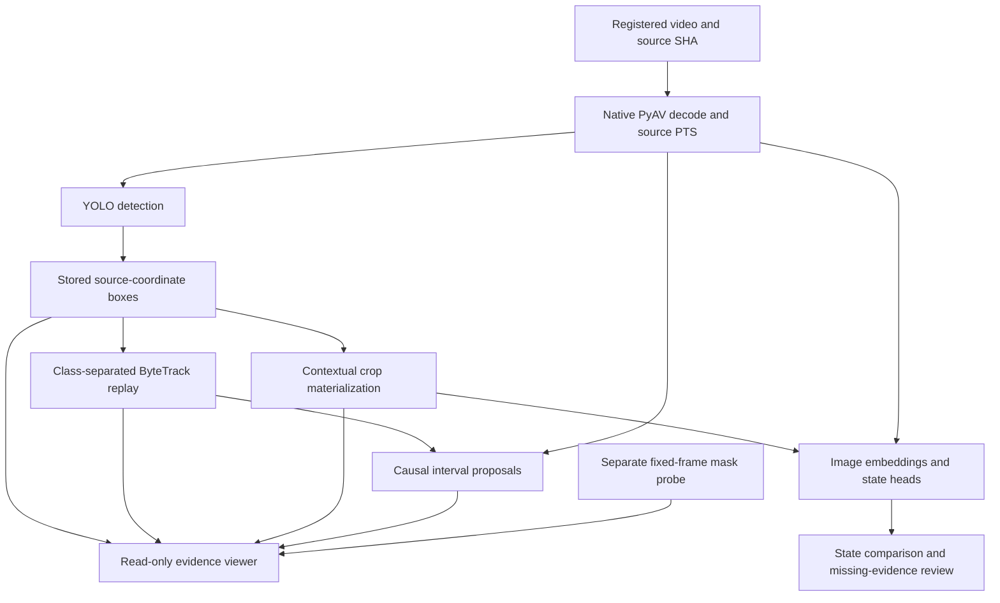
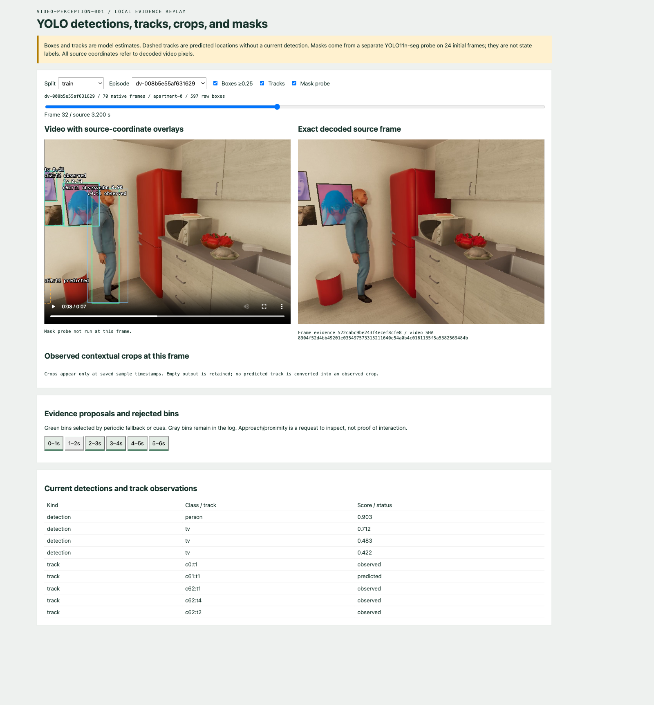
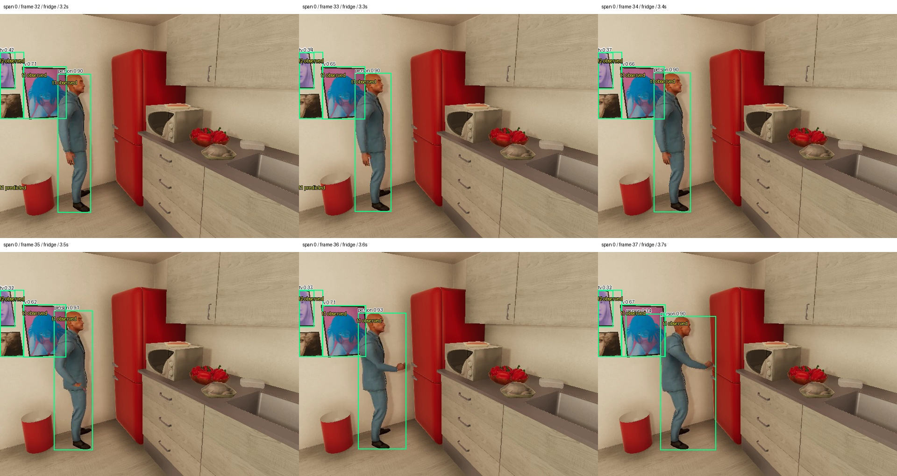
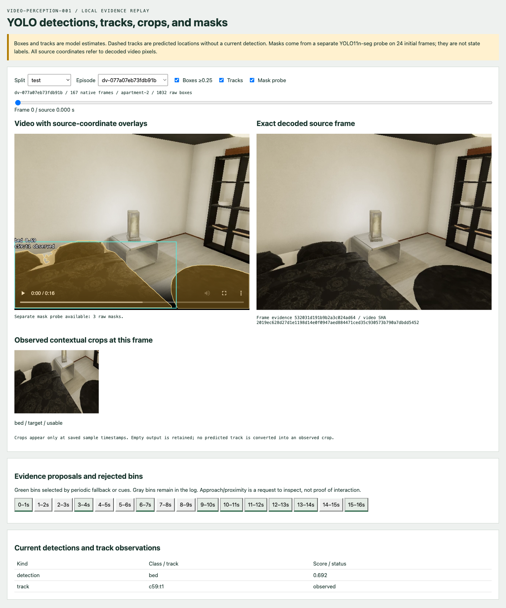
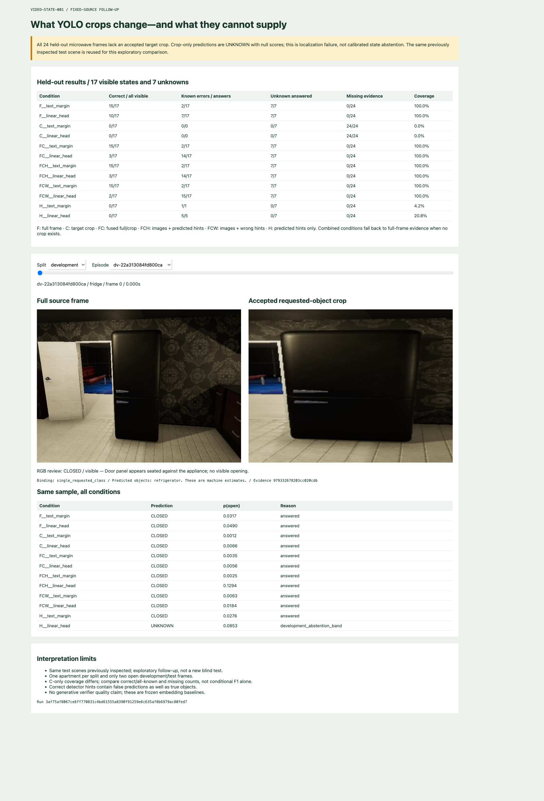

# YOLO Video Perception on Apple Silicon: Detection, Tracking, Evidence Selection, and Observable State

A video state recognizer needs evidence of the requested object at the requested time. A full-frame embedding can preserve scene context while assigning little representation capacity to a small appliance. A detector can provide a closer view, but every subsequent crop, track, and state prediction then depends on localization. This project implements that dependency explicitly and measures where it fails.

The implementation processed **60 VirtualHome videos containing 5,793 native frames**, producing 41,044 detections, 22,459 track records, and 4,472 contextual crops. A separate segmentation checkpoint produced masks on 24 fixed pilot frames. The state follow-up evaluated six evidence representations with two classification methods on the existing 144-sample dataset. No accepted microwave crop existed on any of the 24 held-out state frames. Crop-only recognition therefore had zero test coverage; combining crops with full frames did not establish an improvement.

This report describes `VIDEO-PERCEPTION-001` and its completed experimental handoff into `VIDEO-STATE-001`. The source repository is `/Users/manuel/code/wesen/2026-09-06--vision`. The implementation checkpoint is `f140717`, following the initial detector/tracker commit `dda2aa6`. The result is an inspectable research implementation with negative findings that constrain the next experiment. It is not a validated general-purpose action recognizer. The independent MLX native-video repair is outside this implementation; the state comparison uses the existing image embedding path.

## 1. The units of evidence

A decoded image, an object detection, an object identity, and a state assertion are different records. A decoded image establishes the pixels available at a source timestamp. A detection associates a class and rectangle with those pixels. A tracker connects detections across timestamps. A state assertion estimates a property, such as whether a microwave is open, from supplied evidence. None of these transformations makes the preceding output ground truth.

The central engineering requirement is that each derived record remain traceable to its source. `FrameRef` in `workbench/src/video_workbench/perception/contracts.py` contains the episode identifier, source video SHA-256, decoded frame index, original presentation timestamp, time base, microsecond timestamp, width, and height. The frame identifier is derived from those fields. Keeping both the raw timestamp and its converted value permits alignment checks without assuming that frame number divided by nominal FPS is universally correct.

A crop records its source frame, source rectangle, output dimensions, resize method, producing configuration, and detection identifiers. Its image SHA-256 validates the materialized pixels. A successful episode manifest records hashes of its JSONL artifacts. Readers verify these hashes before replay. A changed model, changed crop, or changed source should produce new evidence identities rather than silently reuse the previous cache.



The dataset boundary matters as much as the record schema. The model-facing source manifest contains registered media and partition information. Reviewed state labels and conservative transition brackets are consumed by evaluation code after evidence selection. Simulator action names and internal object states are not supplied as visual observations. This protects the distinction between a simulator program requesting an action and the rendered pixels showing its outcome.

## 2. Data, partitions, and runtime isolation

The detector run combines the 48 full `diversity-v2` trajectories with 12 microwave trajectories from the original `home-v1` corpus, all of the latter in training. The diversity trajectories vary apartments, camera views, approach-only versus interaction conditions, and door, pickup, posture, and switching families. These 60 videos are the detector workload, not 60 independent samples for every downstream metric. The state experiment remains a smaller fixed dataset with six sampled frames per selected episode.

| Partition | Native frames | Detections | Track records | Predicted records | Crops |
|---|---:|---:|---:|---:|---:|
| Train | 3,096 | 25,717 | 12,605 | 1,538 | 2,351 |
| Development | 1,076 | 6,018 | 4,421 | 593 | 1,055 |
| Test | 1,621 | 9,309 | 5,433 | 603 | 1,066 |
| Total | 5,793 | 41,044 | 22,459 | 2,734 | 4,472 |

An isolated environment at `workbench/perception-env/.venv` prevents detector dependencies from changing the MLX workbench environment. The hash-locked requirements pin Ultralytics 8.4.142, PyTorch 2.14.0, torchvision 0.29.0, NumPy 2.4.6, PyAV 17.1.0, Pillow 12.3.0, and lap 0.5.13 under Python 3.11.4. The run records checkpoint hashes, the model class map, adapter hash, and package versions. Large weights and generated videos remain in ignored output storage; the ticket retains manifests, review labels, results, scripts, and selected images.

YOLO11n is an explicit small-model baseline. The segmentation probe uses the separate YOLO11n-seg checkpoint. Detection and segmentation checkpoints must not be treated as interchangeable producers, even when they share a model family. The upstream model family supports distinct detection and segmentation tasks. [Ultralytics YOLO11 reference](https://docs.ultralytics.com/models/yolo11/).

On this M1 Max with 64 GB of memory, one identical-frame smoke measured CPU calls at 2.6089 seconds initially and approximately 0.048–0.050 seconds warm. MPS measured 3.1004 seconds initially and 0.0178, 0.0122, and 0.0090 seconds warm. These are a small smoke experiment, not a latency distribution. The full detector run accumulated 71.137 seconds of synchronized detector service time, excluding registration, decoding, and overlay generation. Dividing this number into the frame count would not describe end-to-end throughput.

## 3. Detector input and coordinate geometry

`detector.py` feeds PIL RGB images into the predictor and explicitly chooses CPU or MPS. The adapter freezes `imgsz=640`, `conf=0.1`, `iou=0.7`, `max_det=100`, `rect=False`, and `augment=False`. A low detection threshold retains candidates for later tracking, while usable target crops require at least 0.25 confidence. A missing crop can consequently mean no detection, a rejected low-confidence detection, an unusably small region, or multiple accepted candidate instances.

Input color order is an API contract. The upstream predictor accepts PIL images in RGB and NumPy arrays under its documented image conventions; the adapter avoids an implicit RGB/BGR conversion by fixing its input type. Returned boxes are handled as source-image coordinates. [Ultralytics prediction reference](https://docs.ultralytics.com/modes/predict/).

Rectangles use the half-open convention `[x0, y0, x1, y1)`. Every coordinate must be finite, the rectangle must have positive extent, and the rectangle must lie within the source image. Small numerical excursions from the predictor are clipped while the raw coordinates remain recorded. This allows a reviewer to distinguish a normalized box from the original output.

For a source crop with origin `(x0,y0)`, width `w`, height `h`, and resized dimensions `(W,H)`, the source-to-crop transform is:

```text
u = (x - x0) * W / w
v = (y - y0) * H / h

x = x0 + u * w / W
y = y0 + v * h / H
```

The inverse is necessary when a downstream model refers to a location inside a resized crop. Without the crop rectangle and output dimensions, those coordinates cannot be placed back on the original frame. The implementation tests round trips and rejects invalid geometry. It expands target rectangles by 25 percent for context and also creates target/person union crops with additional context. Crops are materialized at 320 × 240 with PIL bicubic resizing. Regions with very small source extent are flagged rather than treated as high-detail evidence merely because resizing increases their pixel count.

## 4. What the detection pilot measures

A fixed initial-frame pilot selected 24 interaction examples independently of detector output. The review used native RGB to estimate the visible extent of the requested target. Supported class mappings include fridge to refrigerator, sofa to couch, and mug to cup. Plate and table lamp do not have direct classes in this pinned model's mapping. One book was hidden sufficiently that a useful visible target rectangle could not be assigned.

The resulting categories were **11 localized, 8 missed, 4 unsupported, and 1 unreviewable**. The supported and visibly reviewable denominator is 19, giving localization recall of 11/19 at confidence ≥ 0.25 and IoU ≥ 0.5. All three reviewed small targets below 1,024 square pixels were missed. These counts describe requested targets in 24 selected frames. They do not constitute scene-wide average precision, dense video recall, or an exhaustive inventory of false positives.



*Figure 1. Actual replay capture showing source pixels and the stored detector/tracker outputs. Portraits, reflections, and actor shadows produced false object/person interpretations in this corpus. The displayed track identifier describes an association in this run, not a verified physical identity.*

The failure modes motivate separate questions. A plate without a supported class cannot be recovered by adjusting a confidence threshold for that nonexistent class. A tiny cup may require more source detail or a detector trained on similar renderings. A portrait classified as a television is a semantic error even if its rectangle is geometrically stable. Reporting these cases separately prevents a single recall number from concealing the cause of missing evidence.

## 5. Tracking stored detections

`tracking.py` replays the saved detections through ByteTrack. This keeps detector inference fixed while testing association behavior. The adapter uses the installed 8.4.142 API, which constructs `BYTETracker(args)` without the older `frame_rate` argument. Code written against an earlier signature would fail before producing any track evidence. The installed source therefore forms part of the implementation reference alongside the upstream tracking documentation. [Ultralytics tracking reference](https://docs.ultralytics.com/modes/track/).

The corpus has a native 100,000-microsecond cadence. The tracker advances on each decoded frame, uses a ten-frame retention buffer, and resets on an episode boundary, explicit shot boundary, or gap exceeding 1.5 expected frame intervals. Variable cadence is rejected by this adapter. These choices avoid silently interpreting ten sampled observations as ten native frames when a caller has actually skipped seconds of video.

Track IDs are namespaced by run, episode, shot, class, and local counter. Separate class trackers prevent a cup and a person from sharing an association pool. A custom local counter avoids process-global ID allocation interfering with independent tracker instances. Observed rows cite the matched detection. Predicted rows retain a propagated location with `detection_id=None`; they must not be presented as fresh visual observations.

```text
for frame in source_order:
    validate_native_cadence(frame)
    if episode_changed or shot_changed or gap_too_large:
        reset_trackers()
    for class_id in accepted_classes:
        outputs = tracker[class_id].update(saved_detections(frame, class_id))
        for output in outputs:
            save(namespaced_id, source_timestamp,
                 status=observed_or_predicted,
                 detection_id=matched_detection_or_null)
```

Eight reviewed spans each contained six contiguous native frames. One bed span did not provide a visible physical actor and was excluded from the identity denominator. Across the remaining **42 visible actor rows**, the reviewed association matched 42/42, with zero within-span ID switches and zero fragmentations. Seven extra observed person-track rows did not represent the physical actor. These short spans establish useful local behavior but cannot establish long-term identity stability across occlusion, re-entry, or long camera motion.



*Figure 2. The review unit is a contiguous native-frame span. A persistent false person prediction must remain distinct from the manually identified actor when counting identity success.*

## 6. Segmentation as a measured probe

The mask experiment runs YOLO11n-seg on the same 24 fixed pilot source frames. It records 148 raw masks, source-coordinate polygons, source hashes, and checkpoint identity. Each image has a saved overlay. The browser can show these polygons together with detection/tracking evidence, but a mask polygon and a detection rectangle originate from different checkpoints and are not automatically the same instance.



*Figure 3. Browser evidence from the fixed-frame mask probe. The page exposes the checkpoint distinction and limited probe coverage. Empty mask display at an unsampled timestamp does not mean a segmentation model ran and found no object.*

The implementation does not claim dense temporal segmentation or mask accuracy. No exhaustive pixel mask annotation was created, and the 24 first-frame samples cannot measure mask stability during an action. Running this probe was useful because it made mask geometry and visual failure cases inspectable before committing to expensive temporal labeling. The next mask experiment should select examples where boundary shape is actually necessary for the target state and then measure those boundaries directly.

## 7. Causal proposals and bounded evidence

The proposal selector reduces the number of intervals sent to a future expensive recognizer. It divides source time into one-second half-open bins and makes a decision only once a subsequent frame establishes that a bin is complete. A periodic fallback accepts every third bin. Additional accepted bins are limited to three per ten-second window and require at least one measured cue.

The cues are normalized person/target center proximity, tracked target movement, and low-resolution full-frame appearance change. Proximity activates at 1.5 target diagonals or less. Movement activates at 0.5 target extents per second. Appearance change activates at 0.035. These signals describe observed geometry and appearance; none is a labeled action. A person approaching an appliance may activate proximity without changing its state.

```text
for new_frame in source_order:
    update_current_bin_with_prefix_only_cues(new_frame)
    for completed_bin in older_bins:
        periodic = bin_number % 3 == 0
        triggered = any_recorded_cue(completed_bin)
        accept = periodic or (triggered and extra_budget_remaining)
        evidence = first_and_last_actual_frame(completed_bin)
        record(accept, reason, cues, evidence, availability, budget)
```

Each packet allows at most two images and 614,400 source pixels. Packet validation checks the interval, source association, supplied evidence IDs, as-of boundary, and budget. Response validation accepts a boolean or unknown result, checks that citations refer to supplied evidence, and bounds explanatory text. These contract tests do not demonstrate the accuracy of a generative verifier. No real generative-verifier quality experiment was run in this ticket.

Causality is tested separately from usefulness: changing future inputs must not change already completed decisions. A policy may satisfy that property and still miss the important event. Availability records conservatively combine the closing source timestamp and the involved frame service-time estimates. They are not a measured live scheduling latency distribution.

| Partition | Uniform calls | Selected calls | Uniform pixels | Selected pixels |
|---|---:|---:|---:|---:|
| Train | 292 | 199 | 179,404,800 | 122,265,600 |
| Development | 98 | 78 | 60,211,200 | 47,923,200 |
| Test | 153 | 91 | 94,003,200 | 55,910,400 |
| Total | 543 | 368 | 333,619,200 | 226,099,200 |

The selector reduced calls by 32.2 percent, but missed six of nine reviewed appliance transition brackets completely. Uniform completed-bin sampling missed two. The current implementation omits the final unclosed bin; this explains a coverage weakness even in the uniform comparator. An explicit end-of-stream flush requires an availability rule and new evaluation rather than silently treating an offline endpoint as an earlier causal observation.

Approach-only diversity videos still produced 82 selected calls out of 110 uniform calls; interaction videos produced 159 out of 230. These counts show that the cues do not selectively isolate successful actions. The reviewed brackets are conservative appliance transition intervals, not dense action ground truth. There is no supported short-action recall claim for pickup, posture, or switching. The current selector should remain experimental rather than replace uniform evidence acquisition.

## 8. Continuing the observable-state ticket

The state follow-up freezes six representations before fitting classifiers. Each sample has a requested entity class and source timestamp from the original state protocol. `predicates/regions.py` selects a target crop only when exactly one usable accepted rectangle has the requested mapped class at that frame. State labels do not participate in selection. Multiple same-class candidates produce ambiguity; no accepted candidate produces missing evidence. Neither condition establishes object absence.

| Code | Representation | Missing-crop behavior | Nominal resized pixel budget |
|---|---|---|---:|
| F | Existing full-frame image embedding | Always available | 76,800 |
| C | Requested target crop embedding | Unavailable | 76,800 |
| FC | Normalized mean of unit F and C vectors | Use F | Up to 153,600 |
| FCH | Joint available images plus predicted-object hint | Full image plus hint | Up to 153,600 |
| FCW | Joint available images plus deliberately wrong hint | Full image plus wrong hint | Up to 153,600 |
| H | Predicted-object hint as text | Hint remains available | 0 MLX image pixels |

Hints use the explicit wording `Predicted objects: {classes}. These are machine estimates.` The wrong-hint condition uses `bicycle, dog`. H contains no MLX image input, but its text is derived from YOLO visual predictions and is therefore not independent of the video. FCH and FCW use joint image/text encoding; FC uses late vector fusion. Comparing all three does not isolate a single architectural variable. The doubled possible image budget also prevents a claim that any future FC gain would be free.

Full-frame features are reused exactly from the existing cache. Crop and hint conditions use the same local Qwen3-VL embedding model artifacts. A duplicate-full late-fusion control equals F numerically because normalizing the mean of two identical unit vectors returns that vector. It is a redundancy identity, not an independently measured joint two-image control.

Each representation is evaluated using both a text-hypothesis margin and a ridge linear head. The head fits on available, visually labeled training rows. Platt calibration and the decision/abstention policy use development rows. Existing apartment groups and sample IDs remain fixed. The test partition was already inspected in the earlier state work, so this is explicitly an exploratory follow-up, not a new untouched benchmark.

Crop availability was **46/96 train, 23/24 development, and 0/24 test**. Across all samples, 69 had a unique accepted crop, 74 had no accepted crop, and one was ambiguous. This distribution is the primary result: a region-conditioned model trained mostly with usable regions encounters a held-out partition where the requested localization is unavailable.



*Figure 4. Actual development sample, paired source and crop, and all twelve predictions. A valid crop path on this partition does not establish localization on the held-out apartment.*

## 9. State results and denominator discipline

The held-out partition contains 17 visibly labeled states and seven unknown observations. Only two visible examples are open. A classifier that always predicts closed can appear successful by raw accuracy while failing the minority state and answering when the object is unobservable. The report therefore records correct answers over all visible samples, errors among answered visible samples, unknown false certainty, and coverage together.

| Representation / classifier | Correct / all 17 visible | Known errors / known answers | Unknown answered / 7 | Answered / all 24 |
|---|---:|---:|---:|---:|
| F / text margin | 15/17 | 2/17 | 7/7 | 24/24 |
| F / linear head | 10/17 | 7/17 | 7/7 | 24/24 |
| C / text margin | 0/17 | 0/0 | 0/7 | 0/24 |
| C / linear head | 0/17 | 0/0 | 0/7 | 0/24 |
| FC / text margin | 15/17 | 2/17 | 7/7 | 24/24 |
| FC / linear head | 3/17 | 14/17 | 7/7 | 24/24 |
| FCH / text margin | 15/17 | 2/17 | 7/7 | 24/24 |
| FCH / linear head | 3/17 | 14/17 | 7/7 | 24/24 |
| FCW / text margin | 15/17 | 2/17 | 7/7 | 24/24 |
| FCW / linear head | 2/17 | 15/17 | 7/7 | 24/24 |
| H / text margin | 0/17 | 1/1 | 0/7 | 1/24 |
| H / linear head | 0/17 | 5/5 | 0/7 | 5/24 |

Crop-only zero errors do not establish good selective classification: it answered nothing because localization failed. Its raw score and calibrated probability are both null, with reason `missing_or_ambiguous_detector_crop`. This required extending `StateObservation` to permit paired null scores only for an unknown value. A numerical score such as zero would imply an inference result that never occurred.

The full-frame text margin retains the earlier 15/17 result, but its visible macro F1 is only 0.46875 because it misses both open states. The full-frame head has visible macro F1 0.4711. FC and FCH heads fall to 0.1736, and the wrong-hint head to 0.1053. These are before-abstention visible metrics; the raw result archive preserves the confusion matrices and policy parameters.

Development F1 reaches 1.0 for several region/hint conditions while held-out performance is poor. The data do not support selecting those development winners as deployable models. At test time FC has only F evidence, but its head was fit in a representation distribution containing crops. That train/test feature difference is one plausible contributor to failure; this small experiment cannot isolate it from scene and class distribution shifts.

There are no common available test crops, so a paired test comparison restricted to frames with both F and C has an empty denominator. The archive records this as null. Creating a table of crop-only conditional accuracy without that fact would conceal the experiment's central limitation.


*Figure 5. The source microwave is visible, but the accepted detector vocabulary at this frame contains bottle, bowl, and cup. The comparison preserves missing crop evidence and null crop-only scores alongside full-frame predictions.*

## 10. Replay interfaces and inspection

The perception viewer at `http://127.0.0.1:8773` displays registered video, exact source frames, source-coordinate boxes, track status, crops, proposals, and the fixed mask probe. The state viewer at `http://127.0.0.1:8774` displays the same sample under all twelve classifier conditions with reviewed RGB labels and an explicit missing-crop panel. These are local read-only review applications.

| Endpoint | Purpose |
|---|---|
| `GET /v1/perception/run` | Detector identity and episode inventory |
| `GET /v1/perception/episodes/{eid}` | Verified episode artifacts |
| `GET /v1/perception/episodes/{eid}/video` | Registered source video with byte-range serving |
| `GET /v1/perception/episodes/{eid}/frame/{index}` | Exact decoded source frame |
| `GET /v1/perception/episodes/{eid}/crop/{crop_id}` | Allowlisted crop with image hash validation |
| `GET /v1/perception/masks` | Optional fixed-frame mask records |
| `GET /v1/regions/run` | Frozen state experiment, labels, evidence, and observations |
| `GET /v1/regions/evidence/{sid}/{kind}` | Source image, crop, or video for a known sample |

Unknown IDs return 404. Changed source pixels are rejected rather than silently displayed under an old evidence identity. The perception application caches verified episode tables in memory, so it is designed around immutable completed runs; it is not a continuous file-change monitor. Mask data is an optional sibling probe and must retain its separate provenance.

## 11. Reproduction and source map

Start from the repository root. The ticket scripts prepare model-safe sources, freeze the pilot, run the mask probe, review tracks and proposals, and evaluate the state comparison. Inference requires the local checkpoint files and both environments. Generated output directories are versioned; choose new destinations for a new experiment rather than overwriting a completed run.

```bash
export PYTHONPATH=workbench/src
export YOLO_CONFIG_DIR="$PWD/output/perception-settings"
workbench/perception-env/.venv/bin/python -m video_workbench.perception detect \
  --manifest output/perception-sources.jsonl \
  --checkpoint output/models/yolo11/yolo11n.pt \
  --out output/video-perception/detect-v2 --device mps
workbench/perception-env/.venv/bin/python -m video_workbench.perception derive \
  --run output/video-perception/detect-v2 --out output/video-perception/derived-v2
```

| Source file under `workbench/src/video_workbench/` | Responsibility |
|---|---|
| `perception/contracts.py` | Source/frame geometry, crop transforms, packet and response checks |
| `perception/store.py` | Atomic writes and successful-manifest verification |
| `perception/detector.py`, `pipeline.py` | Predictor adapter and native-frame run production |
| `perception/tracking.py`, `derive.py` | Association replay, crop production, derived manifests |
| `perception/proposals.py` | Prefix-only cues, budgets, uniform comparator |
| `perception/segmentation.py`, `evaluation.py` | Mask probe and reviewed identity counts |
| `perception/app.py`, `viewer.html` | Source-aligned perception replay |
| `predicates/regions.py` | Label-free crop binding and representation generation |
| `predicates/region_experiment.py` | Train/development fitting and coverage-aware metrics |
| `predicates/contracts.py` | State observations including genuine missing-evidence nulls |
| `predicates/region_app.py`, `region_viewer.html` | Fixed-sample comparison UI |

The principal evidence files in the perception ticket are `various/detection-pilot-results.json`, `identity-review-results.json`, `pipeline-evaluation.json`, `mask-probe.json`, and the reviewed box/identity manifests. The state ticket preserves `various/region-evidence-v1.json` and `various/region-run-v1/`, including raw observations and feature metadata. These permit auditing the conclusions without loading the embedding model, although reproducing pixels requires the original local media.

Main-environment tests passed with 34 passed and one skipped; the isolated perception tests passed eight focused tests. The skip is the ByteTrack module unavailable in the main environment and exercised in the isolated environment. These counts overlap and should not be added as distinct tests. The tested invariants include geometry, immutable artifacts, tracker resets and prediction status, future perturbation, reviewed identity counting, missing-crop metric denominators, and paired-null state scores. Screenshots complement those tests by exposing errors that satisfy schemas, such as a portrait labeled as a television.

## 12. The next experiment should repair evidence coverage

The immediate decision is to keep uniform source evidence available and improve localization evaluation before treating crops or proposals as an optimization. The current call reduction discards too many reviewed transition brackets. The current held-out crop pipeline supplies no requested microwave evidence. Neither weakness can be corrected by presenting a more favorable conditional metric.

A useful next dataset revision should contain multiple visible instances of each requested appliance and prop across apartments, views, sizes, occlusions, and positive/negative states. It should include manually reviewed object rectangles at the actual state sample times, with explicit unsupported, absent, occluded, and ambiguous cases. A manually localized crop control would help separate localization failure from representation failure, provided it is labeled as an oracle-assisted diagnostic and never mixed into production evidence.

Further work has distinct entry conditions:

- Fine-tune or replace the detector after the requested-class and small-object annotations can support an independent localization evaluation.
- Evaluate dense masks when a state question requires object boundaries, and annotate the relevant temporal spans before claiming mask quality.
- Add pose only for posture or manipulation questions where keypoints have a defined evaluable role.
- Add a causal end-of-stream flush and remeasure proposal misses before considering the selector for default evidence acquisition.
- Consider Core ML conversion after measuring an end-to-end bottleneck and establishing a reference output set for conversion parity.
- Run a real generative verifier as a separate experiment with the already implemented citation and availability contracts, using fixed evidence intervals before evaluating proposal-selected intervals.

The completed work makes these choices measurable. Detection, tracking, segmentation probes, crop identities, proposal decisions, and state observations can now be inspected against the same source pixels. The evidence currently supports further localization and observability work, not a claim that YOLO regions already improve household state recognition.

## Related project reports and evidence

The dataset's lineage and visual label limitations are explained in [[ARTICLE - VirtualHome Corpus Expansion - Scenario Diversity Provenance and Visual Labels]]. The preceding retrieval system is described in [[ARTICLE - Timestamped Video Search - From Verified Pixels to Frozen Evaluation]]. This report adds detection, tracking, a mask probe, and region-conditioned state experiments to those foundations.

The following compact evidence files are copied into the vault so that the principal reported counts remain available with this article:

- [Detection pilot results](_assets/yolo-detection-pilot-results.json)
- [Reviewed identity results](_assets/yolo-identity-review-results.json)
- [Pipeline and proposal results](_assets/yolo-pipeline-evaluation.json)
- [State comparison metrics](_assets/yolo-state-comparison-metrics.json)
- [Live review API checks](_assets/yolo-api-review-checks.json)

Full raw mask polygons, per-sample state observations, crop evidence bindings, and detailed chronological diaries remain in the source ticket archives. The note's images are copied assets, not cross-repository image links.
