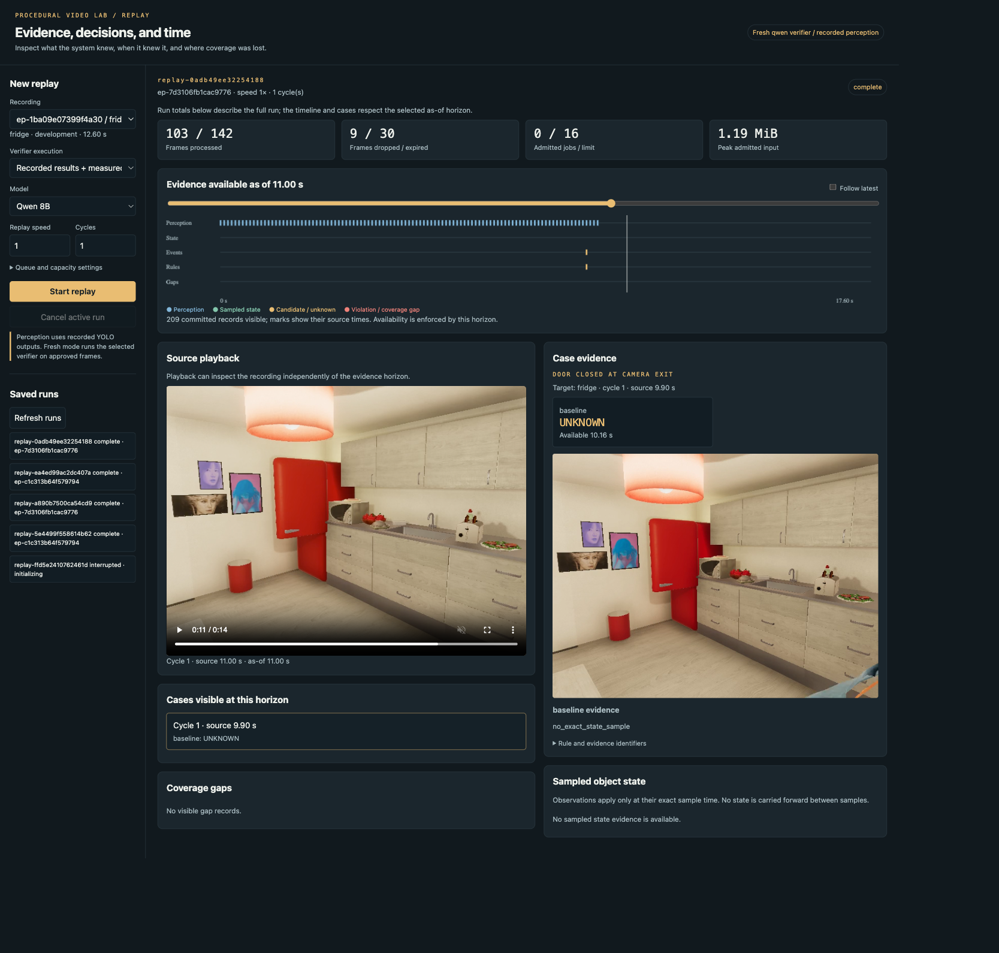
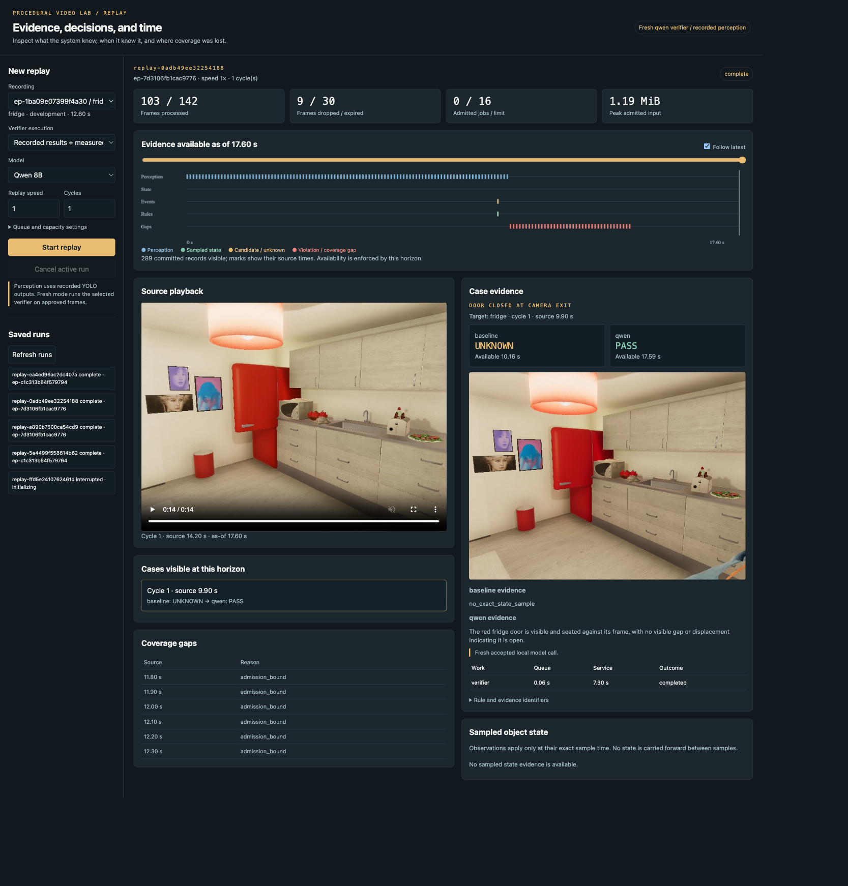
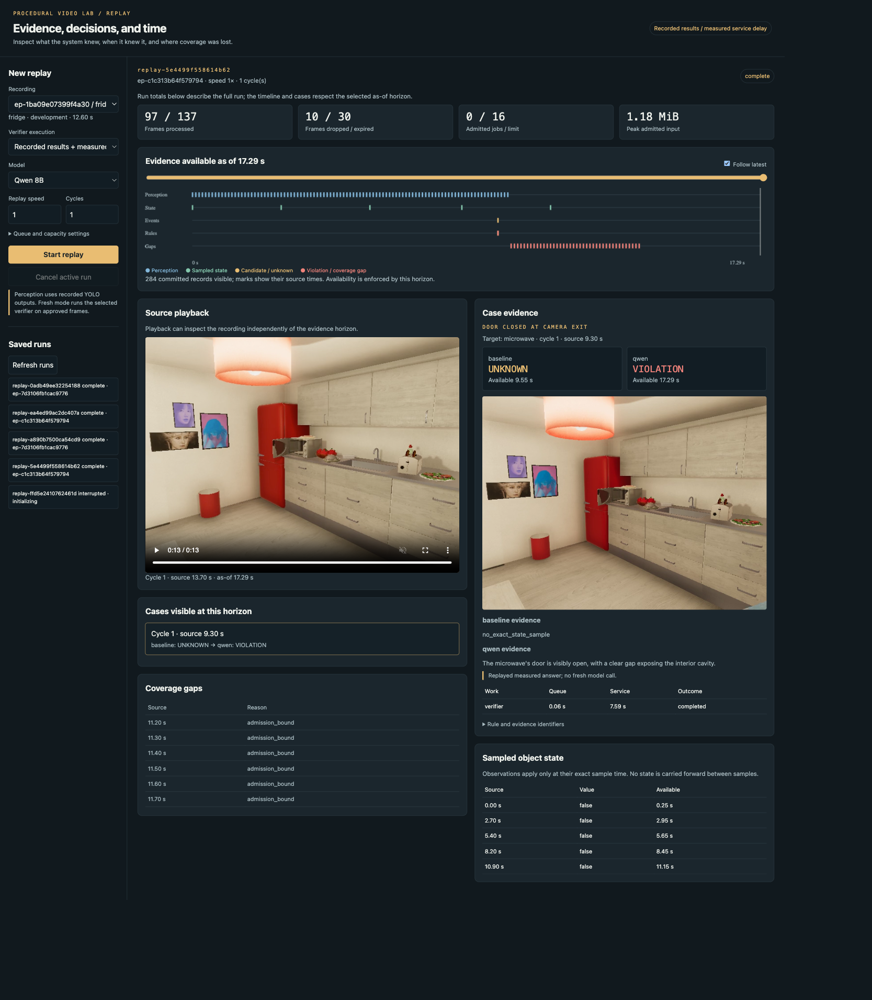
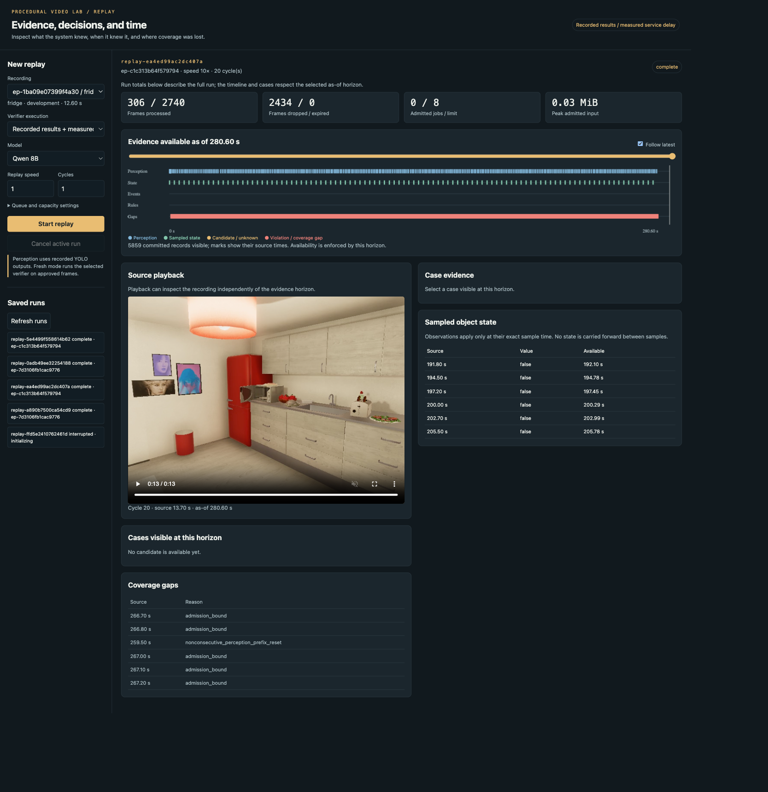

# Measured replay viewer and bounded scheduler

## Implemented result

The workbench now replays registered video evidence through a bounded single-worker scheduler and displays the resulting history in a local browser. It distinguishes source time, evidence availability, queue waiting, worker execution, and result commitment. The viewer shows video, sampled states, departure candidates, separate baseline/verifier decisions, and explicit coverage gaps. It does not calculate rules in JavaScript.

The implementation is in `workbench/src/video_workbench/replay/`. The core checkpoint is `1deb161`, connected engine checkpoint `05ea442`, and viewer/live-validation checkpoint `c8edc9c`. The simplified design is [the bounded replay contract](../design-doc/02-bounded-replay-implementation-and-viewer-contract.md). The original broad guide is preserved with a superseding scope note.

Three principal measured runs establish different facts. A recorded microwave run demonstrates delayed rule evaluation and coverage loss. A fresh Qwen run demonstrates actual accepted-model execution through the broker and scheduler, including a wrong open-fridge PASS. A twenty-cycle overload run demonstrates bounded admission and explicit loss under excessive arrival rate. An additional browser-started run demonstrates the complete API/start/poll/viewer path.

## How evidence moves through the application

`Catalog` checks the operator-selected recording manifest against the measured perception run, verifies per-episode trace hashes, and checks every decoded frame index and PTS against registration. The host may inspect complete metadata. The worker receives only the released per-frame detection payload or an approved exact-time image. The original complete video path is never sent to the worker.

`ReplayClock` maps monotonic elapsed wall time to run microseconds using the declared speed. Within repeated capacity cycles, a frame's run time is `cycle * source_duration_us + local_pts_us`. A cached feature or detection must have its declared dependency end and availability within the current horizon. The presence of its file on disk does not bypass that check.

`EvidenceBroker` rejects future dependencies and mismatched registrations. For a verifier, it decodes the exact requested frame, hashes the resulting PNG, and returns the existing bounded request frame contract. Recorded-verifier execution additionally requires that this PNG has exactly the same hash as the previously measured verifier frame. The original raw model response is reparsed against the current host request; old request IDs and parsed bindings are not copied into the new case.

The scheduler admits mandatory perception jobs and optional verifier jobs. It counts both queued and running inputs toward the configured job and byte bounds. Mandatory jobs can evict queued optional work, but cannot preempt an active model call. Every admission failure, eviction, expiry, cancellation, or worker failure produces a terminal outcome that the engine persists as a job record and an explicit gap.

A gap in completed frame indices resets the departure detector. Without that reset, three observations separated by dropped frames could incorrectly masquerade as three consecutive source frames. The overloaded run visibly demonstrates these prefix resets and produces no departure candidates.

## Execution modes and model boundary

**Recorded mode** releases the saved YOLO detections and schedules saved verifier text with its measured service duration. It includes actual subprocess startup and host scheduling overhead. It measures this application's replay and queue behavior, not fresh detector/model inference throughput. The UI explicitly labels recorded results.

**Live verifier mode** still uses recorded perception, but executes the selected accepted verifier on the approved frame. The existing `verifiers.worker.run` function executes inside the scheduler's process group. The scheduler's wall deadline therefore covers model loading, preprocessing, generation, and completion directly. It kills and reaps that group on timeout or cancellation.

The fresh measured call used Qwen3-VL-Instruct-8B with the accepted community 8-bit checkpoint, direct-greedy profile, and MLX runtime. The worker retained MLX 0.32.2, MLX-VLM 0.6.17, and Transformers 5.16.1 provenance. Cosmos uses the same selectable replay integration and its accepted family profile; a fresh Cosmos replay was not separately run here. Both families were measured on all twelve RULES candidates in the preceding [RULES report](../../VIDEO-RULES-001--project-4-temporal-rules-and-bounded-investigation/reference/03-end-to-end-camera-departure-rule-measurement.md).

These are verifier models. The repaired native embedding pipeline and its feature space are unchanged. Fresh live perception/native-embedding scheduling remains an explicit follow-up.

## History without revision machinery

`ReplayStore` writes immutable SQLite rows. Each row carries source event time and a later availability/commitment time. Stable case IDs group the rule, target, cycle, and trigger; they do not depend on the current status. Baseline and verifier decisions remain separate conditions within the case. There is no supersession chain, mutable "current truth," or lifecycle workflow.

The API queries by cursor and explicit `as_of_us`. A later result cannot appear in an earlier history view. Approved images also require an availability horizon. Source video playback is intentionally available for inspection independently of the evidence horizon; this human inspection surface does not grant future frames to workers. Full-run operational counters are labeled separately from the historical timeline.

The live fridge case demonstrates the contract. The candidate concerns source time 9.90 seconds. The UNKNOWN baseline is committed around run second 10.16. The fresh Qwen PASS is committed around second 17.59. At an as-of horizon of 11 seconds, the viewer displays only the baseline and its approved evidence.



After the later horizon, Qwen's independent PASS appears. Its rationale says the door is seated against its frame, although the approved image shows a protruding door panel. The application preserves this incorrect claim for inspection rather than treating a valid JSON response as factual validation.



## Measured normal and live runs

| Run | Source / wall duration | Completed perception | Dropped / expired | Result | Peak admitted jobs / bytes |
|---|---|---:|---:|---|---:|
| Recorded microwave, speed 1 | 13.7 / 17.29 s | 97/137 | 10 / 30 | UNKNOWN baseline; recorded Qwen VIOLATION | 16 / 1,236,979 |
| Fresh Qwen fridge, speed 1 | 14.2 / 17.60 s | 103/142 | 9 / 30 | UNKNOWN baseline; fresh Qwen PASS, visually wrong | 16 / 1,248,355 |
| Browser-started microwave, speed 2 | 13.7 / 14.64 s | 137/137 | 0 / 0 | UNKNOWN baseline; delayed recorded VIOLATION | See archived run summary |

Both speed-1 runs configured sixteen admitted jobs and sixteen MiB of input. Their verifier started during an idle interval, then blocked the single worker for several seconds. Frames continued arriving. The queue reached its count bound, some arrivals were dropped, and waiting perception work exceeded its two-second wall deadline.

The browser-started speed-2 run demonstrates a different timing outcome. Mandatory perception work accumulated ahead of the optional verifier, so the verifier remained queued until the source workload cleared. It preserved all frames but delayed the decision. This is an observed scheduling outcome, not evidence that increasing replay speed generally improves coverage.



The sampled-state table illustrates why exact-time semantics matter. Earlier state samples exist, but they do not establish state at the departure timestamp. The baseline therefore remains UNKNOWN until separately conditioned image verification becomes available; the application does not carry the last false value forward.

## Latency and memory

The raw run summary includes all terminal work, including jobs dropped without service. The portable report additionally groups latency by work kind and outcome so zero-service dropped jobs do not make successful processing look faster.

| Completed work | Queue p50 / p95 | Service p50 / p95 | Total p50 / p95 |
|---|---:|---:|---:|
| Recorded normal perception, 97 jobs | 0.00034 / 0.00050 s | 0.050 / 0.055 s | 0.051 / 0.056 s |
| Fresh-run perception, 103 jobs | 0.00035 / 0.00049 s | 0.050 / 0.054 s | 0.050 / 0.055 s |
| Overloaded perception, 306 jobs | 0.630 / 0.667 s | 0.092 / 0.104 s | 0.721 / 0.762 s |

The recorded verifier had 0.062 seconds of queue wait and 7.590 seconds of service. The fresh Qwen verifier had 0.058 seconds of queue wait and 7.296 seconds of service. These are individual observations, not meaningful latency percentile populations. The browser-started recorded verifier waited 2.047 seconds and took 7.589 seconds of service.

Peak sampled host-plus-worker RSS was 84.93 MB for the recorded normal run, 10.34 GB for the fresh Qwen run, and 73.53 MB for the overload run. This metric samples the host and known worker process rather than enumerating all system processes. Model-specific MLX allocation remains in the verifier runtime record. The input admission byte bound is not a bound on model weights or GPU allocation.

## Repeated overload experiment

The declared capacity experiment replayed the same 13.7-second microwave recording twenty times, for 274 source seconds. Arrival speed was 10×, recorded service durations were multiplied by four, and the limits were eight admitted jobs and 2,000,000 input bytes. The run completed and drained in 28.06 wall seconds.

Of 2,740 offered perception frames, 306 completed and 2,434 were dropped. Completed-frame coverage was 11.17%. The high-water marks were exactly eight jobs and 31,027 admitted input bytes. There were no departure candidates. Missing-frame prefix resets prevented sparse detections from being treated as consecutive evidence.



This is a repeated accelerated capacity measurement. It adds no independent accuracy examples and establishes no long-duration production memory guarantee. The measured source is synthetic. In particular, zero alerts during this overloaded run do not indicate a safe scene: the system lost the evidence needed to propose departures.

The useful conclusion is concrete: the queue policy enforces its bounds and makes lost coverage inspectable, but a shared nonpreemptive worker cannot guarantee continuous perception while executing a long verifier. If continuous coverage becomes required, the next experiment should compare a separate verifier worker or an explicit admission policy based on an allowed perception-gap budget.

## Validation evidence

Twelve core feature checks passed, covering monotonic clocks, cycle mapping, future/cached dependency rejection, path exclusion, count and byte bounds including running work, mandatory priority, optional eviction, queue expiry, worker timeout and reaping, cancellation, malformed/oversized results, immutable persistence, and missing-frame prefix reset. Four API checks passed, including actual live-run history, evidence cutoff, cursor pagination, media byte ranges, rejected unknown sources, bounded input, one-active-run behavior, and liveness of a separately launched CLI writer.

Browser inspection exercised source playback, as-of seeking, case evidence, recorded/live labeling, run creation, polling, and cancellation. The final inspected pages had zero console errors or warnings. Screenshots were visually reviewed at full-page resolution. An initial favicon 404 was corrected. The in-app browser runtime had no connected browser; the available browser-testing tool provided the inspected surface.

## Reproduction

From the repository root, start the viewer with the existing workbench environment:

```sh
PYTHONPATH=workbench/src workbench/.venv/bin/python -m video_workbench.replay serve --port 8779
```

Open `http://127.0.0.1:8779/`. Choose a registered recording and recorded or fresh verifier mode. One API run is active at a time. Saved runs remain available after server restart; unfinished runs are shown as interrupted rather than automatically resumed.

```sh
# Recorded actual-evidence replay.
PYTHONPATH=workbench/src workbench/.venv/bin/python -m video_workbench.replay run ep-c1c313b64f579794 --speed 1 --max-jobs 16

# Fresh accepted Qwen call; requires the existing local model and Metal environment.
PYTHONPATH=workbench/src workbench/.venv/bin/python -m video_workbench.replay run ep-7d3106fb1cac9776 --mode live_verifier --family qwen

# Separate repeated capacity test.
PYTHONPATH=workbench/src workbench/.venv/bin/python -m video_workbench.replay run ep-c1c313b64f579794 --speed 10 --repetitions 20 --max-jobs 8 --max-bytes 2000000 --service-multiplier 4 --perception-deadline-seconds 1

# Completed-feature smoke.
PYTHONPATH=workbench/src workbench/.venv/bin/python -m pytest -q workbench/tests/test_replay_core.py workbench/tests/test_replay_api.py
```

The API fixture uses the saved measured live run and skips that local-artifact portion when it is absent. Primitive scheduling tests remain independent of model weights. Raw runs are in `output/replay-workbench/`; portable summaries and committed job/gap/state/rule records are archived in ticket `various/p4-measurements/`. Ticket script `02-archive-measured-replays.py` rebuilds those archives from the named measured runs.

## Delivered scope and remaining work

The current goal is delivered: RULES measurement is complete, REPLAY has a concrete simplified design, and the bounded scheduler/viewer is implemented and measured. The scoped RULES result remains 33.3% violation recall for both 8B verifiers, with four open-fridge misses each. The replay application exposes that limitation and its own coverage losses; it does not repair visual accuracy.

Deferred ticket tasks remain visible: general revision/supersession and workflow, publication/outbox and automatic recovery, fresh live perception/native embeddings and multi-worker scheduling, independently reviewed real-video transfer, and live-camera operational acceptance. They are not marked complete by this implementation.
