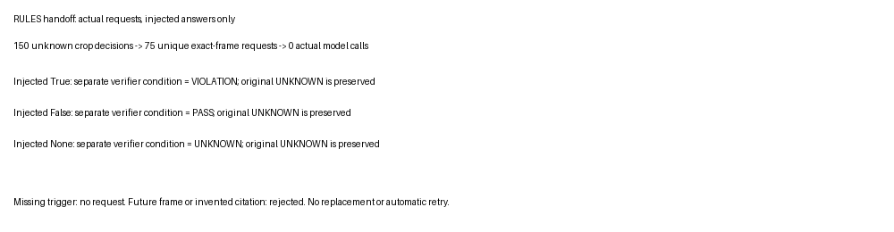

# Measured rules and focused verifier handoff

The initial RULES implementation has three deterministic flat templates and a sampled-observation adapter. `state_at_event` compares an exact-time Boolean state with the expected value; `before` evaluates strict ordering under event-time uncertainty; `no_event_in` requires explicit completed event coverage before concluding absence. Missing triggers, missing exact samples, contradictory values, and incomplete coverage have separate UNKNOWN reasons.

The hand-derived oracle feature check passed 16 cases and rejected three invalid schemas. The cases cover equal timestamps, uncertain overlap, wrong entities, late state commitment, missing departures, coverage gaps, observed prohibited events, and the excluded end of a half-open interval. These are logic checks with known inputs. They do not measure video recognition.

## Actual predicted observations

The read-only adapter evaluated 864 production state observations from the existing replay database, across six independent conditions. Each is bound to an explicit sampled-frame trigger. These triggers are not departures; exact departure truth is unavailable in this handoff. Every decision was UNKNOWN before durable commitment. Afterward:

| Evidence condition | PASS | VIOLATION | UNKNOWN |
|---|---:|---:|---:|
| D linear | 56 | 13 | 75 |
| D text margin | 68 | 1 | 75 |
| FD linear | 123 | 21 | 0 |
| FD text margin | 140 | 4 | 0 |
| F linear | 135 | 9 | 0 |
| F text margin | 140 | 4 | 0 |
| Total | 662 | 52 | 150 |

These are decision counts, not accuracy. The rule asks whether the selected model predicts closed at the sampled frame. A model error propagates into a rule error; a high PASS count is not a quality metric. Repeated read-only connections reproduced evaluation IDs and results. No state was extended between samples, and no prior observation was revised.

## One focused verifier request

`rules/handoff.py:plan_request` produces one request only for an unknown point-state decision with an observed exact-time trigger. Missing triggers and general interval-coverage uncertainty do not produce a misleading door-state question. The request binds episode, entity and class label, property, event time, permitted frames, evidence horizon, output-token limit, and deadline. Its question asks whether the target door is visibly open, without exposing the rule's desired answer.

The initial contract permits one to four approved images at the exact target timestamp. The implementation currently generates one full-frame image per request. A nearby timestamp cannot substitute for the queried point state. The allowed interval is half-open and one microsecond wide for this discrete point contract. Source image identity includes its hash; the runtime must verify local bytes before inference.

The actual 150 unknown crop decisions produce 75 unique request packets because the two crop classifiers share the same missing samples. Request identity is content-derived, making that duplication visible. The approved alternative evidence is the original full frame, not an oracle crop. This changes the evidence supplied to the verifier and must be accounted for when comparing it with crop-only recognition.

`verifiers/contracts.py:parse_answer` accepts strict JSON with request/entity identity, true/false/unknown answer, citations, and rationale. Invalid JSON, duplicate keys, invented citations, and uncited known answers are rejected. Schema/citation validity establishes the response's format and reference bounds, not its factual correctness.

`evaluate_answer` records an immutable observation and evaluates a separately selected verifier stream. It retains the original evaluation ID as comparison provenance. It does not replace the baseline evidence or treat later arrival as proof that an answer is more reliable. The application can compare both evaluations; general reconciliation and supersession remain absent.

Three injected answers produced the expected separate PASS/VIOLATION/UNKNOWN evaluations without changing the baseline. Invalid response fixtures, a future frame, and a missing trigger were handled by the completed-feature smoke. No actual model was called in these checks. Runtime timeout handling belongs to COSMOS-VERIFY; the handoff carries the limits but does not implement an autonomous retry loop.

## Comparison boundaries and next dependency

The oracle conditions isolate logic correctness. The predicted/no-verifier condition demonstrates actual data integration and unknown behavior. Qwen and Cosmos factual support, costs, timeouts, and latency are not measured yet. That comparison follows accepted runtime adapters in COSMOS-VERIFY-001; injected responses must never be reported as model results.

Full-system violation recall, missed departure candidates, and false certainty cannot be computed from the current sampled-frame diagnostic. There is no reviewed departure candidate set or dense event coverage in this handoff. Those metrics remain an explicit integration/evaluation gate. Endpoint graph truth is not used as a replacement for exact departure or continuous-closure labels.

## Files and reproduction

- `rules/evaluate.py`: flat schema, temporal semantics, evidence reasons, immutable evaluation IDs.
- `rules/stored.py`: read-only as-of query adapter.
- `rules/handoff.py`: focused request and separate verifier evaluation.
- `verifiers/contracts.py`: shared request and answer boundary.
- `workbench/configs/rules/household-v1.json`: concrete rule examples.
- Ticket scripts `02-flat-rule-smoke.py`, `03-stored-rule-smoke.py`, and `04-handoff-smoke.py`: one completed-feature check per implementation stage.
- Ticket `various/r1-oracle`, `r2-stored`, and `r3-handoff`: full measured traces and actual request packets.

Run the scripts under `PYTHONPATH=workbench/src workbench/.venv/bin/python`. The R3 packets are ready to seed the first VERIFY image smoke, but model prompt selection and factual evaluation must use a separately reviewed/frozen question set. The existing request population is selected by missing detector crops and is not a balanced verifier benchmark.
