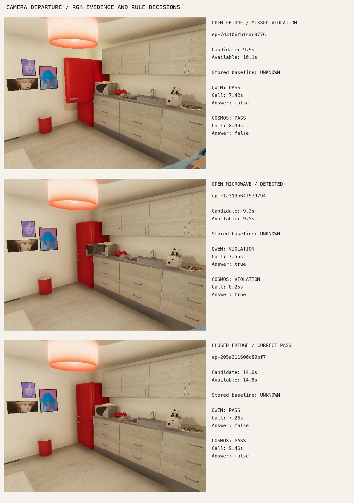

# End-to-end camera departure rule measurement

## Result and scope

The frozen YOLO person-disappearance policy matched all twelve reviewed camera departures. Both Qwen3-VL-Instruct-8B and Cosmos-Reason2-8B detected two of six reviewed violations, for **33.3% end-to-end violation recall**. Both missed every open-fridge violation. All twenty-four model requests completed with valid known answers, demonstrating that valid output and zero unknowns do not establish visual correctness.

This is a measured synthetic camera-exit experiment over 213.4 seconds, not a real-world alert benchmark. Development and test each contain six recordings, three reviewed violations, one detected violation, and two missed violations per model. The protocol and labels were committed in `1d3f2c4` before detector and verifier outcomes. The recordings themselves have appeared in earlier project work; these are not novel held-out images.

## Reviewed population and event definition

`various/r4-review/recordings.json` includes every development and test recording from `home-v1`: twelve videos, 2,134 decoded frames, two appliance targets, and two camera positions. Candidate extraction reads this source manifest but never loads the separate `reviewed-events.json`. Programs, variant names, simulator object states, and weak action labels are absent from candidate inputs.

A reference event is the first decoded frame after the visible actor has left the camera view. It does not identify an unseen kitchen-to-living-room threshold. The actor's last few foreground pixels sometimes remain after YOLO ceases to detect a person. Native-frame exit sheets document that distinction. Door state is independently read from visible geometry at departure; some intended reopening scenarios leave the microwave visibly closed.

Review was performed by the assistant using RGB contact sheets across each recording and every native frame near departure. It is not independent human adjudication or exhaustive dense annotation of all possible brief disappearances. This limits claims about event coverage. The fixed scene, synthetic rendering, correlated programs, and small population further limit generalization.

## Candidate extraction and availability

`rules/departure.py` maintains only consecutive presence/absence counts, an armed flag, and the first absent frame reference. A YOLO person score of at least 0.25 for three consecutive frames arms the detector. Three consecutive absent frames emit a candidate at the first absent timestamp. Availability is the third absent timestamp, 200 ms later in these 10 FPS recordings. New consecutive presence is required to rearm.

The existing `perception.detector.Detector` supplied YOLO11n boxes with its pinned parameters: 640-pixel input, vendor confidence floor 0.1, IoU 0.7, at most 100 detections, and explicit MPS execution. All source frames were processed, not only the reviewed departure neighborhoods. The detector emitted twelve candidates and no unmatched candidates. Several candidate times precede complete visual disappearance by 100 ms; all match within the frozen 500 ms tolerance.

Matching maximizes one-to-one cardinality within episode, then minimizes total absolute timestamp error. Dynamic programming avoids a greedy assignment consuming a candidate needed by a neighboring reference. Every unmatched reviewed event remains in the recall denominator. Smoke fixtures explicitly exercise missing candidates, unknown decisions, duplicate opportunities, episode isolation, and false alerts even though the measured dataset has no unmatched candidates.

## Rule and verifier integration

The rule is `state_at_event`, property `door_open`, expected `false`. Baseline evaluation queries the existing immutable `temporal-replay-v1` observation run and `state/F__linear_head` stream at the exact candidate timestamp and availability horizon. All twelve queries return `UNKNOWN / no_exact_state_sample`. This measures the current sparse-store integration, not the accuracy of a freshly run dense state classifier. No nearest-neighbor or carried-forward state is substituted.

Each unknown decision supplies one exact decoded 640×480 frame to the existing focused handoff. The frame is hashed and bound to episode, target object, timestamp, and request identity. Qwen and Cosmos run as separate conditions; neither overwrites the baseline. The accepted direct-greedy profiles retain their fixed system prompts and neutral sampling parameters, with a 4,096-token ceiling and a 120-second deadline. No retry or prompt tuning followed outcome inspection.

The models are the existing community Qwen3-VL-Instruct-8B 8-bit checkpoint and locally converted official Cosmos-Reason2-8B 8-bit checkpoint. Runtime versions recorded by every worker are MLX 0.32.2, MLX-VLM 0.6.17, and Transformers 5.16.1. They perform visual state verification; the repaired native 2B embedding pipeline is independent of this experiment. Local model file hashes and profile identities are retained with the measurement artifacts.

## Measured outcomes

| Condition | Candidates matched | Violations detected | Violation recall | Unknown decisions | False alerts |
|---|---:|---:|---:|---:|---:|
| Existing exact-time state store | 12/12 | 0/6 | 0% | 12/12 | 0 |
| Qwen 8B direct greedy | 12/12 | 2/6 | 33.3% | 0/12 | 0 |
| Cosmos 8B direct greedy | 12/12 | 2/6 | 33.3% | 0/12 | 0 |

Both models correctly accept the six closed-door departures and correctly reject the two open-microwave departures. Their four false PASS decisions concern the open fridge. There are no candidate losses in this population, so the measured violation loss occurs at visual verification. The result is not evidence that a more permissive JSON parser or a larger reasoning budget would fix the visual error.

Zero false alerts over 213.4 seconds is an observed count. The mechanically normalized rate is zero per source hour, but the experiment is far too short and correlated to establish a useful operational false-alert rate.



The top frame shows the protruding fridge door, although both models return closed. The middle frame shows the open microwave and a correctly emitted violation. The bottom frame shows a closed fridge and a correct PASS. Tiny actor fragments visible in some candidate frames explain why the proposal timestamp can precede the fully absent reference by one frame.

## Cost and latency

| Measurement | Qwen | Cosmos |
|---|---:|---:|
| Requests | 12 | 12 |
| Total call wall time | 89.23 s | 104.02 s |
| Median call wall time | 7.46 s | 8.58 s |
| Maximum call wall time | 7.98 s | 9.46 s |
| Prompt tokens | 6,084 | 6,216 |
| Generated tokens | 686 | 805 |
| Peak MLX allocation | 10.86 GB | 10.86 GB |

The detector processed 2,134 frames in 39.59 seconds summed across episode runs, approximately 0.186 seconds of processing per source second. That total includes decode and per-episode loop work but excludes initial detector construction. Each verifier call launches an isolated worker and includes model loading, preparation, generation, and validation in its wall time. These are sequential offline call costs, not measured live queue latency or sustained replay capacity. REPLAY will measure queueing and overload separately.

## Reproduction and files

Run from the repository root. The extraction and inference scripts intentionally refuse to overwrite completed experiment destinations.

```sh
PYTHONPATH=workbench/src workbench/.venv/bin/python ttmp/2026/09/06/VIDEO-RULES-001--project-4-temporal-rules-and-bounded-investigation/scripts/05-review-departure-recordings.py
PYTHONPATH=workbench/src workbench/.venv/bin/python ttmp/2026/09/06/VIDEO-RULES-001--project-4-temporal-rules-and-bounded-investigation/scripts/06-refine-exit-review.py
PYTHONPATH=workbench/src workbench/perception-env/.venv/bin/python ttmp/2026/09/06/VIDEO-RULES-001--project-4-temporal-rules-and-bounded-investigation/scripts/07-detect-departures.py
PYTHONPATH=workbench/src workbench/.venv/bin/python ttmp/2026/09/06/VIDEO-RULES-001--project-4-temporal-rules-and-bounded-investigation/scripts/08-verify-departures.py
PYTHONPATH=workbench/src workbench/.venv/bin/python ttmp/2026/09/06/VIDEO-RULES-001--project-4-temporal-rules-and-bounded-investigation/scripts/09-measure-departures.py
PYTHONPATH=workbench/src workbench/.venv/bin/python ttmp/2026/09/06/VIDEO-RULES-001--project-4-temporal-rules-and-bounded-investigation/scripts/10-departure-smoke.py
```

`output/rules-departure-v1/` retains complete per-frame detections, source hashes, event packets, approved frame images, raw model output, profile hashes, runtime versions, and separately conditioned rule decisions. The portable scored report is copied to ticket `various/r4-measurement.json`; screenshots and the frozen review protocol are committed beside it. Scripts 09 and 11 rebuild the metrics and illustrated comparison without inference.

## Consequences for REPLAY

RULES now has a complete scoped end-to-end measurement, including a denominator that preserves missed candidates. It does not have acceptable general visual accuracy. The replay viewer must make an UNKNOWN baseline and a wrong verifier PASS inspectable side by side. It must also expose processing delay and dropped work instead of presenting a final answer as if it were available at source time.

The next implementation retains monotonic source availability, bounded scheduling, stable case identities, separate evidence conditions, explicit as-of queries, and visible gaps. General revision/supersession, lifecycle workflow, transactional outbox, distributed recovery, and real-video collection remain separate follow-up work. None is required to explain this measured failure.
