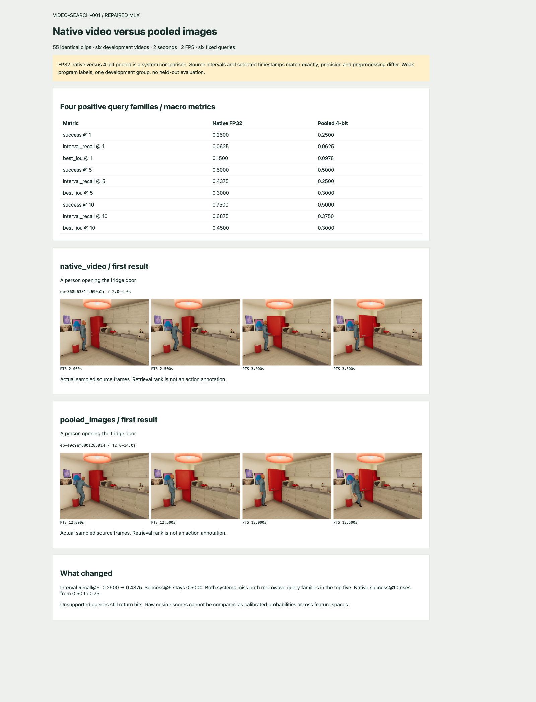

# Repaired native video versus pooled images: development comparison

The repaired FP32 native-video path successfully encoded 55 clips from six development videos. The source video hashes, split groups, interval boundaries, selected PTS, raw PTS, time bases, and origins exactly match the preserved two-second, 2 FPS pooled-image index. Native Interval Recall@5 increased from 0.25 to 0.4375, while Success@5 remained 0.50. Both systems still failed both microwave query families at K=5.

This is a fixed development system comparison. Native uses official FP32 weights and pinned official preprocessing; pooled uses the existing community 4-bit checkpoint and image preprocessing. The experiment measures the combined systems, not the isolated value of temporal attention. There is no held-out result or default-mode promotion in this follow-up.

## Accepted implementation and frozen inputs

The workbench integration is `127921a`; the MLX-VLM fork is `6452614f6de04694d1e34fd13abaca11f6ffb994`. The native environment is `output/mlx-video-fix/.venv`, with official model artifacts under `output/mlx-video-fix/models/official`. The original `workbench/.venv`, pooled frame cache, and pooled index remain unchanged. The reproduction protocol/script was committed as `4483cbd`.

The fixed protocol is `various/native-pooled-v1/protocol.json`. It preserves the six original query texts and SHA-256, development group g03, K values 1/5/10, 50-percent relevance coverage, and seeded random controls. Four queries have weak program-supervised positive intervals: opening/closing fridge and opening/closing microwave. The dog/garden and watering-houseplants queries have no positive intervals and are reported as unsupported, without a learned rejection threshold.

A chunk ID includes feature-space identity and must differ across native and pooled indices. The script therefore compares every source chunk field except that derived ID. It also rejects query encoders whose feature space does not match their index. Native's internal repeated-final-frame handling for odd inputs remains part of its preprocessing contract; equality here concerns the original selected source observations.

## Results

| Macro metric over four positive queries | Pooled 4-bit | Native FP32 |
|---|---:|---:|
| Success@1 | 0.25 | 0.25 |
| Interval Recall@1 | 0.0625 | 0.0625 |
| Best temporal IoU@1 | 0.0978 | 0.1500 |
| Success@5 | 0.50 | 0.50 |
| Interval Recall@5 | 0.2500 | 0.4375 |
| Best temporal IoU@5 | 0.3000 | 0.3000 |
| Success@10 | 0.50 | 0.75 |
| Interval Recall@10 | 0.3750 | 0.6875 |
| Best temporal IoU@10 | 0.3000 | 0.4500 |

Success measures whether any relevant interior is covered. Interval recall measures the fraction of distinct relevant interiors covered, averaged across query families. A returned interval matches a weak interior when it overlaps at least 50 percent of that interior. These metrics do not establish visible action correctness; simulator program intervals can disagree with rendered motion.

| Query family | Relevant interiors | Pooled matched @5 | Native matched @5 |
|---|---:|---:|---:|
| Opening fridge | 4 | 2 | 3 |
| Closing fridge | 2 | 1 | 2 |
| Opening microwave | 4 | 0 | 0 |
| Closing microwave | 2 | 0 | 0 |

The improvement at K=5 comes from recovering additional fridge interiors, not solving a new query family. The identical seeded random control gives macro Success@5 0.2525 and Interval Recall@5 0.089375. These small correlated samples do not support a statistical generalization claim.

Unsupported queries still return ranked hits. Native top cosine scores are approximately 0.2944 for dog/garden and 0.4131 for watering plants; pooled gives 0.0624 and 0.1574. Those numbers are not directly comparable calibrated confidence estimates across feature spaces. Higher native raw similarity does not establish a higher false-positive rate without a defined thresholding policy.

## Inspecting actual frames



The native first result is `ep-368d6331fc690a2c`, 2–4 seconds. The pooled first result is `ep-e9c9ef6801285914`, 12–14 seconds. The screenshot shows the actual selected frames at half-second intervals, decoded from source videos whose hashes were checked. The images are evidence for review, not newly assigned dense action labels.

A static review page is available at `http://127.0.0.1:8775/comparison.html`. The ticket preserves its HTML, eight source-frame PNGs, and browser screenshot so later reports can reuse the evidence without rerunning a model.

## Reproduction

Run from the repository root. Use a new experiment directory if changing the protocol or rerunning completed query evaluations.

```bash
output/mlx-video-fix/.venv/bin/video-workbench index \
  --mode native_video --splits development --seconds 2 --fps 2 \
  --root output/native-pooled-comparison-v1/native
```

The existing pooled manifest is `output/video-workbench/indices/78b4ccb4780da259733f3ab253cf359b759b147da556b90b7af6421b02eb8a1b/manifest.json`. The native manifest is `output/native-pooled-comparison-v1/native/indices/ed99514634df6f1c8f952be1ce54a281ebf80a576f98806c3e894dfda7d9eb23/manifest.json`. Each has 55 × 2,048 float32 embedding values; the vector file occupies 450,688 bytes including its NumPy header.

`scripts/04-compare-native-pooled.py` runs in three stages: `native_video` under the native environment, `pooled_images` under the pooled environment, and `compare` after both results exist. It records query vectors, their hashes, encoder identities, all ranked hits, per-query and aggregate metrics, and copied index manifests. The mode stages refuse to overwrite existing completed reports. `scripts/05-render-native-comparison.py` creates the screenshot page from those frozen results and hash-checked source videos.

The fresh native build reported 14.8026 seconds inside the build function, excluding model loading and subsequent query encoding. This is not an end-to-end latency comparison because the pooled baseline was reused. A repeat build reused all 55 clips with zero fresh inference, preserved the identical index ID, and reported 0.0267 seconds inside the build function.

## Validation and next use

The main test suite passed: 34 passed, one skipped, two existing dependency deprecation warnings. This includes the native cache/space separation, timestamp padding, and failed-inference publication tests. The skipped ByteTrack module is isolated in the perception environment and unrelated to the repaired native adoption.

The fixed native path is now usable for subsequent video experiments via explicit `--mode native_video`. Keep the pooled baseline and use new feature identities for new native datasets. Before choosing a default or claiming action understanding, evaluate a broader visually reviewed corpus with more scenes and microwave variation. A matched-precision and matched-preprocessing control is needed to attribute differences specifically to temporal encoding.
