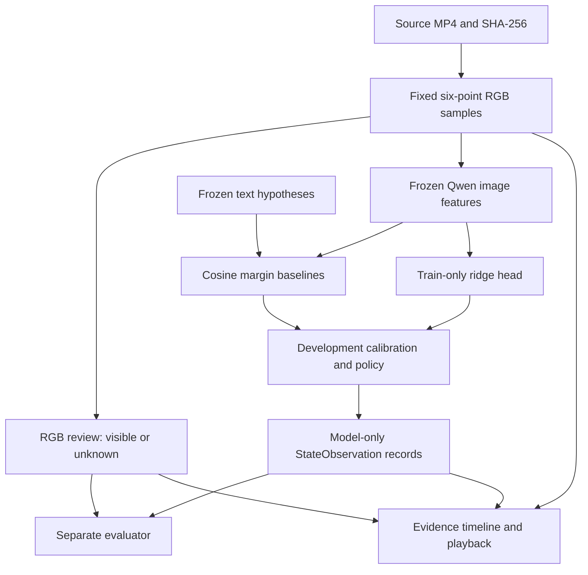
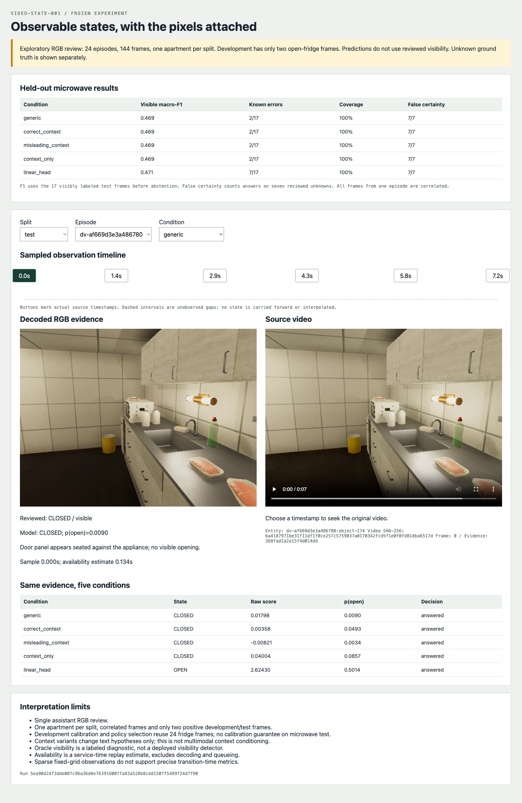
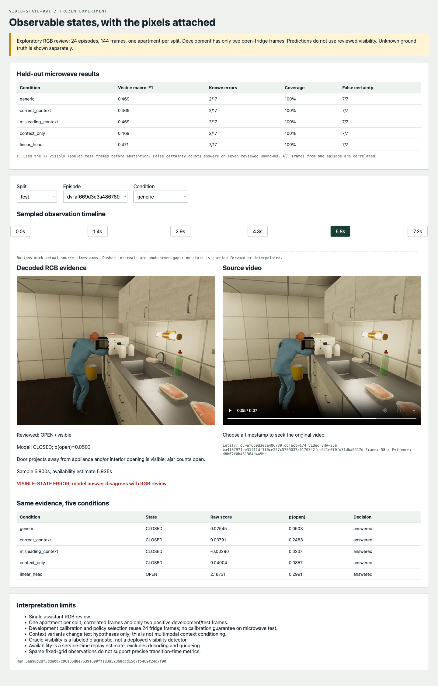
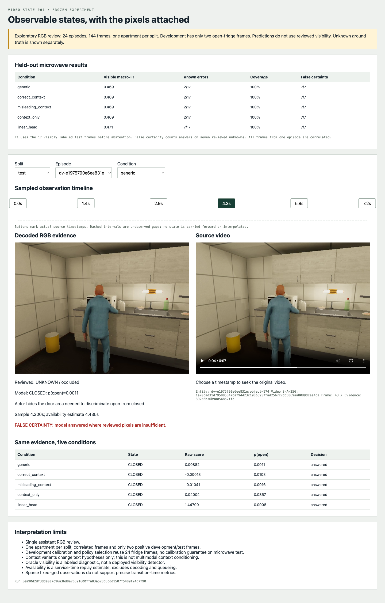
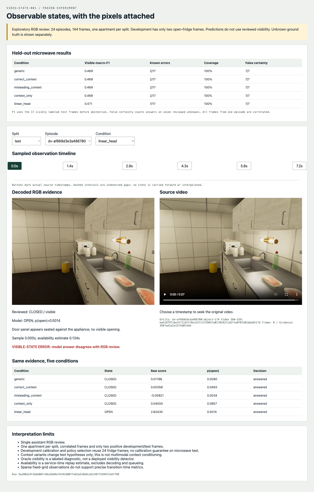

# Observable state recognition: implementation, failed transfer, and the next experiment

## What this project establishes

The state workbench now implements a reproducible path from source video pixels to reviewed door-state labels, frozen image features, five baseline conditions, development-calibrated predictions, and evidence playback. The implementation is useful; the measured recognition quality is insufficient for deployment. Keeping those conclusions separate is essential when interpreting this project.

On the held-out microwave apartment, the generic image/text baseline predicts every visible frame as closed. It correctly labels 15 closed frames and misses both open frames. Correct kitchen context and deliberately misleading bathroom context produce the same decisions. A context-only control also produces those decisions. The trained linear head recognizes one open frame but introduces six false-open predictions. All five conditions answer all seven frames whose reviewed door state is unknown.

The experiment therefore provides an explicit failure case for the next perception project. It does not establish that localized crops will improve the result, nor that a particular model family is inherently unsuitable. The data contains only one apartment per split, with fridge-only development and microwave-only test. Representation transfer, scene appearance, target scale, and calibration transfer are confounded.

## System boundaries and data flow

A source video is immutable input. A sample identifies a decoded RGB frame at its actual presentation timestamp. An entity identifies the appliance whose door is being judged. A reviewed label is evaluator information. A feature is a numerical model representation. A state observation is a model output with source evidence and producer identity. These objects have different authority: an entity binding identifies what to inspect, but does not determine its visible state.



No simulator action name or graph state determines a reviewed value. The source binding uses the simulator's target identifier to name the requested appliance, so this experiment assumes the correct entity has already been selected. It does not solve visual detection or entity association. That assumption must be removed or explicitly retained when detector tracks enter the pipeline.

The runtime lives in `workbench/src/video_workbench/predicates/`. It reuses `media.py` for source timestamps, `registry.py:file_hash` for source verification, and `embedding.py:QwenEmbedder.image/text` for the existing local model. The shared embedding adapter and native-video repair were not modified. No new runtime dependency or model download was required.

## Reviewed data and split policy

The subset contains 24 episodes and six fixed relative positions per episode: 0%, 20%, 40%, 60%, 80%, and 100% of the decoded frame-index range. The selected frame's actual PTS is retained in microseconds. This grid was fixed before model scores; it is not a transition-centered sample chosen to make the classifier look better.

Twelve microwave episodes come from the original `home-v1` release. Twelve appliance-door episodes come from `diversity-v2`. All original videos were rendered in apartment 0, so this experiment assigns all original microwave episodes to training. The diversified release retains its apartment-based train/development/test ownership. Neither original release is changed.

| Split | Appliance | Closed | Open | Ambiguous | Occluded |
|---|---|---:|---:|---:|---:|
| Train, apartment 0 | Fridge | 20 | 4 | 0 | 0 |
| Train, apartment 0 | Microwave | 36 | 35 | 1 | 0 |
| Development, apartment 1 | Fridge | 22 | 2 | 0 | 0 |
| Test, apartment 2 | Microwave | 15 | 2 | 1 | 6 |

The 144 frames contain 136 visible labels and eight unknowns. Frame counts are not independent trial counts: multiple frames share an episode, and alternate views share a situation. Only one apartment exists in each partition. The proposed minimum class support is not achieved for open fridges; adding adjacent images would increase counts without establishing new situations.

Review was performed once by the assistant at native contact-sheet resolution. This is not independently adjudicated human gold. All 24 review sheets are preserved under `various/screenshots/sheet-00.jpg` through `sheet-23.jpg`; `review-codes-v2.json` records the six decisions per sheet. The freezing script materializes those decisions and their source hashes. C means closed, O means open, A means ambiguous, and U means occluded. A partially open door counts as open when the panel angle or interior gap is visibly established.

This review found a distinction already suggested by the corpus calibration work: an intended CLOSE can leave a microwave door visibly open. It also found actor occlusion that prevents reliable decisions from one camera. Labels remain unknown in those cases rather than borrowing state from the other camera or the simulator program.

## Label and observation contracts

`contracts.py:StateLabel` separates `value: bool | None` from `observability`. A visible label must carry a Boolean; ambiguous, occluded, or out-of-frame labels must carry null. False means visibly closed. Null means the reviewed evidence is insufficient. A missing row is an annotation completeness error and is rejected rather than converted to null.

Every label carries sample ID, entity ID, property, reviewer, revision, reviewed-RGB provenance, and rationale. `load_dataset` validates one-to-one label coverage and entity/property agreement. `validate_samples` checks split ownership across apartments, source hashes, and episodes, validates source paths against the workspace root, and rehashes source images and videos.

`StateObservation` exports the temporal-memory boundary:

```python
StateObservation(
    sample_id="source-frame-key",
    episode_id="episode",
    entity_id="episode:object-174",
    property="door_open",
    sample_us=4_300_000,
    available_us=4_435_000,
    availability_source="sample-plus-image-service-time-replay; ...",
    value=False,                 # model prediction, not the reviewed label
    raw_score=margin,
    calibrated_probability=p,
    unknown_reason=None,         # required when value is null
    evidence_ids=("source-frame-key",),
    feature_space_id=space_id,
    producer_id=producer_id,
)
```

The example times illustrate the implemented semantics. `available_us` is source PTS plus measured image-encoding service time. It excludes startup, decode, queueing, and head/calibration computation. Context-only text features are precomputed. This is a service-time replay estimate, not a live latency measurement or a guarantee that observations arrive by that horizon. A future causal runtime must measure its actual end-to-end availability.

Observation validation rejects time reversal, nonfinite scores, invalid probability bounds, and unknown values without reasons. The timeline presents samples as discrete points. It does not forward-fill an old state through an unobserved interval.

## Frozen features and model identity

`features.py:extract` accepts only sample metadata and a local model path. It validates sources, loads the existing 4-bit Qwen3-VL embedding model, and encodes each frame individually. Native RGB is 640×480. The existing adapter converts to RGB and resizes to 320×240 using Pillow bicubic interpolation. No target crop is used in this experiment.

The feature representation is explicitly marked `single_image_state`, with no temporal pooling and a fixed-six-point sampling declaration. Its identity includes the model artifact digest and inherited preprocessing/runtime configuration. The cache separately records the adapter and extractor hashes, source video/image hashes, entity bindings, text templates, and feature-archive SHA-256. Reusing a cache against another entity, evidence set, feature space, or template set is rejected.

The cache contains 144 image vectors of dimension 2048 and 14 text vectors: three pairs of state hypotheses for each of two appliances, plus one context-only sentence per appliance. Feature vectors are finite and unit normalized. The model's measured image service time totaled 19.467 seconds, with a median of 134.769 ms per frame. This number excludes model loading and the rest of the workflow.

## Baselines and numerical procedure

For unit-normalized image vector x and two hypothesis vectors, the raw text score is:

```text
margin = dot(x, text_open) - dot(x, text_closed)
```

A positive margin favors the open hypothesis before calibration. It is not itself a probability. The hand-computed test uses x=(0.6,0.8), closed=(1,0), and open=(0,1), yielding 0.2.

The frozen conditions are:

| Condition | Input or hypothesis |
|---|---|
| Generic | “The {entity} door is {state}.” |
| Correct context | “In a kitchen, the {entity} door is {state}.” |
| Misleading context | “In a bathroom, the {entity} door is {state}.” |
| Context only | Embed “A {entity} in a kitchen.” and compare to generic hypotheses; no image vector |
| Linear head | Ridge regression on frozen image vectors and visible train labels |

Context conditions change the text hypotheses; they are not an implementation of multimodal prompt conditioning. Context-only predictions are constant within appliance class and expose shortcuts caused by class priors or wording.

The linear head centers training vectors and maps Boolean labels to −1/+1. With centered training matrix X and centered targets y, it solves the dual ridge system:

```text
alpha = solve(X Xᵀ + 0.01 I, y)
w = Xᵀ alpha
raw_score(x) = (x - training_mean) · w + training_target_mean
```

Only the 95 visible training rows participate. There is no encoder fine-tuning, no test-selected crop, and no hyperparameter search after the result. The head artifact retains weights, mean, bias, ridge coefficient, feature-space identity, and supported appliance classes.

For each condition, `fit_calibration` fits a regularized two-parameter logistic model on the 24 visible development rows. Score standardization also uses development only. `select_policy` chooses the probability threshold with highest development macro-F1, then the smallest radius from a predeclared list that achieves at most 10% empirical development error among answers. A radius greater than one supplies a reject-all fallback.

```python
head = fit(train.features, train.visible_labels)
raw_scores = score_all_sources(head, frozen_features)
calibration = fit_platt(raw_scores[development], development.labels)
policy = select_policy(calibration(development), development.labels)
predictions = apply(calibration, policy, raw_scores)
metrics = evaluate(predictions[test], reviewed_labels[test])
```

Calibration and policy selection reuse the same tiny development set, so its apparent quality is optimistic. Development has no occluded labels and only two positives. A 10% error target even permits a constant closed predictor to miss both positives and still pass with 2/24 errors. The resulting probabilities have no demonstrated calibration guarantee on the microwave apartment.

## Results and failure analysis

The following table uses the frozen selected policies. TN/FP/FN/TP refer only to the 17 visible test labels. False certainty counts non-null model answers among the seven reviewed unknowns.

| Condition | TN | FP | FN | TP | Visible macro-F1 | Known errors | False certainty |
|---|---:|---:|---:|---:|---:|---:|---:|
| Generic | 15 | 0 | 2 | 0 | 0.46875 | 2/17 | 7/7 |
| Correct context | 15 | 0 | 2 | 0 | 0.46875 | 2/17 | 7/7 |
| Misleading context | 15 | 0 | 2 | 0 | 0.46875 | 2/17 | 7/7 |
| Context only | 15 | 0 | 2 | 0 | 0.46875 | 2/17 | 7/7 |
| Linear head | 9 | 6 | 1 | 1 | 0.47111 | 7/17 | 7/7 |

All conditions selected radius zero and answered all 24 test frames. Known selective risk is therefore 11.76% for text/context conditions and 41.18% for the linear head. These are observed fractions, not precision estimates over independent trials. Combining known errors and answers on unknown evidence would count 9/24 unsupported-or-incorrect answers for the text conditions and 14/24 for the head; this combined denominator differs from known selective risk.

The raw ridge head before development calibration classifies all 95 visible training rows correctly at its zero threshold. On development and test, it predicts open for every visible frame. The associated raw macro-F1 values are 1.0, 0.07692, and 0.10526. Development calibration adjusts the threshold but does not repair this transfer failure. This diagnosis is preserved in `various/run-v2/diagnostics.json` alongside radius sweeps. The sweeps are descriptive; no test-selected operating policy replaces the original predictions.

An oracle-visibility diagnostic suppresses model outputs at reviewed unknown frames. It would reduce answered test frames from 24 to 17, but requires evaluator knowledge unavailable to this implementation. It is not a visibility detector and must not be presented as an abstention success.

Precise transition metrics are unsupported in this run. The corpus has conservative reviewed brackets for a subset of transitions, but six sparse samples per episode do not localize each predicted boundary within those brackets. Exact transition error would imply temporal resolution this experiment does not possess. No transition score is fabricated.

## Evidence gallery and API









These are actual browser captures of the frozen run. The screenshot trail also includes every reviewed contact sheet. Detection overlays, tracker outputs, and masks are not part of this state ticket; the perception project should preserve corresponding source/overlay/crop views as it is implemented.

The read-only FastAPI application in `app.py` exposes:

| Endpoint | Behavior |
|---|---|
| `GET /` | Evidence timeline and comparison interface |
| `GET /v1/state/run` | Frozen samples, reviewed labels, observations, metrics, and limitations |
| `GET /v1/state/evidence/{sample_id}/image` | Registered sample RGB; hash checked before serving |
| `GET /v1/state/evidence/{sample_id}/video` | Source MP4 with browser Range support; hash checked before serving |

The API accepts evidence IDs rather than arbitrary paths. Unknown evidence or kind returns 404. Changed source bytes return 409. Browser verification confirmed native image width 640, decoded video readiness, and seeking to 5.8 seconds for the missed-open example. The only initial console error was a missing favicon; the page now declares an inline empty icon.

## Reproduction and review map

Run from the repository root with `workbench/.venv/bin/python`. The original MP4 releases and local model remain under ignored `output/`; they are not included in a Git checkout. Their expected hashes are tracked in the ticket manifests. Reproduction requires the same source artifacts or an explicit new dataset revision.

```bash
# Recreate fixed RGB samples and freeze the recorded review decisions.
workbench/.venv/bin/python ttmp/2026/09/06/VIDEO-STATE-001--project-2-observable-state-recognition/scripts/04-prepare-diverse-review.py
workbench/.venv/bin/python ttmp/2026/09/06/VIDEO-STATE-001--project-2-observable-state-recognition/scripts/05-freeze-labels.py

# Inspect the existing immutable run.
workbench/.venv/bin/python -m video_workbench.predicates serve \
  --run output/state-workbench/run-v2 --port 8772

# Run meaningful contract, split-isolation, and API tests.
workbench/.venv/bin/python -m pytest workbench/tests -q
```

Use `python -m video_workbench.predicates encode --help` and `evaluate --help` for new runs. Encoding needs the sample manifest, local model directory, and a new cache destination. Evaluation needs samples, labels, cache, and a new output directory. Existing complete caches and run directories are rejected to preserve prior experiments. `scripts/06-summarize-run.py` archives the first run and creates diagnostics without altering its policies.

| File | Review responsibility |
|---|---|
| `predicates/contracts.py` | Label completeness, visibility semantics, source grouping, observation validation |
| `predicates/features.py` | Frozen templates, representation identity, evidence-bound cache |
| `predicates/classify.py` | Margins, ridge head, calibration, threshold policy, metric denominators |
| `predicates/experiment.py` | Train/development ownership, producers, prediction export |
| `predicates/app.py`, `timeline.html` | Read-only evidence serving and discrete timeline |
| `tests/test_predicate_split_isolation.py` | Held-out-label perturbation leaves parameters/predictions unchanged |
| `tests/test_predicate_api.py` | Evidence allowlist, byte ranges, and changed-source rejection |
| Ticket `various/run-v2/` | Frozen full results, 720 observations, diagnostic sweeps |

All 24 workbench tests passed. Two warnings originate from installed Starlette/AnyIO test dependencies; they did not affect assertions. This project did not change dependencies to remove those unrelated warnings.

## Handoff to perception and temporal memory

The next implementation opportunity is VIDEO-PERCEPTION-001 D1–D2: detection contracts and vocabulary coverage, followed by tracking and reversible contextual crops. It should use a separate dependency environment, keep full-frame evidence available, and establish source-coordinate overlays before integrating recognition. Its detector must report unsupported categories and misses instead of interpreting no detection as object absence.

Compare full frames, target crops, and full frames plus contextual crops on identical fixed intervals. Give crops distinct cache identities containing coordinates and transforms. A crop can increase effective target resolution; it cannot reveal geometry hidden by the actor. Binding a detector track to the requested appliance also requires an explicit policy rather than copying a tracker integer into a simulator entity ID.

Only after that representation comparison should D3 add cue-based evidence selection. Otherwise an apparent recognition gain could come from choosing easier moments. Generative verifier experiments should wait for their runtime capability gate. Pixel masks should follow a measured failure that boxes and contextual crops cannot address.

Temporal memory can already consume the `StateObservation` shape for interface tests, but should not treat this baseline's confidence as reliable household state. It must preserve unknowns, evidence identity, and actual availability, and it must define expiration or new observations before carrying state across gaps. A broader reviewed dataset with appliance diversity in development and test remains necessary before any generalization or calibrated-abstention claim.
