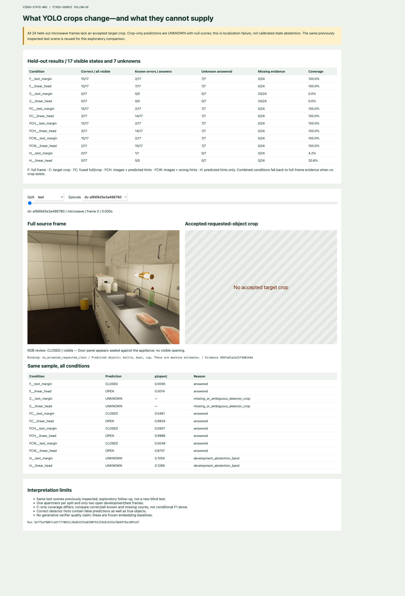

# YOLO region evidence: state comparison and failure analysis

This follow-up reopens the completed observable-state baseline to test whether source-bound detector crops and predicted object hints improve recognition. The experiment is finished, and the result does not establish an improvement. The decisive failure is unavailable target localization on every held-out microwave sample.


The state follow-up freezes six representations before fitting classifiers. Each sample has a requested entity class and source timestamp from the original state protocol. `predicates/regions.py` selects a target crop only when exactly one usable accepted rectangle has the requested mapped class at that frame. State labels do not participate in selection. Multiple same-class candidates produce ambiguity; no accepted candidate produces missing evidence. Neither condition establishes object absence.

| Code | Representation | Missing-crop behavior | Nominal resized pixel budget |
|---|---|---|---:|
| F | Existing full-frame image embedding | Always available | 76,800 |
| C | Requested target crop embedding | Unavailable | 76,800 |
| FC | Normalized mean of unit F and C vectors | Use F | Up to 153,600 |
| FCH | Joint available images plus predicted-object hint | Full image plus hint | Up to 153,600 |
| FCW | Joint available images plus deliberately wrong hint | Full image plus wrong hint | Up to 153,600 |
| H | Predicted-object hint as text | Hint remains available | 0 MLX image pixels |

Hints use the explicit wording `Predicted objects: {classes}. These are machine estimates.` The wrong-hint condition uses `bicycle, dog`. H contains no MLX image input, but its text is derived from YOLO visual predictions and is therefore not independent of the video. FCH and FCW use joint image/text encoding; FC uses late vector fusion. Comparing all three does not isolate a single architectural variable. The doubled possible image budget also prevents a claim that any future FC gain would be free.

Full-frame features are reused exactly from the existing cache. Crop and hint conditions use the same local Qwen3-VL embedding model artifacts. A duplicate-full late-fusion control equals F numerically because normalizing the mean of two identical unit vectors returns that vector. It is a redundancy identity, not an independently measured joint two-image control.

Each representation is evaluated using both a text-hypothesis margin and a ridge linear head. The head fits on available, visually labeled training rows. Platt calibration and the decision/abstention policy use development rows. Existing apartment groups and sample IDs remain fixed. The test partition was already inspected in the earlier state work, so this is explicitly an exploratory follow-up, not a new untouched benchmark.

Crop availability was **46/96 train, 23/24 development, and 0/24 test**. Across all samples, 69 had a unique accepted crop, 74 had no accepted crop, and one was ambiguous. This distribution is the primary result: a region-conditioned model trained mostly with usable regions encounters a held-out partition where the requested localization is unavailable.

## 9. State results and denominator discipline

The held-out partition contains 17 visibly labeled states and seven unknown observations. Only two visible examples are open. A classifier that always predicts closed can appear successful by raw accuracy while failing the minority state and answering when the object is unobservable. The report therefore records correct answers over all visible samples, errors among answered visible samples, unknown false certainty, and coverage together.

| Representation / classifier | Correct / all 17 visible | Known errors / known answers | Unknown answered / 7 | Answered / all 24 |
|---|---:|---:|---:|---:|
| F / text margin | 15/17 | 2/17 | 7/7 | 24/24 |
| F / linear head | 10/17 | 7/17 | 7/7 | 24/24 |
| C / text margin | 0/17 | 0/0 | 0/7 | 0/24 |
| C / linear head | 0/17 | 0/0 | 0/7 | 0/24 |
| FC / text margin | 15/17 | 2/17 | 7/7 | 24/24 |
| FC / linear head | 3/17 | 14/17 | 7/7 | 24/24 |
| FCH / text margin | 15/17 | 2/17 | 7/7 | 24/24 |
| FCH / linear head | 3/17 | 14/17 | 7/7 | 24/24 |
| FCW / text margin | 15/17 | 2/17 | 7/7 | 24/24 |
| FCW / linear head | 2/17 | 15/17 | 7/7 | 24/24 |
| H / text margin | 0/17 | 1/1 | 0/7 | 1/24 |
| H / linear head | 0/17 | 5/5 | 0/7 | 5/24 |

Crop-only zero errors do not establish good selective classification: it answered nothing because localization failed. Its raw score and calibrated probability are both null, with reason `missing_or_ambiguous_detector_crop`. This required extending `StateObservation` to permit paired null scores only for an unknown value. A numerical score such as zero would imply an inference result that never occurred.

The full-frame text margin retains the earlier 15/17 result, but its visible macro F1 is only 0.46875 because it misses both open states. The full-frame head has visible macro F1 0.4711. FC and FCH heads fall to 0.1736, and the wrong-hint head to 0.1053. These are before-abstention visible metrics; the raw result archive preserves the confusion matrices and policy parameters.

Development F1 reaches 1.0 for several region/hint conditions while held-out performance is poor. The data do not support selecting those development winners as deployable models. At test time FC has only F evidence, but its head was fit in a representation distribution containing crops. That train/test feature difference is one plausible contributor to failure; this small experiment cannot isolate it from scene and class distribution shifts.

There are no common available test crops, so a paired test comparison restricted to frames with both F and C has an empty denominator. The archive records this as null. Creating a table of crop-only conditional accuracy without that fact would conceal the experiment's central limitation.


## Inspecting the result



The striped panel means that the crop condition has no evidence. It must not be read as a black image passed into the encoder or as a confident prediction that the appliance is absent. Every crop-only observation records null raw and calibrated scores.


The development example demonstrates a usable crop. Its apparent success does not remove the distribution shift: the held-out partition contains a different appliance rendering and has no accepted requested-class localization. The comparison dashboard exposes both outcomes rather than selecting only attractive crop examples.

## Implementation and reproduction

`workbench/src/video_workbench/predicates/regions.py` freezes label-free source/crop bindings and generates six feature arrays. The original full-frame cache is reused exactly. Each representation receives an identity derived from the base feature space, evidence manifest, condition, policy, and producer code. `region_experiment.py` fits only available visually labeled training rows, calibrates on development rows, evaluates the existing partitions, and exports per-sample observations. `region_app.py` validates experiment/sample/label hashes and serves allowlisted evidence to `region_viewer.html`.

```text
for representation in [F, C, FC, FCH, FCW, H]:
    train = visible_training_rows_with_available_evidence
    dev = visible_development_rows_with_available_evidence
    fit ridge_head(train)
    for scoring_method in [text_margin, ridge_head]:
        fit calibration_and_abstention_policy(dev)
        for fixed_sample in all_samples:
            if evidence_missing:
                save UNKNOWN, raw_score=null, probability=null
            else:
                save calibrated_prediction_or_abstention
        report coverage, missing_count, known_errors, unknown_false_certainty
```

The ticket entry scripts are `scripts/07-region-evidence.py`, `08-evaluate-regions.py`, and `09-serve-region-review.py`. The first script supports preparation and encoding; inspect its arguments before choosing fresh output destinations. The third serves the frozen run at `http://127.0.0.1:8774`. The run archive is `various/region-run-v1/`, containing results, all 1,728 observations, and feature metadata. Model weights and the feature NPZ remain in ignored local output storage, with their identities retained in metadata.

## Review and next work

The next experiment needs reviewed object rectangles at the actual state sample times, more positive open examples, and multiple apartments per partition. A manually localized crop control can test whether better localization could help, but it must remain explicitly oracle-assisted. The detector should then be evaluated on requested-object recall, ambiguity, source size, and view before any region-based state model is promoted.

The complete upstream implementation and its measured detector, mask, tracking, and proposal findings are documented in the perception ticket's `reference/02-yolo-perception-implementation-and-measured-evidence-report.md`. The diaries record commands, environment issues, implementation checkpoints, and print receipts. No generative-verifier quality result or real-time state latency is claimed by this comparison.
