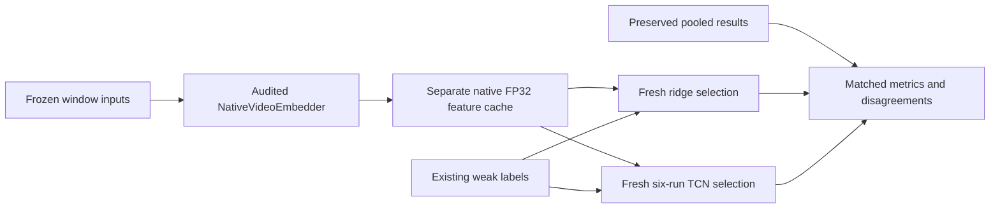

# FP32 native temporal feature comparison

## Question and scope

Does the repaired native-video representation improve weak action discrimination relative to the pooled-image TEMPORAL baseline when source windows, supervision, partitions, and head-training policies are held fixed? This follow-up answers that question with actual FP32 extraction and freshly fitted heads. It does not modify the main thread's RULES/VERIFY work, replace old feature caches, or introduce a new dataset.

The prior experiment used 792 trailing windows from 48 VirtualHome-AIST episodes. Its independent ridge head achieved 21.16% test macro recall; the selected causal TCN averaged 18.63% across three seeds. Those are measurements on four-bit pooled-image features. The repair was not evaluated in that temporal experiment, so its negative result does not settle the native representation question.

## Fixed evidence and comparison limits

Reuse `output/temporal-v1/dataset` exactly: inputs SHA `388a556ff3dc53ed05f50e4c21524342006b0e2ae18441e485b5902e587769c3`, labels SHA `74dba5ddd859e559854b34aa0994e4c189c11c6a55db4c1f5690b668fac750f6`. Windows end at a half-second stride, span at most two seconds, and select actual source frames at two fps. Native input must use the exact same frame indices and timestamps, not resample the video again.

Train/development/test weak supervised counts remain 157/176/308, with WALK occupying 249 test positions. Report per-class recall, macro recall, accuracy, and paired disagreements. OPEN/CLOSE and GRAB/PUTBACK deserve explicit inspection. Exact segmentation-boundary metrics remain unavailable on these weak labels. Overlapping windows are not independent trials, and the small within-scene corpus does not establish broad generalization.

The comparison is native FP32 versus the deployed four-bit pooled system. It changes modality processing, precision, and processor artifacts together. An improvement would establish a better measured system on this frozen evaluation, not isolate temporal order as its cause. Quantized native variants and a separate official-FP32 pooled control are outside this requested first comparison.

## Accepted runtime

Use `output/mlx-video-fix/.venv/bin/python` and the existing `NativeVideoEmbedder`. It checks runtime pins, the repaired wrapper hash, official artifact identity, absence of quantization configuration, and official Transformers processors before inference. Repair commit: `6452614f6de04694d1e34fd13abaca11f6ffb994`. Official checkpoint revision: `9f2f7e710d6d81056aa5c0a4f04764fec6bb7bda`. Load only the existing official checkpoint at `output/mlx-video-fix/models/official`; no replacement model download is required.

The adapter casts parameters to FP32 and materializes evaluation. Native preprocessing receives ordered frames and actual microsecond timestamps relative to window start. Odd frame counts repeat the last frame and timestamp according to the accepted adapter contract. It disables internal frame sampling. The single-frame early windows are retained, not removed because they provide less temporal context.

## Architecture

Add a separate `temporal/encode_native.py` producer, preserving the existing pooled producer and trainer. Decode each selected source image once per episode, but encode each complete ordered window independently. Validate video hashes, native PTS, raw PTS, time base, origin, and half-open source bounds. Zero/false remains the representation of missing features; empty windows are not background labels.

The resulting `features.npz` has `[792,2048]` features plus validity, using the existing sequence-loader contract. A manifest records the input hash, native feature-space identity, ordered sample IDs, source audit, per-window inference timings, model load/extraction times, and MLX/RSS memory observations. Publish a complete feature manifest only after finite/unit-vector and row identity checks pass. Pilot artifacts are explicitly marked and rejected by the full loader's row-match requirement.

## Training and comparison

Use the unchanged ridge training/selection routine: train-only fitting, candidate strengths 0.01/0.1/1, selection by development macro recall. Use the unchanged TCN policy: seeds 7/17/27; 16 channels; one/two blocks per stage; two stages; 80 epochs; Adam 0.003; development evaluation every ten epochs; architecture selection by mean development macro recall across seeds. New heads are mandatory because native and pooled feature spaces are incompatible.

The shared trainer's legacy description mentions pooled features; the follow-up orchestrator will annotate its own new report with the actual native representation and preserve the underlying algorithm/source hashes. It will not modify the shared trainer while another thread is working. Trained native heads must pass the same actual-checkpoint future-perturbation and full-versus-streamed tolerance checks already built into that trainer.

Comparison joins by episode, timestamp, target, and mask, rejecting missing or different populations. Save per-class counts, changed predictions, corrected/worsened counts, seed variability, and the selected settings. Do not choose models or report only a favorable seed based on test results. Preserve the original pooled results unchanged and hash them in the comparison manifest.

## Phases and feature-boundary validation

1. N1: Commit design and producer, run an eight-window pilot including single/odd/even frame counts, and confirm pixel sensitivity and accepted runtime provenance.
2. N2: Extract all 792 native windows into a fresh cache, with every source timestamp audited. Record actual extraction duration and shared-machine resource measurements.
3. N3: Fit fresh ridge and TCN heads using the same policies, validate matched populations, and produce comparison tables and a figure. Run smoke checks at the completed feature boundary rather than repeatedly testing unrelated code.
4. N4: Write a measured findings report, record diary/commits/printing receipts, and close this follow-up only when actual artifacts prove completion.

## Reproduction and file map

The new producer CLI is `python -m video_workbench.temporal.encode_native DATASET DESTINATION [--limit N]` under the isolated native interpreter and `PYTHONPATH=workbench/src`. An optional limit creates a pilot only. Full output is `output/temporal-native-fp32-v1/features`; pilot output is a distinct directory. CPU training uses the existing `workbench/perception-env/.venv` and creates separate ridge/TCN outputs beneath the follow-up root.

Read `native_video.py:NativeVideoEmbedder` for acceptance gates, `temporal/encode.py` for the pooled audit contract, `temporal/benchmark.py:load_sequences` for identity/mask joins, and `temporal/train.py` for the unchanged training policy. The prior results and report remain the comparison record. The new diary is separate from the closed-phase diary to minimize interference with ongoing repository work.
