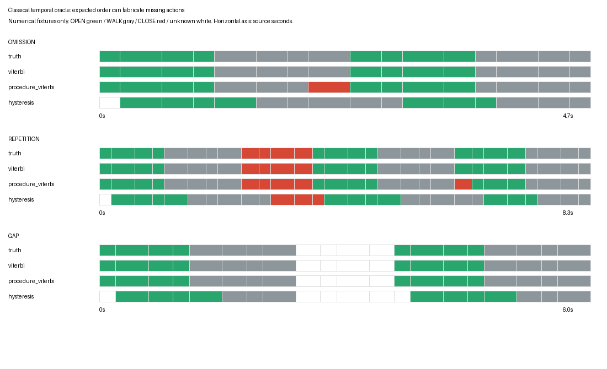

# Classical temporal comparison on dense pooled video features

The classical models do not establish a useful improvement over the independent head on this corpus. Development selection retains zero temporal strength for filtering and Viterbi and zero persistence for hysteresis. Offline smoothing increases test macro recall by only 0.16 percentage points while reducing accuracy by 6.49 points. The duration model reduces both measures. These results are exploratory measurements on weak program-interior labels, not reviewed dense visual action labels.

## Dataset and selection

The frozen release contains 48 VirtualHome-AIST episodes and 792 trailing pooled-image features of dimension 2048. Windows span at most two seconds, end every half-second, and sample source images at two frames per second. Latest sampled-frame timestamps determine weak interior targets; unreviewed boundary cells remain excluded from supervised metrics. Supervised counts are 157 train, 176 development, and 308 test. WALK contributes 249 test targets; predicting it everywhere gives 80.84% accuracy and 10% macro recall across ten classes.

The linear head is the previously development-selected ridge model. Transition potentials use Laplace-smoothed adjacent training labels, with no counting across masked cells. Decoder strength is selected from 0, 0.25, and 1 by development macro recall. Hysteresis persistence candidates are zero, 0.5, and 1 second. HSMM additionally selects a duration preference centered at 2, 4, or 8 feature samples. Ties retain the first candidate. Test labels never choose settings. These potentials are scores; neither ridge outputs nor the explicit duration preference are claimed to be calibrated generative probabilities.

| Method | Capability | Selected settings | Test weak accuracy | Test macro recall |
|---|---|---|---:|---:|
| Linear | Causal local feature | Existing ridge 0.01 | 75.97% | 21.16% |
| Hysteresis | Causal prefix | Persistence 0 seconds | 75.97% | 21.16% |
| Filter | Causal prefix | Strength 0 | 75.97% | 21.16% |
| Smoother | Offline valid run | Strength 0.25 | 69.48% | 21.31% |
| Viterbi | Offline valid run | Strength 0 | 75.97% | 21.16% |
| HSMM | Offline valid run | Strength 0.25, duration mean 2 samples | 68.83% | 18.35% |

The complete candidate results, per-class counts, per-episode targets and predictions, timings, source hashes, and settings are in `various/classical-comparison-v2/video-results.json`. Repeated overlapping windows are not treated as independent statistical trials, and no significance claim is made. The selected zero-strength models are valid negative findings: temporal complexity did not earn its cost under this selection rule.

## Numerical error preservation and segment metrics

Exact segment evaluation is limited to numerical oracle fixtures. `metrics.segment_metrics` forms contiguous output-cell runs, excludes negative prediction labels, retains validity gaps, and greedily matches predictions in temporal order to the unmatched same-class truth segment with greatest IoU. Each truth segment can match once. Saved thresholds are 0.1, 0.25, and 0.5. Normalized edit score compares the resulting event sequences. Short-action recall uses a declared maximum truth duration of 1.5 seconds. UNKNOWN contributes missed truth segments rather than an invented background action; no OTHER class appears in these three-class fixtures.

The unconstrained numerical decoders preserve the omission and all three repeated OPEN events, with exact valid predictions. The procedure-cycle ablation permits OPEN→WALK→CLOSE→OPEN and self-loops only. It inserts a false CLOSE into the omission despite 15/16 sample accuracy. Hysteresis at 0.3-second persistence delays transitions and leaves startup unclassified. Its loss of sample accuracy and short-event coverage is recorded, not hidden behind a smoothing claim.

The figure was opened and reviewed at its generated resolution. The omission row exposes the fabricated red CLOSE segment; the repetition rows retain distinct OPEN events; the gap rows retain white unknown intervals. Horizontal extents use each fixture's actual irregular microsecond grid. This is a numerical result figure, not a simulator screenshot.

## Evidence availability and output meaning

Each output records causal/offline capability, feature-space identity, current feature evidence, dependency evidence, output-cell bounds, validity, and availability. Filtering uses prefix dependency evidence; smoothing and joint decoders cite the entire valid run and become available no earlier than its latest available input. Missing evidence splits runs and remains unclassified. Hysteresis cancels on missing observations and restarts persistence after excessive time gaps.

These availability timestamps represent source horizons, excluding actual encoding and transport latency. They are suitable for this offline experiment but must be advanced by the production runner before a real-time claim. Output cells describe the feature decision grid, not exact action boundaries. The feature support itself can span two seconds and is mapped separately through `Sequence.segment_time`; the corpus has no reviewed exact boundary supervision for this experiment.

## Code and reproducibility

- `workbench/src/video_workbench/temporal/benchmark.py:load_sequences` verifies frozen artifact hashes, unique row identities, and sequence contracts before joining labels. Re-running the original baseline after extraction of this loader reproduced its entire result exactly.
- `classical.py:training_prior` counts training-only adjacent known labels. `decode` implements capability-tagged adapters and explicit dependency/availability output.
- `hmm.py` and `duration.py` implement the reviewed dynamic programs. Exhaustive tiny path enumeration checks partition sums, all smoothed marginals, best paths, and best explicit-duration segmentations.
- `metrics.py:segment_metrics` defines one-to-one matching and edit/short-action metrics.
- `classical_benchmark.py:run` performs development selection and saves all partitions.
- The ticket's `scripts/04-classical-evidence.py` copies measured artifacts, computes numerical segment metrics, and renders the saved figure.

Run tests with `PYTHONPATH=workbench/src workbench/.venv/bin/python -m pytest workbench/tests/test_temporal_classical.py workbench/tests/test_temporal_data.py -q`. Eleven tests pass, including source availability, dependency evidence, missing intervals, one-to-one matching, prefix future perturbation, and exhaustive dynamic programs.

Reproduce the actual experiment by calling `classical_benchmark.run` with dataset `output/temporal-v1/dataset`, features `output/temporal-v1/pooled-features`, baseline `output/temporal-v1/linear-v1/results.json`, and a fresh destination. The accepted output for this step is `output/temporal-v1/classical-v2`; v1 preceded dependency-evidence serialization and is retained only as an intermediate artifact.

The next phase trains small causal TCN heads on the same frozen features, checks future perturbation and chunk equivalence, and reports seed variability against this measured baseline. The final phase stores immutable observations and revisions with event, availability, and commit clocks for replay-safe rules.
