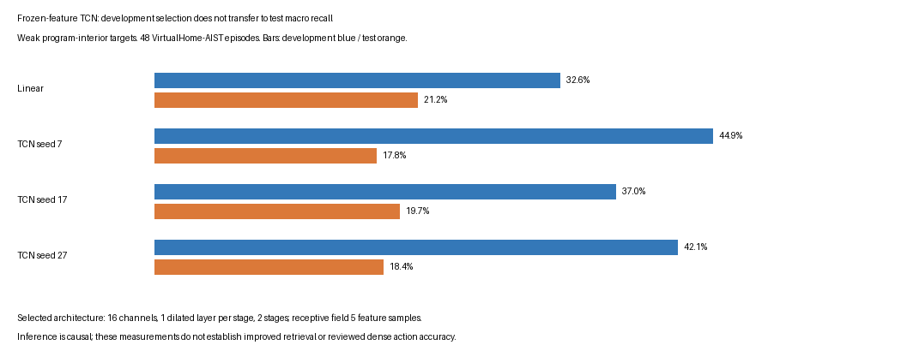

# Causal TCN training and streaming results

The trained causal heads do not improve test macro recall over the independent linear baseline. Three selected seeds achieve 17.82%, 19.72%, and 18.35%, compared with 21.16% for the linear head. Mean TCN macro recall is 18.63%, with a population standard deviation of 0.80 percentage points across seeds. These are weak program-interior measurements on the frozen within-scene corpus; three seed runs do not establish statistical confidence or generalization.

## Architecture and data flow

`temporal/tcn.py:CausalMultiStageTCN` adapts the imported teaching network. Each stage projects its input with a pointwise convolution, applies causal dilated residual blocks, and produces class logits. A later stage consumes the preceding stage's per-time softmax. Each residual block has one kernel-three dilated convolution with left padding only, a pointwise mixing convolution, and dropout. There is no normalization across time.

Training-only feature means and standard deviations are registered model buffers. Scale is floored at 0.01; invalid inputs are masked after normalization and at every block. The input is `[B,D,T]`, validity is `[B,T]`, and outputs are `[stages,B,classes,T]`. Loss uses validity intersected with the weak-label mask; unreviewed boundary targets and padding never contribute cross entropy. Inverse training-frequency class weights are normalized to mean one. The experiment sets temporal smoothness loss to zero so the learned head is evaluated without an additional hand-imposed persistence penalty.

Two architectures have 16 channels and two stages, with either one or two dilated blocks per stage. For this implementation the receptive field is `1 + stages * sum(2 * dilation)` samples. The selected one-block architecture has a five-sample receptive field and 35412 trainable parameters. Samples are half a second apart on most of this grid; feature windows themselves span up to two seconds. A five-sample receptive field therefore must not be described as five seconds of raw video.

## Training, selection, and checkpoints

The frozen 792-window feature matrix is reused without encoder updates. Only train episodes determine normalization and class weights. Six CPU runs cover seeds 7, 17, 27 and the two architectures. Each run trains 80 full-batch epochs with Adam at learning rate 0.003, dropout 0.1, two CPU threads, and deterministic PyTorch algorithms. Development macro recall is evaluated every ten epochs, and the first best checkpoint is retained. The architecture is chosen by mean development macro recall across all three seeds. Test evaluation occurs after this selection.

| Seed | Selected epoch | Development macro recall | Test weak accuracy | Test macro recall |
|---|---:|---:|---:|---:|
| 7 | 60 | 44.88% | 76.62% | 17.82% |
| 17 | 80 | 37.05% | 79.87% | 19.72% |
| 27 | 20 | 42.06% | 68.83% | 18.35% |

The selected runs trained in about 1.4 seconds each on this machine. Recorded process peak RSS was 401342464 bytes on macOS, approximately 383 MiB. This peak includes the Python/PyTorch process and training allocations; it is not model-only memory. Each selected model's parameters and normalization buffers occupy 158032 bytes. Its bounded raw feature history occupies 32772 bytes for batch size one, excluding temporary activation allocations and Python objects.

The figure was opened and reviewed at generated resolution. Development and test bars are labeled separately, and the weak-target limitation appears in the figure itself. The increase in development macro recall did not transfer to test. The existing linear baseline remains the better measured macro-recall result.

Each checkpoint in `output/temporal-v1/tcn-v1/layers-*-seed-*.pt` contains the architecture configuration, selected model state including normalization buffers, seed, epoch, and feature-space ID. It is an inference checkpoint, not an optimizer-resume checkpoint. The tracked `various/tcn-v1/results.json` records checkpoint hashes, all candidate traces, runtime version, input/label/feature hashes, source hashes, training episode IDs, and full selected per-episode results. Checkpoint binaries remain in the experiment output cache; the documented training command recreates them.

## Causality and bounded-history streaming

`ChunkPredictor` accepts arbitrary chunks in evaluation mode. It retains at most receptive-field-minus-one raw feature cells and recomputes the finite context. Missing feature activations are masked, but the convolution history is not reset: evidence before a gap can affect later valid predictions within the receptive field. That is a declared policy, distinct from the classical adapter's run-reset policy. Invalid cells remain unclassified by the observation wrapper.

For each selected trained checkpoint, all test episodes were checked by comparing full evaluation with one-cell streaming. Maximum absolute logit discrepancies ranged from 8.58e-6 to 1.15e-5; these are floating-point evaluation differences below the declared 1e-4 tolerance. Perturbing future features changed earlier logits by exactly zero in the measured checks. Separate unit tests exercise irregular chunk sizes, missing feature values, label masks, empty supervision, and bounded history length.

`AvailableSequenceStream` buffers in event order. An unavailable earlier feature blocks later cells even if they are individually available. Advancing the as-of clock processes only the available prefix, and emitted observations record the caller's processing time as availability. A test delays the second feature past several later feature endpoints and verifies that changing those future features cannot alter earlier emitted outputs. The caller must use a clock that includes real processing latency in production; source horizons alone are not end-to-end availability.

Head-only streaming measurements over 356 test cells per seed gave median latency 0.199–0.203 ms and p95 0.313–0.325 ms. These measurements include bounded-history head recomputation but exclude tensor construction, video decoding, embedding extraction, transport, and downstream storage. They do not establish an end-to-end video latency.

## Review and reproduction

Run `PYTHONPATH=workbench/src workbench/perception-env/.venv/bin/python -m video_workbench.temporal.train output/temporal-v1/dataset output/temporal-v1/pooled-features NEW_DESTINATION`. The module exposes an argparse CLI and rejects an existing destination. The runtime used here is PyTorch 2.14.0 on CPU. No installation or GPU-runtime modification was needed.

Inspect `tcn.py` for architecture/masking/streaming, `train.py` for partition discipline and checkpoint selection, and `test_temporal_tcn.py` for leakage and gradient checks. Run all temporal checks with `PYTHONPATH=workbench/src workbench/perception-env/.venv/bin/python -m pytest workbench/tests/test_temporal_data.py workbench/tests/test_temporal_classical.py workbench/tests/test_temporal_tcn.py -q`; fourteen tests pass. The ticket's `scripts/05-tcn-evidence.py` reloads trained checkpoints, measures head-only streaming latency, and renders the comparison figure.

T3 is complete as an implemented and measured causal learned-head comparison. Improved accuracy was an experiment question, not an acceptance prerequisite. T4 must now persist observations and immutable revisions with explicit event, evidence availability, and commit clocks, and verify replay queries through delayed evidence, contradictions, gaps, expiry, and restart.
