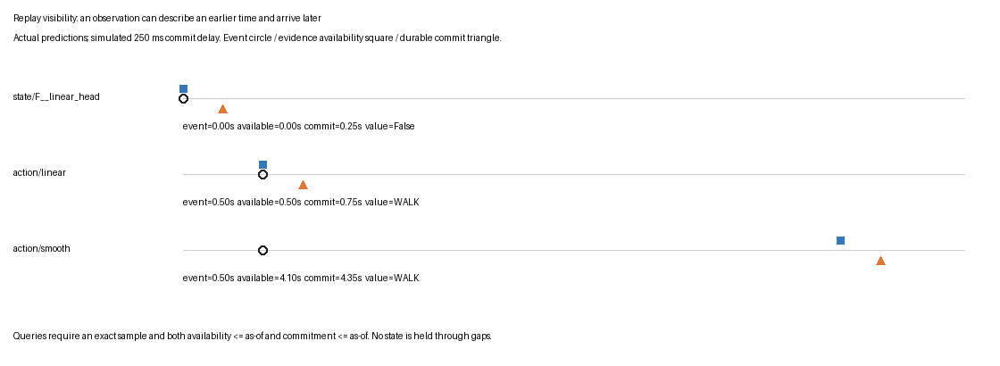

# Observation memory and practical rule handoff

The implemented memory feature stores model observations and answers what was durably available at a particular sampled time. It deliberately makes no claim that a sampled state continues between frames. This supports the present causal/offline comparison and a later rule consumer without introducing an expiry policy or a correction workflow that has no current caller.

The original design also proposed general revisions, retractions, expiry, uncertainty intervals, and reconciliation. After the user's request to explain their necessity and avoid premature engineering, implementation focused on observations and bounded evidence. Those broader design items remain explicitly unimplemented; this report does not claim that the original full T4 design has been delivered. The initial uncommitted general fact-store prototype was replaced, not retained as an unused parallel abstraction.

## What was actually exercised

The replay contains 2448 actual predictions: 864 state observations from the localization handoff and 1584 action observations from the temporal comparison. State inputs are the six production conditions F/D/FD crossed with linear-head/text-margin methods, each with 144 observations. Oracle O/FO predictions are excluded. Action inputs are 792 independent linear predictions and 792 offline smoothed predictions, in separate streams.

The local SQLite replay inserted every observation once. Re-ingesting the same observations inserted zero rows. For each observation, the replay checked a query immediately before and exactly at its commitment time, then closed and reopened the database and repeated all queries. All 4896 query results remained identical after restart. A query one microsecond after a sparse state sample returned unknown rather than inheriting that sample's value.

These checks ran once at the completed feature boundary, along with one store smoke test. No full project test suite was rerun. The replay uses real saved predictions but a simulated 250 ms commitment delay, explicitly recorded in its manifest. It is not a live end-to-end latency benchmark.

## Three timestamps with distinct meanings

`event_us` identifies the sample or feature-decision timestamp that an observation concerns. `available_us` records when the producer's required inputs/result are available under the experiment's clock policy. `committed_us` records when that observation enters the replay database. All are nonnegative integer microseconds within the named run; the store enforces event <= availability <= commitment.

For example, the saved figure compares the same action decision at 0.5 seconds. The independent head's source horizon is 0.5 seconds and its simulated database commitment is 0.75 seconds. The offline smoother needs the full valid run through 4.1 seconds and commits at 4.35 seconds. At an as-of time of one second, the independent observation is visible and the smoother's observation is not. Both predictions happen to be WALK; identical values do not make their availability equivalent.



The figure was opened and visually reviewed. It uses actual selected observations and labels the artificial commitment delay. Circle, square, and triangle represent event time, source/result availability, and durable commitment respectively. The original localization availability excludes measured inference latency, so the replay should be interpreted as a controlled clock demonstration rather than a live scheduling measurement.

## The small data model

`temporal/store.py:Observation` contains the observation ID, run and stream IDs, episode/entity/property, value, the three timestamps, evidence IDs, producer ID, feature-space ID, inference mode, and an unknown reason. A null value requires an explicit unknown reason. Known values must not carry an unknown reason. JSON serialization rejects nonfinite numerical values.

The stream identity prevents alternatives from becoming spurious corroboration. For example, `state/F__linear_head` and `state/FD__linear_head` are different streams. The database refuses to mix producer, feature-space, or causal/offline mode identities within a run/stream pair. Queries require the caller to choose a stream; they do not combine independent experimental alternatives automatically.

The SQLite schema has one observation table and an index over the query identity and clocks. Database triggers reject UPDATE and DELETE. `Store.append` uses an explicit immediate transaction and rolls back failed inserts. An exact retry with the same observation ID and content preserves the original commitment time; reusing the ID with different content is rejected. Newly inserted records cannot move a run's commitment clock backward. These guarantees serve current import/replay behavior rather than a hypothetical distributed writer protocol.

There is no migration framework beyond the initial schema and its version marker. An unsupported schema version is rejected. There is no expiry column, revision graph, supersession method, retraction method, or inferred interval table.

## Query behavior

`Store.state_at(run_id, stream_id, episode_id, entity, property, event_us, as_of_us)` selects observations at exactly the requested event timestamp whose availability and commitment are both no later than as-of. The exact timestamp requirement is intentional: sparse samples do not establish continuous coverage.

```python
rows = observations.where(
    run=run_id, stream=stream_id, episode=episode_id,
    entity=entity, property=property,
    event_us=event_us,
    available_us <= as_of_us,
    committed_us <= as_of_us,
)
if not rows:
    return unknown("no_visible_sample")
if any(row.value is None for row in rows):
    return unknown("source_unknown")
if values_disagree(rows):
    return unknown("disagreeing_samples")
return supported(rows[0].value, observation_ids, evidence_ids)
```

The disagreement check is a conservative guard, not a reconciliation subsystem. The query never decides that one producer is more credible, revises a prior record, or chooses whichever row arrived last. A rule consumer can inspect cited observations or choose another stream explicitly.

The output distinguishes `supported` from `unknown`, includes the requested clocks, and cites observation/evidence IDs. False is a supported Boolean value; it is not interchangeable with unknown. Missing crop observations remain explicit unknown records with their source reason.

## Connection to existing producers

`temporal/replay.py:state_observations` verifies the localization production handoff's file hash and row count, rejects oracle-assisted rows, and retains sample time, entity/property, value, evidence, producer, and feature space. Frame identity and upstream provenance remain available through the immutable source handoff and its recorded hash.

`action_observations` consumes the completed classical comparison's independent and smoothed streams. It preserves each method's declared causal/offline mode and availability. Its evidence citations include the decoder's required prefix or complete valid-run dependencies. The stored event time is the feature-decision endpoint, not a reviewed exact action boundary. No attempt is made to infer a continuous action interval from weak labels.

The replay CLI sorts observations by simulated commitment time before inserting them. It writes the SQLite database, an immutable observation JSONL export, exact query results, and a manifest with source/artifact/code hashes. Oracle diagnostic state observations and TCN alternatives can be integrated later when a caller requires them; the current handoff intentionally demonstrates one causal and one offline action stream alongside existing production state alternatives.

## Rule consumer contract

VIDEO-RULES-001 can use the JSONL export or `Store.state_at` to ask a narrowly supported question: what did this selected producer report at this sampled event time, as known by this replay time? It must propagate unknown when there is no visible sample or when the source itself is unknown.

This store cannot establish that a door was continuously closed over an interval, that an action was absent throughout a gap, or that a later correction supersedes a prior prediction. Those requirements would need a concrete coverage or review policy. Adding them before a rule needs them would reintroduce the speculative machinery deliberately excluded here.

The existing separate measured reports remain authoritative for prediction quality: classical causal/offline metrics are in `reference/02-measured-classical-temporal-comparison.md`; trained causal TCN metrics are in `reference/03-causal-tcn-training-and-streaming-results.md`. The memory layer preserves those predictions and their availability; it does not improve their accuracy.

## Files and commands

- `workbench/src/video_workbench/temporal/store.py`: observation contract, initial SQLite schema, append and exact-time query APIs.
- `workbench/src/video_workbench/temporal/replay.py`: actual producer adapters, replay CLI, commitment/restart evidence.
- `workbench/tests/test_temporal_store.py`: one end-of-feature smoke check covering append/retry, visibility, gaps, unknowns, producer isolation, immutable rows, and restart.
- `scripts/06-replay-evidence.py`: compact report examples and clock figure.
- `various/replay-v1/manifest.json`: 2448 imported rows, 4896 query checks, restart result, and source/artifact hashes.
- `various/replay-v1/examples.json`: exact observations and before/after query examples used in the figure.

Run the actual import/replay with `PYTHONPATH=workbench/src workbench/.venv/bin/python -m video_workbench.temporal.replay output/localization-v1/temporal-handoff-v2 output/temporal-v1/classical-v2/results.json NEW_DESTINATION`. It requires a fresh destination. The completed local replay is `output/temporal-v1/replay-v1`; the database and full JSONL/query artifacts remain there, while compact evidence is tracked with the ticket.

Run the store smoke check at the feature boundary with `PYTHONPATH=workbench/src workbench/.venv/bin/python -m pytest workbench/tests/test_temporal_store.py -q`. Broader testing should be driven by another completed feature or a concrete failure, following the user's updated testing preference.
