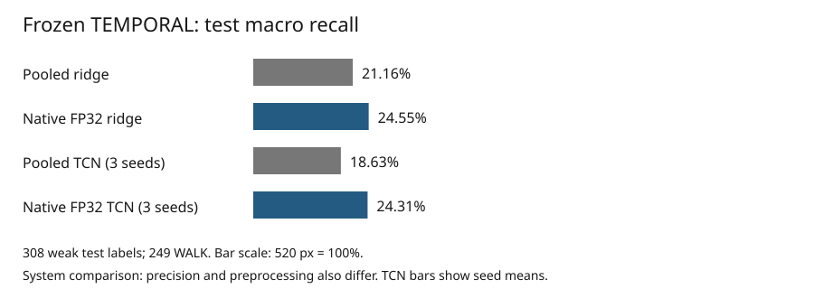

# Native FP32 temporal benchmark: measured findings

## Result and decision

The repaired native FP32 representation improves the average measurements on the frozen TEMPORAL benchmark. Ridge test macro recall increases from 21.16% to 24.55%, a 3.39 percentage-point gain. The causal TCN mean increases from 18.63% to 24.31%, a 5.68 point gain across the same three seed identifiers. These results justify keeping native FP32 as a measured reference for subsequent work, while retaining the pooled baseline.

The temporal model still does not establish an advantage over the independent native ridge head: 24.31% mean macro recall versus 24.55%. Its seed standard deviation rises from 0.80 to 4.91 percentage points. All selected native heads fail on CLOSE, GRAB, PUTBACK, and TURNTO in this test set. The repair therefore improves this experiment without resolving its core action-discrimination limitations.



## Experimental population

The comparison uses the original 792 trailing windows from 48 VirtualHome-AIST episodes. Each window spans at most two seconds and advances by half a second, selecting actual source frames at two fps. The pilot exercised one-, two-, three-, and four-frame windows. All rows, partitions, selected indices, source timestamps, and weak labels remain identical to the pooled experiment.

There are 157 training, 176 development, and 308 test supervised positions. WALK accounts for 249 of the test labels. This imbalance makes raw accuracy an incomplete measure: predicting WALK everywhere would achieve 80.84% accuracy but only 10% macro recall. The native ridge's 82.47% accuracy is only modestly above that majority-class reference, despite exceeding the original pooled ridge's 75.97%.

Labels describe weak program interiors rather than reviewed dense action boundaries. Adjacent overlapping windows are correlated. The reported values are descriptive results on a small fixed corpus, not independent-window significance estimates or generalization guarantees.

## Native feature production

The new `workbench/src/video_workbench/temporal/encode_native.py` producer invokes the existing accepted `NativeVideoEmbedder`. Its runtime checks enforce official weights, absence of quantization, repaired MLX-VLM source, and pinned official preprocessing. The repair commit is `6452614f6de04694d1e34fd13abaca11f6ffb994`; model parameters are materialized as FP32. No community quantized checkpoint participates in this run.

For each episode, the producer hashes the video, probes its timestamps, and decodes the union of requested source frames once. For each window it verifies raw PTS, normalized microsecond PTS, time base, origin, half-open bounds, and availability. It passes the ordered frames and relative timestamp context to the native video adapter. The adapter performs the accepted odd-frame padding and official processing. A 2048-dimensional normalized vector is stored alongside its validity flag.

The encoder does not open the weak-label file. Its manifest records sample IDs, input hash, adapter and model provenance, source audits, per-call timing, and the feature archive hash. The complete feature-space identifier is distinct from the preserved pooled identifier. An eight-row pilot is explicitly marked as a pilot and the full sequence loader rejects it as an incomplete population.

Full extraction took 199.086 seconds, including 5.934 seconds of loading, on this shared Mac. Peak MLX allocation was 9.61 GB and macOS process peak RSS was 5.37 GB. These are different accounting systems and are not additive. The black-frame diagnostic produced cosine similarity 0.45445 and maximum component difference 0.29677 relative to the original first window. This demonstrates pixel sensitivity; it does not validate action semantics.

## Fresh head training

The existing ridge routine fits candidate regularization strengths 0.01, 0.1, and 1 using training data, then chooses development macro recall. The causal TCN experiment trains one- and two-layer configurations with seeds 7, 17, and 27, two stages, 16 channels, 80 epochs, and Adam at 0.003. Feature normalization and inverse-frequency class weights are estimated from training data only. Checkpoints are selected every ten epochs using development macro recall; architecture selection averages that score across seeds.

Both representations select the one-layer architecture. Native selected epochs are 80, 50, and 60 for seeds 7, 17, and 27. Six native training runs required about 9.03 seconds of measured training-loop time. The trainer itself was unchanged. The follow-up runner corrects only the new report's legacy pooled-description field and records that annotation explicitly.

| Head | Test accuracy | Test macro recall |
|---|---:|---:|
| Pooled ridge | 75.97% | 21.16% |
| Native FP32 ridge | 82.47% | 24.55% |
| Native TCN seed 7 | 77.60% | 17.40% |
| Native TCN seed 17 | 73.70% | 27.22% |
| Native TCN seed 27 | 79.55% | 28.32% |

The native TCN seed 7 result is slightly below its pooled counterpart. Reporting only seed 27 would conceal that variability. The average native TCN result is improved, but this experiment does not justify replacing the simpler head with a TCN.

## Class-level interpretation

| Class | Test labels | Pooled ridge correct | Native ridge correct |
|---|---:|---:|---:|
| CLOSE | 6 | 0 | 0 |
| GRAB | 5 | 0 | 0 |
| OPEN | 4 | 2 | 4 |
| PUTBACK | 4 | 0 | 0 |
| SIT | 16 | 0 | 0 |
| STAND | 10 | 2 | 3 |
| SWITCHOFF | 4 | 2 | 0 |
| SWITCHON | 6 | 0 | 1 |
| TURNTO | 4 | 0 | 0 |
| WALK | 249 | 228 | 246 |

Native ridge corrects 24 previously incorrect positions and worsens four, with 230 correct under both representations and 50 wrong under both. Its OPEN improvement is two additional correct positions out of only four examples. SWITCHOFF regresses from two correct examples to zero. GRAB and PUTBACK remain entirely unresolved, so this result provides no evidence that native features reliably distinguish that action pair.

The paired TCN corrected/worsened counts are 13/10, 9/28, and 33/0 for seeds 7, 17, and 27 respectively. Seed 17 improves macro recall while losing raw accuracy because minority-class gains coexist with additional WALK errors. This is why both metrics and per-class counts belong in the report.

## Causal and artifact checks

All selected native checkpoints passed the existing actual-weight future-perturbation and streaming-equivalence checks. The largest full-versus-streamed absolute logit difference was 0.0000105947, below the 0.0001 tolerance. Future perturbation changed no earlier output. These checks establish the causal computation contract for these models; they do not make feature extraction instantaneous. Reported availability remains an offline source horizon and excludes measured wall-clock feature latency.

The final smoke check loaded exactly 792 rows and 48 episodes, recovered exactly 308 test labels, rejected the pilot population, verified all six checkpoint hashes, and verified that the original pooled result and feature manifests were unchanged. A separate comparison smoke check verified corrected/worsened accounting and rejection of a timestamp mismatch. Ruff passed for both added modules.

## Interpretation limits and next use

This is a native FP32 versus existing four-bit pooled system comparison. Precision, preprocessing, and representation all change. It cannot attribute the observed improvement specifically to ordered video processing; a matched official-FP32 pooled control would be needed for that claim. This follow-up deliberately did not expand into that separate experiment or a quantization study.

Proceed with native FP32 as a reference representation and retain the independent ridge head as the simpler temporal baseline. The measured weakness is still discrimination among specific actions. A subsequent data experiment should target reviewed contrasting action pairs and less imbalanced supervision before investing in more temporal-model complexity. None of these results require revision/supersession machinery or changes to the ongoing verifier implementation.

## Reproduction and evidence map

Run from the repository root, using fresh destination directories. The two existing environments remain separate:

```sh
PYTHONPATH=workbench/src HF_HUB_OFFLINE=1 TRANSFORMERS_OFFLINE=1 \
  output/mlx-video-fix/.venv/bin/python -m video_workbench.temporal.encode_native \
  output/temporal-v1/dataset output/temporal-native-fp32-v1/features

PYTHONPATH=workbench/src workbench/perception-env/.venv/bin/python \
  -m video_workbench.temporal.native_compare \
  output/temporal-v1/dataset output/temporal-native-fp32-v1 output/temporal-v1
```

On this Mac, native inference required GPU access beyond the sandbox because the sandbox could not initialize Metal. Reproduction must use an environment with actual Metal device access.

- `../various/native-fp32-v1/results.json`: comparison, per-class metrics, paired changed predictions, preserved source hashes.
- `../various/native-fp32-v1/features-manifest.json`: native model/runtime identity, 48 source audits, timing and vector provenance.
- `../various/native-fp32-v1/tcn-results.json`: all six candidates and selected native predictions with causality checks.
- `../various/native-fp32-v1/ridge-results-without-weights.json`: ridge selection and predictions; large fitted weights remain in the original local output.
- `../various/native-fp32-v1/smoke.json`: final artifact and causal check summary.
- `output/temporal-native-fp32-v1/`: full feature archive, ridge weights, and six TCN checkpoints, kept outside tracked ticket evidence.
- `05-fp32-native-follow-up-diary.md`: implementation sequence, failures, commits, and printing status.

After explicit approval, all five plan and phase slips were printed successfully through Almanach. Printer responses are archived in `../various/native-print-receipts.json`.
