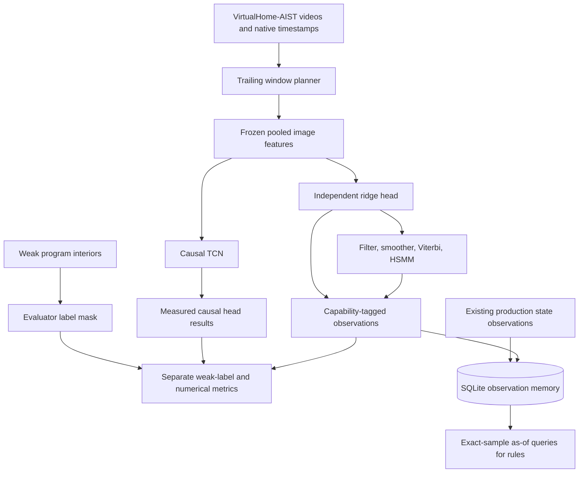

# Temporal Video Models: Causality, Weak Supervision, and Observation Memory

Temporal video recognition estimates actions from a sequence of observations rather than treating each image independently. The additional context can reduce unstable predictions, but it also introduces assumptions about action order, persistence, and duration. Those assumptions are consequential when the application needs to detect an omitted or repeated step. A model that produces a plausible procedure can make the recording less accurately represented.

VIDEO-TEMPORAL-001 implemented and measured that tradeoff on 48 VirtualHome-AIST episodes. It extracted 792 dense trailing features, compared independent classification with classical temporal inference, trained six small causal neural heads, and connected actual predictions to an append-only observation store. The principal result is negative: the temporal models did not establish a useful improvement over the independent linear baseline. The implementation nevertheless establishes source-time mapping, explicit missing-evidence behavior, causal streaming checks, and reproducible replay of what was available at a given time.

> [!summary]
> The independent baseline reached 21.16% test macro recall on weak action interiors. The selected offline smoother reached 21.31%, with lower accuracy; the selected causal TCN averaged 18.63% across three seeds. A numerical procedure-constrained decoder fabricated an omitted CLOSE. The memory feature stores exact sampled observations and preserves availability, without assuming continuous state between samples.

The source repository is `/Users/manuel/code/wesen/2026-09-06--vision`. The ticket is closed around the implemented temporal comparison and practical observation memory. General revisions, retractions, expiry policies, and inferred continuous intervals were explicitly deferred during wrap-up. They are not implemented features. VirtualHome-AIST is the AIST extension of VirtualHome used by this corpus, not an unrelated simulator. This experiment uses pooled image embeddings; the separate repaired MLX native-video feature space was not used for the dense temporal run.

## 1. The problem has three distinct outputs

The first output is a prediction at a feature-decision timestamp: given the pixels used to construct this feature, which action does the head assign? The second is a sequence interpretation: after combining multiple predictions, which events or segments remain? The third is a replay answer: by a particular processing time, which observations had become available and been stored? Correctness in one output does not imply correctness in the others.

For example, a causal convolution can compute a numerically correct prefix while consuming a feature that includes future video frames. A Viterbi decoder can find the exact highest-scoring path while its allowed transition graph excludes the procedure that actually occurred. A database can return the most recently inserted observation while exposing it in a replay time before it was produced. The project separates these responsibilities so that each assumption is visible in code and evidence.



The diagram distinguishes a measured model from a production integration. The replay imports independent and smoothed action predictions plus the existing state predictions. TCN training and streaming are implemented and measured, but those alternative checkpoints are not automatically added to the replay database. Adding every alternative would not produce independent corroborating evidence.

## 2. Constructing a dense feature sequence from rendered video

### 2.1 Native timestamps define the evidence

The sequence planner uses integer microseconds and half-open source windows. The nominal window width is two seconds, and endpoints advance at a half-second stride. At the start of an episode, the window is shorter because no earlier video exists. A final endpoint is added when the exact video duration does not coincide with the regular stride.

For endpoint `end_us`, the source window is `[max(0, end_us - 2000000), end_us)`. A source frame at the endpoint is excluded. The media sampler selects source frames at a target rate of two frames per second within the window. Native presentation timestamps, raw PTS values, time base, and origin are retained rather than reconstructed from a frame-number approximation.

```python
for end_us in dense_endpoints(video_duration_us, stride_us=500_000):
    start_us = max(0, end_us - 2_000_000)
    indices = sample_native_frames(pts_us, start_us, end_us, fps=2)
    window = {
        "start_us": start_us,
        "end_us": end_us,
        "available_us": end_us,
        "frame_indices": indices,
        "pts_us": [pts_us[i] for i in indices],
    }
```

Here availability is the offline source horizon. It excludes decoding, inference, transport, and database latency. A live producer must account for those delays before publishing a result. The distinction matters even though the window itself is trailing: absence of future source frames is a necessary condition for causal use, not a complete latency model.

The encoder verifies each source video's hash and re-probes its native timestamps. Every selected PTS must lie inside the recorded window. Raw PTS, time base, and origin must also match the frozen input record. All 48 episode audits passed before the feature artifact was published. These checks establish the mapping between the extracted features and the source video; they do not establish the correctness of an action label.

### 2.2 Pooled features and independent supervision

The feature producer uses the existing `qwen3-vl-embedding-2b-4bit` image path. It encodes each unique selected image once per episode, averages the image embeddings in each window, and normalizes the mean. The final matrix has shape `[792, 2048]`. Producer metadata identifies the model/preprocessing space, window policy, input manifest, and relevant source code hashes.

The sequence producer does not read the weak-label file during image encoding. `prepare.py` writes model inputs and supervision separately; `benchmark.py:load_sequences` joins them only after loading and validating the frozen feature artifact. This separation makes it possible to inspect whether evaluator labels entered representation production.

A sequence contains features `[T,D]`, window start/end times, availability times, evidence IDs, a validity mask, a label mask, and integer targets. Validity states whether a feature has evidence. The label mask states whether the evaluator permits supervision at that position. Missing feature storage is zero and validity is false; a missing feature is not an example of background or OTHER.

The supervised mask is the intersection:

```python
loss_mask = sequence.valid & sequence.label_mask
training_features = sequence.features[loss_mask]
training_targets = sequence.targets[loss_mask]
```

A visible but unreviewed boundary can therefore have valid features and no supervised target. Conversely, a program annotation cannot turn absent visual evidence into a usable training example.

### 2.3 Weak program interiors limit the result

The corpus supplies weak interiors of scripted actions, not reviewed dense visual boundaries. The target is the action whose weak interior contains the latest actual sampled source frame. If no unique action label applies, the target remains masked. The nominal endpoint is not substituted for that source frame.

| Partition | Dense windows | Supervised weak interiors |
|---|---:|---:|
| Train | 211 | 157 |
| Development | 225 | 176 |
| Test | 356 | 308 |

All ten observed classes occur in each partition: CLOSE, GRAB, OPEN, PUTBACK, SIT, STAND, SWITCHOFF, SWITCHON, TURNTO, and WALK. Their counts are highly unequal. WALK occupies 249 of the 308 supervised test windows. An always-WALK classifier therefore achieves 80.84% accuracy, although its macro recall across ten classes is only 10%.


The figure shows all episode rows, the action inventory, and gray unlabeled boundary/gap positions. It explains why an apparently respectable aggregate accuracy is insufficient. Overlapping windows also share source images, so they cannot be treated as independent statistical trials. The split planner enforces lineage separation; that prevents a known leakage mechanism but does not turn a small within-scene corpus into a generalization benchmark.

## 3. Establishing an independent baseline

The independent head is multiclass ridge regression on frozen features. Training features and one-hot targets are centered. If `X` is the centered feature matrix and `Y` the centered target matrix, the primal solution is `(XᵀX + λI)⁻¹XᵀY`. When the number of feature dimensions exceeds the number of supervised observations, the implementation uses the dual form `Xᵀ(XXᵀ + λI)⁻¹Y`, avoiding a larger system solve.

The stored model contains the feature-space identity, class count, ridge strength, feature mean, target bias, weights, and training episode IDs. Prediction rejects a different feature space. Invalid positions remain unclassified. This is a discriminative scoring head; its class scores are not calibrated probabilities.

Ridge strength is selected from 0.01, 0.1, and 1.0 using development macro recall. The selected value is 0.01. Training accuracy is 100%, development accuracy is 78.98%, and test accuracy is 75.97%. Test macro recall is 21.16%. With only 157 supervised training positions and 2048 feature dimensions, perfect training accuracy is not evidence of generalization.

Macro recall averages each class's fraction of correctly recovered targets. It gives an uncommon action the same aggregate weight as WALK. It does not solve the small-sample problem: a class with four test examples still has a very coarse estimate. The report retains per-class counts and per-episode predictions so that this uncertainty remains inspectable.

## 4. Classical temporal models and their assumptions

### 4.1 Filtering, smoothing, and joint decoding

The HMM implementation accepts log emissions `[T,K]`, transition scores `[K,K]`, and initial scores `[K]`. The forward recurrence combines the previous state potentials, transition potential, and current observation score:

```text
alpha[0, k] = initial[k] + emission[0, k]
alpha[t, k] = emission[t, k]
              + logsumexp_j(alpha[t-1, j] + transition[j, k])
```

Normalizing each forward row gives prefix-conditioned state weights. This operation is causal with respect to the supplied prefix. Backward messages incorporate later observations to produce smoothed weights; smoothing is offline. Viterbi replaces the sum over paths with a maximum and records backpointers to recover the highest-scoring complete path. Full-episode Viterbi is also offline.

The project describes these as scored decoders because the emissions come from ridge regression. Normalizing a set of potentials does not validate a generative probability model. The implementation supports impossible transitions as negative infinity and rejects paths with no finite support rather than returning a fabricated label or NaN posterior.

Transition priors are estimated from adjacent known training labels with Laplace smoothing. Counts do not bridge masked positions. The experiment selects transition strength from 0, 0.25, and 1 on development macro recall. Zero strength is retained as a candidate because the independent observation path is a legitimate outcome of the comparison.

### 4.2 Explicit duration and timestamp persistence

The HSMM decoder scores completed segments explicitly. A duration table uses column `d-1` for a duration of `d` feature samples. The dynamic program considers candidate segment starts, combines a prior segment score and a state transition with the segment emission sum, and adds the duration score. Adjacent segments cannot have the same state; otherwise repeated self-segments could bypass the duration model.

The final segment is treated as completed. That assumption matters near episode boundaries. Duration units are feature samples, not seconds. Source-time mapping must use the recorded grid, especially in the irregular numerical fixtures. The real-feature experiment uses scored duration preferences centered at 2, 4, or 8 samples; these preferences are not fitted reviewed action-duration distributions.

Hysteresis has a different purpose and implementation. It requires a candidate label to persist for a specified amount of elapsed source time before changing the output. Startup also requires persistence. A missing observation cancels history, and an excessive sampling gap starts a fresh candidate. Persistence reduces rapid changes by delaying or suppressing short events; those costs are part of its behavior, not implementation defects to hide.

### 4.3 Numerical oracles reveal procedural fabrication

The numerical fixtures contain normal, omission, repetition, and missing-feature cases with irregular timestamps. Their features are controlled synthetic values, so exact segment and event checks are legitimate. They are software and inference checks, separate from rendered-video representation quality.

The unconstrained numerical decoders preserve the omitted CLOSE and all repeated OPEN events. The procedure ablation permits only dwell or movement around the OPEN→WALK→CLOSE→OPEN cycle. On an omission fixture, the cycle inserts a CLOSE even though the evidence contains none. It still obtains 15/16 correct sample labels. A single changed sample is sufficient to falsify the procedural interpretation.


The red segment in the constrained omission row is the fabricated event. The figure also shows persistence delays and explicitly unclassified gaps. Missing evidence splits the classical inference into separate valid runs; it is not filled by a plausible hidden state.

Exact numerical metrics include segment F1 at IoU thresholds 0.1, 0.25, and 0.5, normalized edit score over event sequences, and short-action recall with a 1.5-second maximum truth duration. Matching processes predictions in temporal order and assigns each to the unmatched same-class truth segment with greatest IoU. A truth segment can match once. Negative predictions are excluded from predicted segments, leaving unmatched truth events as false negatives. These boundary metrics are not computed on the weak video labels.

### 4.4 Measured video results

| Method | Capability | Selected temporal setting | Test weak accuracy | Test macro recall |
|---|---|---|---:|---:|
| Linear | Causal local feature | Ridge 0.01 | 75.97% | 21.16% |
| Hysteresis | Causal prefix | Zero persistence | 75.97% | 21.16% |
| Filter | Causal prefix | Zero transition strength | 75.97% | 21.16% |
| Smoother | Offline valid run | Strength 0.25 | 69.48% | 21.31% |
| Viterbi | Offline valid run | Zero transition strength | 75.97% | 21.16% |
| HSMM | Offline valid run | Strength 0.25, mean 2 samples | 68.83% | 18.35% |

Development selection retained the independent behavior for three temporal methods. The smoother's macro-recall gain is only 0.16 percentage points and comes with lower accuracy. The HSMM reduces both measures. These results provide no compelling reason to replace the independent head on this corpus.

Each emitted classical record identifies mode, feature space, current evidence, dependency evidence, output-grid cells, and availability. Offline outputs depend on the entire valid run and cannot become available before its last input. Filter outputs depend on prefixes. Output cells represent the decision grid, not reviewed action intervals.

## 5. A causal learned head on frozen features

### 5.1 Architecture and masking

The neural model adapts the imported teaching implementation of a causal multistage TCN. Each stage projects features with a pointwise convolution, applies dilated residual blocks, and produces class logits. Later stages consume the earlier stage's per-time softmax. A residual block contains one kernel-three dilated convolution with left padding, a pointwise mixing convolution, and dropout. No normalization operation pools across future time.

Inputs have shape `[B,D,T]`; validity has shape `[B,T]`; outputs have shape `[stages,B,classes,T]`. Training-only feature means and standard deviations are registered model buffers. Scales are floored at 0.01. Invalid positions are masked after normalization and throughout the residual blocks, so normalized missing storage cannot become a pseudo-observation.

Cross entropy uses validity intersected with the weak-label mask. The experiment uses inverse training-frequency class weights normalized to mean one and sets the optional temporal smoothness penalty to zero. Padding and unreviewed boundary targets do not contribute supervised loss.

For this exact block structure, receptive field is `1 + stages × sum(2 × dilation)`. Counting stages matters because later stages consume temporally processed earlier outputs. The selected architecture has two stages, one dilation-one block per stage, 16 channels, and a five-sample receptive field. It contains 35412 trainable parameters.

### 5.2 Selection across seeds

Six CPU runs cover seeds 7, 17, and 27 for architectures with one or two blocks per stage. Each trains 80 full-batch epochs with Adam at learning rate 0.003, dropout 0.1, two CPU threads, and deterministic PyTorch algorithms. Every ten epochs, development macro recall is measured; the first best checkpoint is retained. The architecture is selected by mean development macro recall across its three seeds. Test results do not choose an architecture or seed.

| Seed | Selected epoch | Development macro recall | Test weak accuracy | Test macro recall |
|---|---:|---:|---:|---:|
| 7 | 60 | 44.88% | 76.62% | 17.82% |
| 17 | 80 | 37.05% | 79.87% | 19.72% |
| 27 | 20 | 42.06% | 68.83% | 18.35% |

Mean test macro recall is 18.63%, with a population standard deviation of 0.80 percentage points across the selected seeds. The improvement on development did not transfer to test. Three seeds characterize this experiment's variability; they do not establish a confidence interval for general video recognition.


Checkpoints contain configuration, selected model state including normalization buffers, seed, epoch, and feature-space ID. They support inference, not exact optimizer resume. The report records their hashes, complete training traces, source hashes, and all selected per-episode results. Large experiment artifacts remain in the source repository's ignored output cache, while the ticket tracks measured metadata.

### 5.3 Bounded streaming and availability

`ChunkPredictor` retains receptive-field-minus-one raw feature cells and recomputes that finite context for each new chunk. It requires evaluation mode so dropout does not make chunk comparisons stochastic. Irregular chunk boundaries must reproduce full inference within a declared floating-point tolerance.

The TCN masks missing positions but does not reset its convolution history. Earlier valid evidence may influence later valid predictions across a short gap within the receptive field. This differs from the classical adapter's valid-run restart policy. Neither wrapper publishes a class for a missing feature itself.

Actual trained checkpoints were tested on every test episode against one-cell streaming. Maximum absolute logit discrepancies were between 8.58e-6 and 1.15e-5, below the 1e-4 trained-check tolerance. Perturbing future features changed earlier logits by zero. Separate feature-availability checks delay an earlier input and confirm that later available cells remain buffered rather than silently bypassing it.

```python
# Actual streaming policy: event-ordered buffering.
while next_cell.available_us <= as_of_us:
    logits = bounded_history_model.push(next_cell.features, next_cell.valid)
    emit(event_us=next_cell.end_us,
         available_us=as_of_us,
         prediction=argmax(logits) if next_cell.valid else None)
    next_cell = following_cell()
```

The selected runs trained in about 1.4 seconds each. Head-only streaming over 356 test cells per seed measured median latency of 0.199–0.203 ms and p95 of 0.313–0.325 ms. This includes bounded-context head recomputation but excludes tensor construction, video decoding, embedding extraction, transport, and storage. It is not end-to-end video latency.

Model parameters and normalization buffers occupy 158032 bytes. Batch-one retained raw history occupies 32772 bytes, excluding temporary activations and Python objects. Recorded macOS process peak RSS was 401342464 bytes, approximately 383 MiB; that includes the Python/PyTorch process and training allocations.

## 6. Observation memory with evidence-limited queries

### 6.1 Why the final scope is smaller than the initial design

The original memory design included revision chains, retractions, expiry, uncertain interval bounds, and reconciliation. The user questioned whether those features served a present consumer. The final implementation stores immutable point observations and exact-sample queries. General correction and continuous-state policies are deferred until a concrete review or rule workflow requires them.

This is a substantive simplification. Expiry is unnecessary when the store never extends an observation beyond its sampled timestamp. A revision graph is unnecessary when no current interface corrects stored predictions. Preserving model streams and source evidence still matters because downstream rules must distinguish an actual observation from a later offline interpretation.

`Observation` contains an ID, run/stream identity, episode/entity/property, value, event/availability/commit timestamps, evidence IDs, producer, feature space, mode, and unknown reason. Null requires a reason; false is a known Boolean value. A stream cannot mix producers, feature spaces, or causal/offline modes.

### 6.2 Storage and query semantics

SQLite stores one observation table with a query index. UPDATE and DELETE triggers enforce append-only behavior. Inserts use an explicit transaction. Exact retries preserve the original commitment time, while changed-content reuse of an observation ID is rejected. Newly inserted observations cannot move a run's commitment clock backward.

The query requires a selected stream and exact event timestamp. It filters both evidence availability and durable commitment against the requested as-of time:

```sql
SELECT payload FROM observations
WHERE run_id = ? AND stream_id = ? AND episode_id = ?
  AND entity = ? AND property = ? AND event_us = ?
  AND available_us <= ? AND committed_us <= ?
ORDER BY observation_id;
```

No visible sample produces unknown. An explicitly unknown source stays unknown. Disagreeing values at the same query identity also produce unknown; this is a guard, not a reconciliation algorithm. The store does not choose the last-arriving value or rank producers. A supported answer cites the underlying observation and evidence IDs.

### 6.3 Actual replay results

The replay imports 864 production state observations and 1584 action observations, totaling 2448 rows. The state conditions remain six distinct streams. Independent and smoothed actions remain separate causal and offline streams. Oracle localization evidence is excluded.

The experiment simulates commitment as producer availability plus 250 ms. The figure shows an action at 0.5 seconds: independent availability is 0.5 seconds, while smoothing needs evidence through 4.1 seconds. Their simulated commitments are 0.75 and 4.35 seconds respectively. An as-of-one-second query can expose the independent observation but not the smoothed one, even though both predict WALK.


Re-ingestion inserted zero additional rows. For every observation, queries immediately before and at commitment were recorded. Closing and reopening SQLite preserved all 4896 query results. A query one microsecond after a sparse state sample returned unknown. The replay demonstrates durable visibility and absence of extrapolation; its artificial commitment delay does not measure live processing performance.

The rules handoff can answer what a chosen producer reported at a sampled time, as known by a given replay time. It cannot prove continuous closure across an interval or absence of an action across an observation gap. Those questions require additional coverage evidence and an explicit rule policy.

## 7. Implementation map and reproduction

All paths below are relative to `/Users/manuel/code/wesen/2026-09-06--vision`. The implementation package is `workbench/src/video_workbench/temporal/`.

| File / API | Responsibility |
|---|---|
| `data.py:Sequence`, `trailing_grid` | Shapes, masks, clocks, half-open source windows, gap-preserving support mapping |
| `prepare.py:prepare` | Frozen model inputs and separate weak targets |
| `encode.py:encode` | Actual pooled-image extraction and native timestamp audit |
| `benchmark.py:load_sequences`, `run` | Verified joins and development-selected ridge baseline |
| `hmm.py:forward`, `filter`, `smooth`, `viterbi` | Log-space prefix and offline inference |
| `duration.py:hsmm_viterbi` | Completed-segment duration decoding |
| `classical.py:decode` | Mode, dependencies, availability, and gap policy |
| `classical_benchmark.py:run` | Development-selected real-feature comparison |
| `metrics.py:segment_metrics` | Declared numerical segment/edit/short-action metrics |
| `tcn.py:CausalMultiStageTCN`, `ChunkPredictor` | Learned causal head and finite-context inference |
| `tcn.py:AvailableSequenceStream` | Ordered availability buffering |
| `train.py:run` | Seed runs, train-only normalization, checkpoint selection |
| `store.py:Store.append`, `state_at` | Immutable sampled observations and as-of visibility |
| `replay.py:run` | Existing producer integration and durable replay |

The teaching sources are retained under the COSMOS ticket's `sources/procedural_video_labs/sequence_lab.py` and `neural_lab.py`. The temporal implementation adapts those small numerical examples into source-linked video experiments; it does not present them as a production recognition service.

Two existing Python environments serve the experiment. `workbench/.venv` provides the image-embedding and NumPy pipeline. `workbench/perception-env/.venv` provides PyTorch 2.14.0 for CPU head training. Training does not modify the image encoder or the repaired native-video environment.

```bash
# Train six candidate runs into a fresh destination.
PYTHONPATH=workbench/src workbench/perception-env/.venv/bin/python \
  -m video_workbench.temporal.train \
  output/temporal-v1/dataset \
  output/temporal-v1/pooled-features \
  output/temporal-v1/tcn-new-run

# Replay measured state and action outputs into a fresh database.
PYTHONPATH=workbench/src workbench/.venv/bin/python \
  -m video_workbench.temporal.replay \
  output/localization-v1/temporal-handoff-v2 \
  output/temporal-v1/classical-v2/results.json \
  output/temporal-v1/replay-new-run
```

Existing artifacts are `output/temporal-v1/dataset`, `pooled-features`, `linear-v1`, `classical-v2`, `tcn-v1`, and `replay-v1`. Fresh destinations prevent an experiment from silently overwriting previous evidence. The ticket's scripts 02, 04, 05, and 06 regenerate the four result figures embedded here; the architecture diagram is inline Mermaid. Their images are copied into this vault so the report remains self-contained.

## 8. Validation, limitations, and the next useful experiment

Validation matched the feature under implementation. Earlier temporal phases used numerical checks for masks, native source grids, exhaustive tiny dynamic programs, future perturbation, and chunk equivalence. The final memory feature used one end-of-feature smoke check plus the actual import/restart replay. Following the user's updated preference, the wrap-up did not repeatedly rerun all tests or retrain unchanged models.

The accepted evidence distinguishes several limits. Weak program interiors are not reviewed visual boundaries. The source corpus is small and concentrated within a scene. Pooled embeddings are a different representation from repaired native-video embeddings. Inference-mode correctness does not establish model calibration. CPU head latency excludes the dominant video/embedding stages. Replay commitment is simulated. Each limitation constrains a different claim; none can be removed by adding more classifier complexity alone.

The next useful application is a concrete rule demonstration using exact observations and explicit unknowns. It should expose what the selected producer supports, what remains unobserved, and when each result became available. A later experiment can then decide whether reviewed boundaries, broader scenarios, different representations, or a narrowly defined correction workflow addresses the observed failure. The present results justify retaining the independent baseline and keeping the observation store small.

## Source evidence and related reports

The complete ticket is `ttmp/2026/09/06/VIDEO-TEMPORAL-001--project-3-temporal-models-and-durable-memory/`. Its intern guide was delivered to reMarkable. The final scope and closure decision are recorded in the ticket; the original delivered guide also records the broader initial memory proposal and should be read as design history where it differs from this report.

Measured references are `reference/02-measured-classical-temporal-comparison.md`, `reference/03-causal-tcn-training-and-streaming-results.md`, and `reference/04-observation-memory-and-practical-rule-handoff.md`. Detailed chronology is in `reference/01-design-and-delivery-diary.md`. Frozen metrics, hashes, source mappings, and reviewed figures are under `various/dense-plan-v1`, `classical-comparison-v2`, `tcn-v1`, and `replay-v1`.

Implementation checkpoints include `0d47851` for dense features and baseline, `cf153c1` for classical numerical checks, `3be2278` for the actual classical comparison, `fd405d3` for trained causal heads, and `3bd21e5` for practical memory. These references identify measured implementation stages rather than implying that every experimental cache is embedded in Git.

Related vault context:

- [[PROJ - VirtualHome-AIST - Native Apple Silicon Simulation and Video Ground Truth]]
- [[ARTICLE - VirtualHome Corpus Expansion - Scenario Diversity Provenance and Visual Labels]]
- [[ARTICLE - YOLO Video Perception - Detection Tracking Evidence and State Recognition]]
