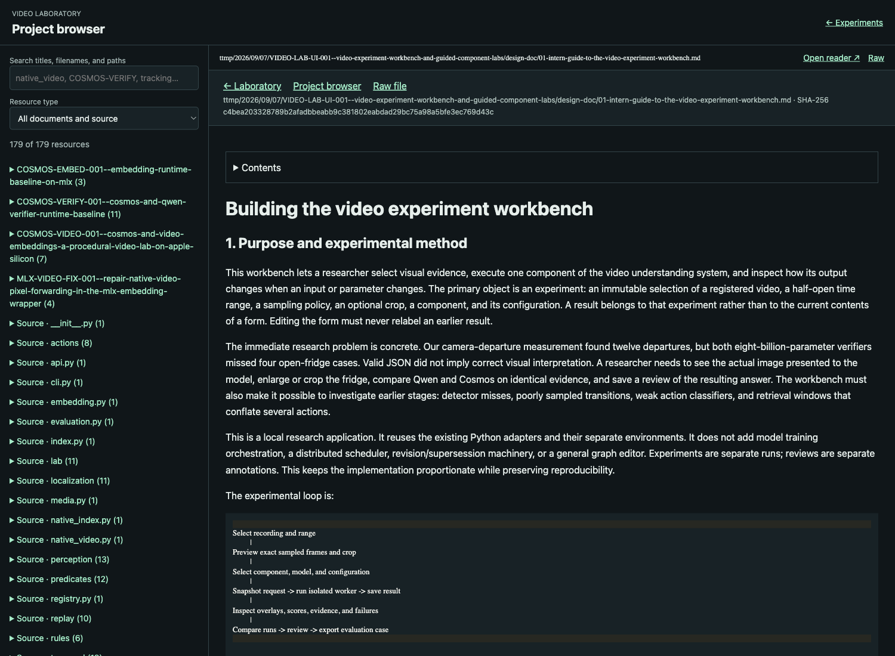
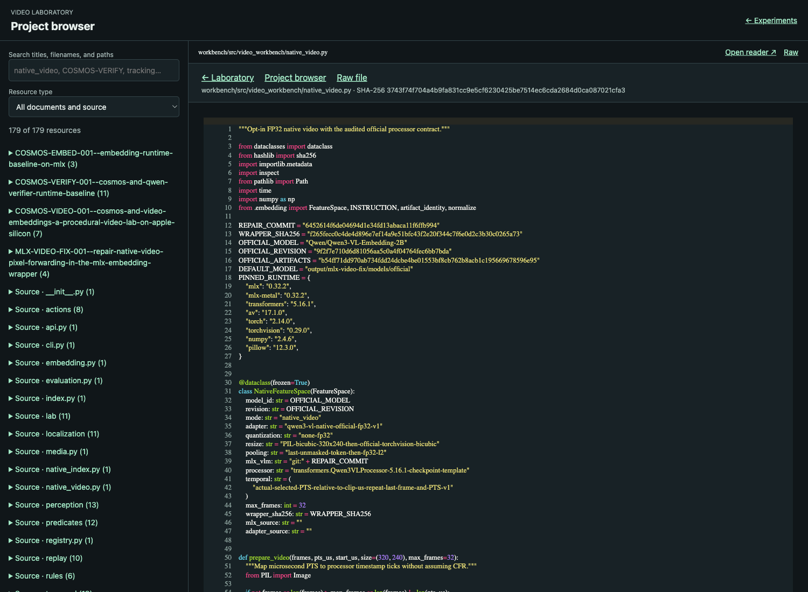
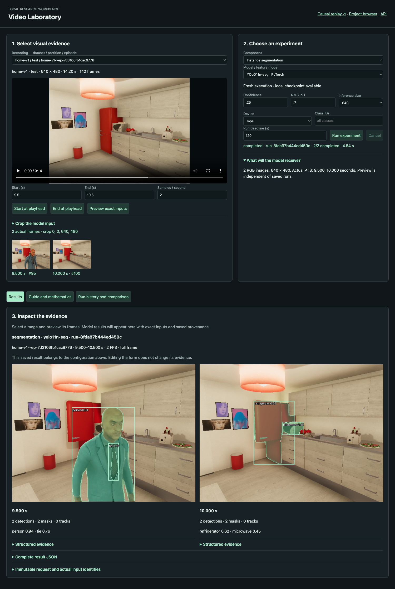
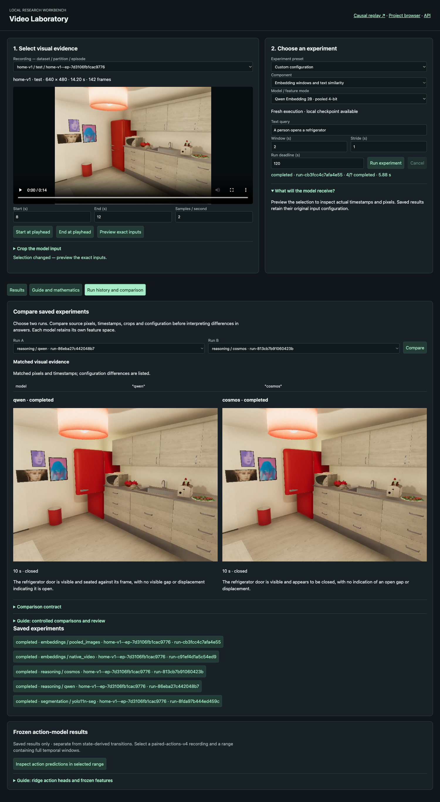
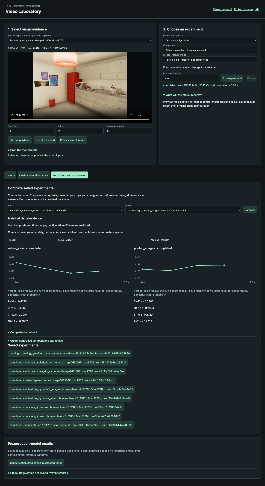
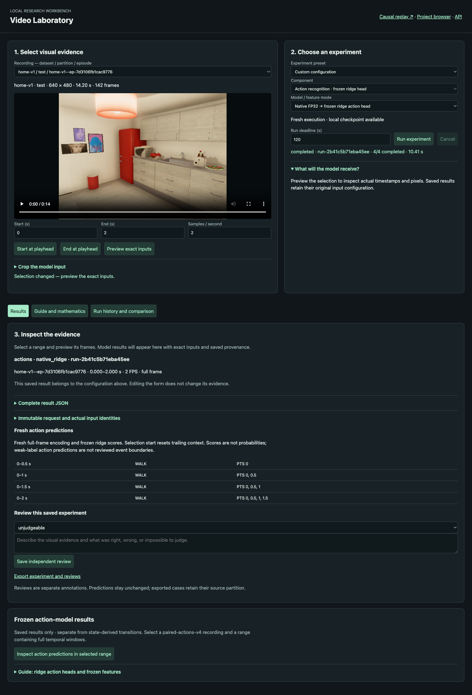
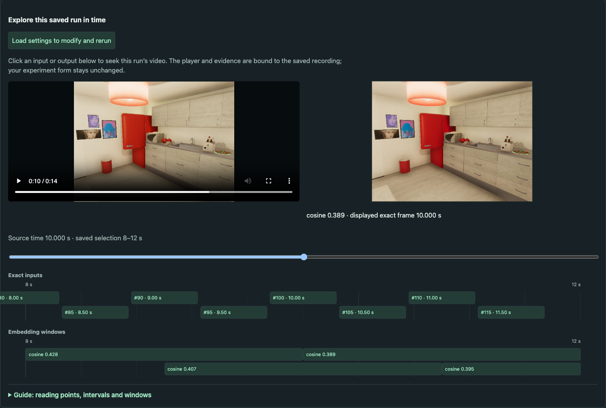
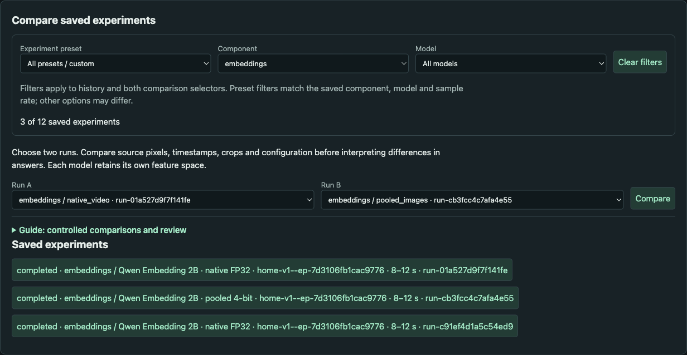
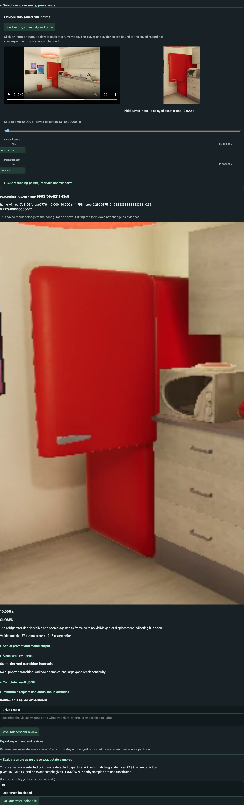

# Delivered video laboratory: API and measured walkthrough

## 1. Starting and navigating the system

The laboratory is available at [mimimi:8780](http://mimimi:8780/) on the same Tailscale network. [Project browser](http://mimimi:8780/resources) is a separate page for reading current local Markdown and source. [Interactive API documentation](http://mimimi:8780/docs) describes the actual request schema. [Replay](http://mimimi:8780/replay/) uses the existing replay engine at the same origin, so remote browsers do not accidentally connect to their own localhost.

The main workspace shares a registered recording, half-open range, FPS and crop across component controls. A preview shows the actual decoded PNGs and timestamps. The Run button snapshots those inputs into a new experiment and starts one isolated worker. Results retain their original options even after the form changes. Select an old run from history to inspect its output.

Every component has a Guide and mathematics view with prose, equations, examples and limitations. The resource groups link to implementation, local measured reports and upstream documentation. The separate browser searches titles, paths and filenames; Markdown includes a contents foldout and tables, while source has syntax highlighting and linkable line numbers. Each reader shows the current file hash. This is a working-tree reader, not a historical Git viewer.





## 2. Evidence and execution API

The authoritative archived schema is `various/openapi.json`. Core endpoints are listed below. JSON requests reject extra fields and nonfinite numbers. Model and runtime paths come from the server catalog rather than user-provided shell commands.

| Method / path | Meaning |
|---|---|
| GET `/v1/lab/catalog` | Corpus-qualified source IDs and explicit local model availability. |
| GET `/v1/lab/sources/{id}` | Hash-verified media metadata and actual PTS. |
| POST `/v1/lab/preview` | Selection fields: `episode_id`, `start_us`, `end_us`, `fps`, nullable normalized `crop`. |
| POST `/v1/lab/runs` | Selection plus component/model and bounded options; returns run ID. |
| GET `/v1/lab/runs/{id}` | Immutable request, persisted status, progress and result. |
| POST `/v1/lab/runs/{id}/cancel` | Kill/reap the active worker group and persist cancellation. |
| GET `/v1/lab/compare?a=...&b=...` | Evidence equality and configuration differences. |
| POST `/v1/lab/runs/{id}/reviews` | `verdict` and explanatory `note`; stores a separate review. |
| GET `/v1/lab/runs/{id}/export` | Experiment and independent reviews, retaining source partition. |
| POST `/v1/lab/runs/{id}/rule` | `event_us` and `expected_open`; exact-point evaluation with the existing rule engine. |
| POST `/v1/lab/actions/inspect` | Selection; returns only matched original frozen action windows. |
| GET `/v1/lab/resources?component=...` | Curated source, local document and official external references. |
| GET `/resources?file=...` | Project browser with a selected indexed resource. |
| GET `/resources/{id}` | Rendered Markdown, highlighted code or indexed raster image. |
| GET `/resources/{id}/raw` | Original text, served as plain text. |

Run bounds are 64 selected images, at most 128 embedding windows, and at most 600 seconds of total execution. A verifier image retains its separate maximum 120-second budget and 4096-token ceiling. The default token budget in the UI is 512. A sequence of state requests can exceed one-image cost; the total experiment deadline still applies. Interrupted, timed-out and cancelled runs do not become negative model answers.

The experiment's source identity includes dataset-qualified episode ID, original episode ID, source SHA-256, split and split group. Different corpus versions reused episode IDs with different video bytes, which is why the laboratory ID includes the dataset. The preview and immutable run images have their own hashes and exact crop rectangles.

## 3. Perception and reasoning walkthrough

Select `home-v1--ep-7d3106fb1cac9776`, range 9.5–10.5 seconds, 2 FPS and instance segmentation. The real smoke run produced two masks on each image, but the object classes changed: person/tie at 9.5 seconds and refrigerator/microwave at 10.0 seconds. Inspecting actual images makes this target miss visible. A successful process does not establish good target coverage.



For reasoning, use a selection producing exactly one image. Qwen and Cosmos were both run at 10.0 seconds on the same full-frame PNG. Both produced valid CLOSED answers. The comparison page reports matched evidence and a model difference, then displays both explanations beside the images. These are runtime integration checks, not a new visual-accuracy acceptance result.



The state component runs independent image requests. Adjacent known samples that change state support an OPEN or CLOSE interval only when their gap is within the configured maximum. Unknown samples break the chain. The exact-point rule accepts a manually selected timestamp; at a known closed state it can PASS, while a missing timestamp yields UNKNOWN. It does not silently use the nearest sample or invent a departure event.

## 4. Embeddings and fresh action heads

Native FP32 and pooled 4-bit embedding runs were matched on the 8–12 second range at 2 FPS, two-second windows, one-second stride and the same query. Both produced four windows. The comparison confirms identical pixels and timestamps while retaining different feature-space identities. Their ranking and score plots are separate; the UI does not combine vectors across spaces.



Fresh action recognition computes new embeddings and applies a frozen ridge head. The model uses `scores = (x - mean) @ weights + bias`, then chooses the largest score. The runtime verifies the encoder against the frozen training manifest and binds the checkpoint hash. Native and pooled heads use their respective feature spaces. Neither score vector is a calibrated probability distribution.

The frozen action policy requires full frame, 2 FPS, two-second trailing windows and half-second steps. Selection endpoints must lie on the half-second grid. Context resets at selection start, so early windows contain less history. The UI rejects crops and arbitrary FPS for these heads. Both fresh action heads completed the two-second smoke selection; the native head predicted WALK across the initial windows. That prediction on this scene is an example to review, not evidence that an action actually occurred.



The separate frozen-results viewer reads the earlier benchmark after matching source hashes and retaining original window boundaries. It excludes weak labels from its response. This allows comparison with historical outputs without claiming another inference run occurred.

## 5. Measured execution and validation

The following are single local smoke runs, including interpreter startup and model loading. They measure integration on this Mac, not throughput or comparative model accuracy.

| Component | Run ID | Wall seconds |
|---|---|---:|
| YOLO masks, 2 images | run-8fda97b444ed459c | 4.64 |
| Qwen 8B, 1 image | run-86eba27c442048b7 | 7.83 |
| Cosmos 8B, 1 image | run-813cb7b91060423b | 8.46 |
| Native FP32 embeddings, 4 windows | run-c91ef4d1a5c54ed9 | 11.22 |
| Pooled embeddings, 4 windows | run-cb3fcc4c7afa4e55 | 5.88 |
| Qwen state samples, 2 images | run-fc7db205cb284dcd | 13.18 |
| Native fresh ridge actions, 4 windows | run-2b41c5b71eba45ee | 10.41 |
| Pooled fresh ridge actions, 4 windows | run-354329c3cd2542a3 | 5.26 |
| YOLO + ByteTrack, 10 images | run-7e52c6665e804620 | 4.53 |

Seven focused tests cover selection and model contracts, exact preview pixels/timestamps, project resource boundaries and rendering, cancellation of a real subprocess, unknown transition gaps, comparison identity, exact-point rule semantics, and action preprocessing rejection. The final live API smoke additionally checked eight saved action rows, review persistence, test-partition preservation on export and separate embedding feature spaces. Browser console inspection reported zero errors and warnings after the final feature navigation.

The smoke review is explicitly labeled automated and unjudgeable; it tests persistence, not human visual judgment. The evidence summary and full OpenAPI schema are saved in `various/final-api-smoke.json` and `various/openapi.json`. The reusable smoke script is `scripts/02-final-api-smoke.py`.

## 6. Implementation boundaries

Multi-image and native-video reasoning are not accepted runtime modes. State sequences are independent image calls. Fresh TCN execution is not offered; action inference uses the existing ridge heads. Presets are explicit component configurations and state-to-transition stages, not a generic graph editor. The replay subsystem keeps its own existing manager, so the one-worker laboratory limit does not coordinate GPU allocation with a separately started replay or another process.

The current project browser renders Markdown tables and code but leaves Mermaid fences as source text. Local links are rewritten only for indexed resources. This avoids exposing arbitrary filesystem paths while making the relevant implementation and ticket material readable. Current file hashes help identify changes, but a future historical reader would need an explicit commit selector.

Previews and experiment artifacts remain on disk for the research trail. They are not automatically deleted. Keep representative screenshots and reports in the ticket; large model outputs remain under `output/video-lab`.

## 7. Saved-run timeline and repeatable experiments

Completed results now provide their own video player, exact saved-frame display and clickable timeline lanes. Inputs and state estimates are point samples; action and embedding predictions span their original windows. Transition intervals retain temporal uncertainty. Clicking a timeline item seeks the saved recording and names the exact PNG shown beside it. This inspection does not change the experiment form.

Use **Load settings to modify and rerun** to explicitly restore the saved source, range, sampling, crop, model and component options. The application regenerates the evidence preview but does not automatically launch inference. Edit one option and run a new experiment to preserve the original for comparison.



## 8. Responsive previews and history filters

Input thumbnails wrap into rows within the evidence column. The parameter column retains its width while frames load; narrow screens stack the columns. Run history and both comparison selectors share preset, component and model filters. Filters combine, and Clear filters restores the full list. Preset filtering matches saved component/model/sample-rate settings, including older runs; it does not claim to reconstruct which preset the user originally selected.




## 9. Shared-scale embedding overlays

Embedding comparisons now show A and B on one chart. Time and similarity bounds are computed from both runs together. The mint solid and orange dashed curves retain their own window membership and raw scores, and hover labels identify the run and interval. Shared axes support direct visual reading; they do not calibrate separate feature spaces or combine their vectors. Per-run ranking lists remain below the chart.


## 10. Sharing and refreshing comparisons

The address bar records run A (`a`), run B (`b`), history filters (`history_preset`, `history_component`, `history_model`), selected `tab`, and `compare=1` when a comparison is displayed. Copy the URL or the **Comparison permalink** link. Opening it restores selections and redraws the chart without starting inference. Browser Back/Forward restore earlier comparison choices. The linked run artifacts must still exist on the serving Mac.

[Native versus pooled comparison example](http://mimimi:8780/?tab=history&history_component=embeddings&a=run-c91ef4d1a5c54ed9&b=run-cb3fcc4c7afa4e55&compare=1)

## Detector-to-reasoner handoff

A completed perception run now exposes a selection of refrigerator, microwave and oven detections. Each choice names the actual timestamp, class, detector score and detection ID. Selecting a box and clicking **Preview reasoning draft** restores the source in the experiment form and prepares one exact frame for Qwen. The user can switch to Cosmos or alter decoding settings before explicitly starting inference. This implements the bounded dependency described in the original design without introducing a general workflow scheduler.

```text
saved perception run → select frame + detection + padding
                     → POST /v1/lab/handoff
                     → resolve source coordinates → preview exact RGB crop
                     → choose Qwen / Cosmos → POST /v1/lab/runs
                     → validate binding again → independent door-state result
```

The accepted question remains `door_open`. A detector score estimates the detector's confidence in an object class and box; it is not a door-state probability. A segmentation mask is not passed into the reasoner. The input is an ordinary rectangular RGB crop, including the requested surrounding context. Restricting available classes avoids offering a door-state question for a detected person, tie or unrelated prop.

For a detection box `(x0,y0,x1,y1)` in the parent input image, let `dx = p*(x1-x0)` and `dy = p*(y1-y0)`, where `p` is padding per side. Add the parent input crop's source origin `(ox,oy)` before rounding outward and clamping to the source image dimensions `(W,H)`:

```python
left   = max(0, floor(ox + x0 - dx))
top    = max(0, floor(oy + y0 - dy))
right  = min(W, ceil(ox + x1 + dx))
bottom = min(H, ceil(oy + y1 + dy))
normalized_crop = (left/W, top/H, right/W, bottom/H)
selection = [frame.pts_us, frame.pts_us + 1)  # microseconds; one exact frame
```

The one-microsecond half-open interval selects the saved timestamp without substituting a nearby frame. It does not claim the observation persists for one microsecond or longer. The existing evidence preparation function applies normalized crop coordinates; its actual saved PNG and recorded pixel crop are authoritative if floating-point rounding affects a boundary.

### API and implementation references

- `POST /v1/lab/handoff` accepts `run_id`, `frame_id`, `detection_id`, and `padding` in `[0,1]`. It returns validated experiment `options` and resolved `provenance`; it does not execute a model.
- `POST /v1/lab/runs` accepts those options, including optional `handoff`. The manager resolves that reference again, checks source identity, and rejects changed source, timestamp interval, FPS, crop, target or component. Changing model or decoding parameters is permitted.
- Saved `request.json.handoff` includes parent request/result SHA-256, source metadata and partition, parent frame, detection, padding and intended source crop. The existing export includes this request without altering the original perception output.
- `workbench/src/video_workbench/lab/contracts.py`: bounded handoff reference and optional experiment binding.
- `workbench/src/video_workbench/lab/handoff.py`: coordinate conversion, parent lookup and submission validation.
- `workbench/src/video_workbench/lab/manager.py`: admission, evidence preparation and persisted provenance.
- `workbench/src/video_workbench/lab/analysis.js`: selection controls, guided draft loading, explicit detach and saved provenance display.
- `workbench/tests/test_lab.py::test_detection_handoff_nested_crop_and_binding`: nested crop offsets, unsupported edits, missing detection and unsafe parent identifier rejection.

The UI displays an explicit **Detach detection provenance to edit evidence** control. Detaching creates an ordinary independent experiment; the old parent result remains unchanged. Keeping the binding while editing protected fields produces HTTP 422. Comparisons list differing handoff references alongside other option differences and continue comparing actual image hashes and timestamps. A full-frame versus crop comparison changes visual evidence, so it is an input intervention rather than an isolated model comparison.

### Measured handoff smoke

Parent `run-8fda97b444ed459c` supplied refrigerator detection `6dc9d12bd5f35ece90c1653b4b57a944fda6a6da1009fb9ea8b4b05a2f9d8e85` at 10 seconds. With padding 0.15, the actual source crop was `(167,94,352,383)`, producing a 185×289 image. Qwen 8B 8-bit run `run-6903f06e821843c6` completed in 13.583 seconds with a valid `closed` answer and persisted parent provenance. No accuracy gain is claimed from this single case. An intentionally altered crop with the binding retained was rejected with HTTP 422 and `handoff crop changed; detach the handoff before editing evidence`.



